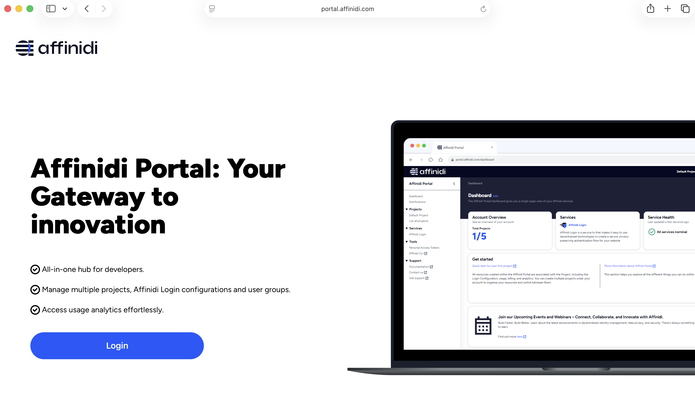
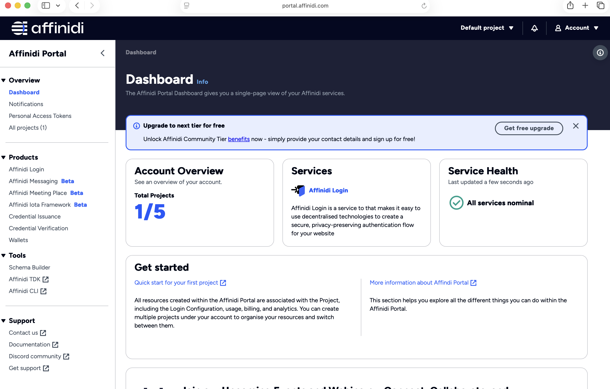
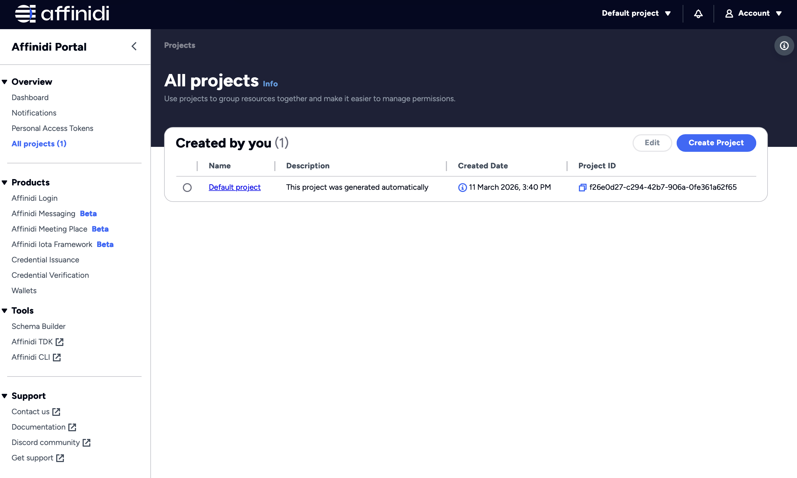
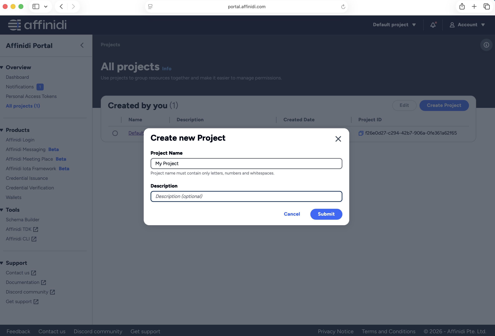
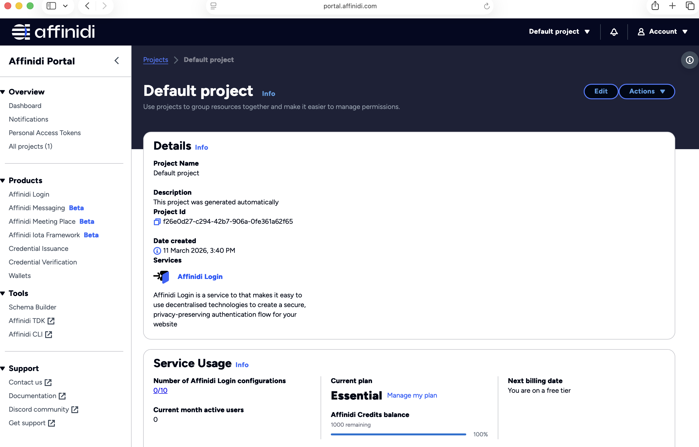
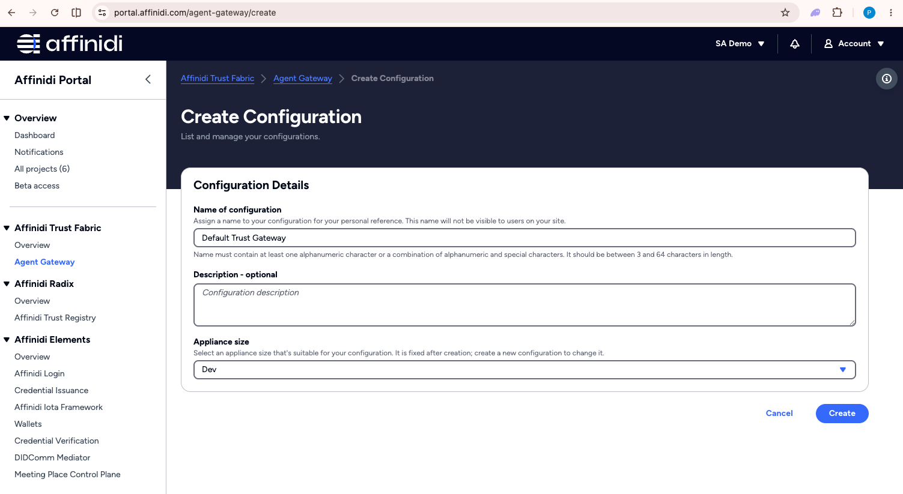
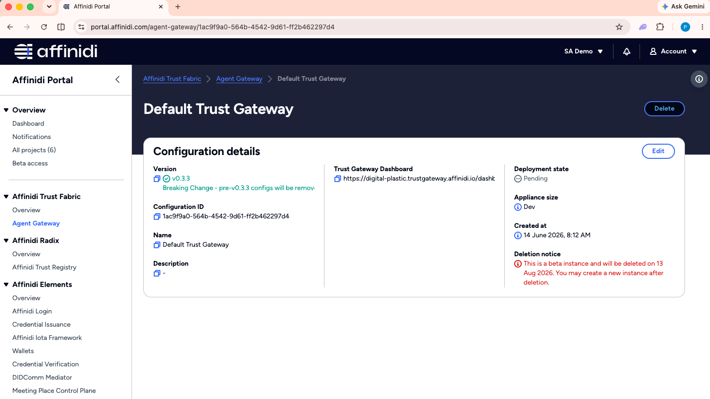
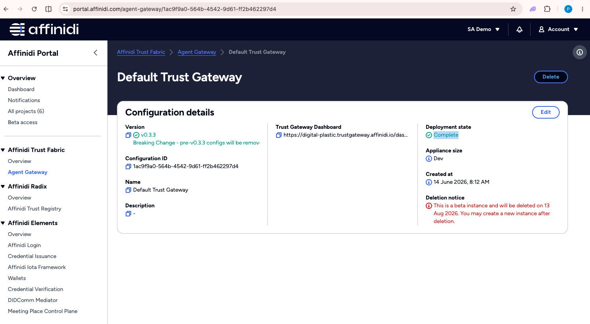
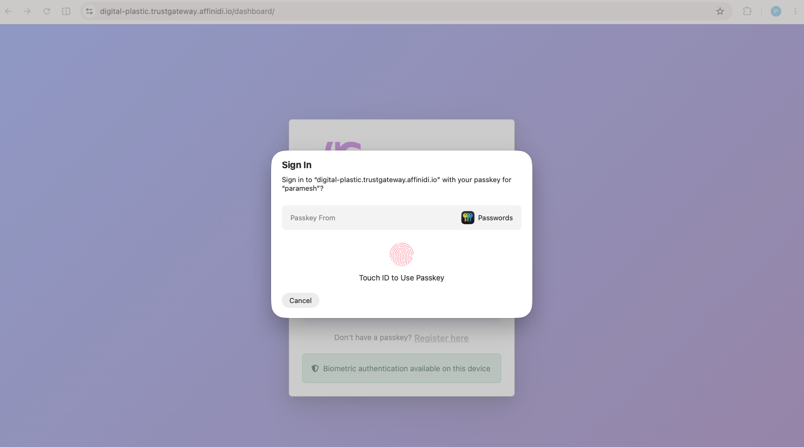

# Onboarding to Agent Gateway

This guide walks you through the steps to get access to the Agent Gateway, from creating your developer account to setting up your first Agent Gateway configuration.

---

## Step 1: Log In to the Affinidi Developer Portal

1. Open the [Affinidi Developer Portal](https://portal.affinidi.com) in your browser.
2. Click the **Login** button.

   **First-time users** will be guided through a one-time vault setup:
   - **Create a passphrase** — this protects your personal vault.
   - **Enable fingerprint authentication** (optional) — for faster access on supported devices.
   - **Verify your email** — enter your email address and confirm the OTP sent to your inbox.

   

3. After a successful login, you will land on the Developer Portal dashboard.

   

---

## Step 2: Default Project

After logging in for the first time, the portal automatically creates a **Default Project** for you. You can use this project or create a new one (see Step 3).

---

## Step 3: Create a New Project (Optional)

If you want to work under a dedicated project:

1. Click **Create Project**
2. Enter a **Project Name** and an optional **Description**.
3. Click **Create** to Confirm.
   

---

## Step 4: Copy Your Project ID

1. Navigate to **All Projects** from the left menu bar.
2. Locate and select the project.
3. Copy the **Project ID** displayed on the project details page — you will need this in the next step.
   

---

## Step 5: Request Whitelisting

Share your **Project ID** with the Affinidi team to have your project whitelisted for Agent Gateway access.

> **Note:** Whitelisting may take some time. You will be notified once the process is complete.

Once your project is whitelisted, you will see the **Agent Gateway** menu item appear in the left navigation bar of the portal.

---

## Setup Agent Gateway

After your project is whitelisted, you can create and configure your Agent Gateway.

### Step 1: Create Agent Gateway Configuration

1. Log in to the [Affinidi Developer Portal](https://portal.affinidi.com).
2. Select your whitelisted project from the top-left project menu.
3. Click **Agent Gateway** in the left menu bar.
4. Click **Create Configuration** and provide a name and description.

   

5. Wait until the deployment status shows **Complete** (this may take a few minutes).
6. Once deployment is complete, copy the **Agent Gateway dashboard URL**.

   
   Note: Ideally takes < 5mins to spin-up agent gateway
   

---

### Step 2: Register and Log In to the Agent Gateway Control Plane

1. Open the Agent Gateway dashboard URL in your browser.

2. **First-time users:**
   - Click **Register here**.
   - Enter a **username**.
   - Click **Register Passkey** to complete registration.

   > The first user to register is automatically assigned the **admin** role.

   

3. **Returning users:**
   - Enter your **username**.
   - Click **Sign in with Passkey**.

   
   

4. After a successful login, you will land on the Agent Gateway **dashboard**.

   

---

## Next Steps

With the Agent Gateway configured, you can now:

- **Set up MCP channels** to route Model Context Protocol traffic through the gateway with observability and identity management.
- **Set up A2A channels** to route Agent-to-Agent traffic through the gateway.
- **Enable decentralized identities** for your inbound MCP/A2A clients.

Refer to the [README](README.md) for detailed instructions on configuring channels and running agents through the Agent Gateway.
