# Affinidi Trust Gateway (part of Affinidi Trust Fabric)

The Affinidi Trust Gateway (Affinidi TGW) is an enterprise-grade gateway designed specifically for the emerging Agent-to-Agent AI ecosystem. Written in Rust for maximum performance and security, it provides comprehensive trust infrastructure, observability, and governance for AI agent communications across organizational boundaries, in ways that set it apart in the emerging AI observability space.

At its core, the Affinidi TGW is a protocol-aware intercepting proxy for the Internet of AI Agents. The Gateway provides three fundamental capabilities:

- **Protocol inspection** (understanding A2A, AP2, UCP, MCP, OpenAI protocols)
- **Identity management** (issuing and validating durable and portable decentralized identities for agents to bridge the decentralized world to AI agents), and
- **Intelligent routing** (directing traffic based on channels, routes, and connection points)

Built on top of these foundations are advanced features for production deployments including circuit breakers, retry logic, rate limiting, real-time metrics and logging for traffic observability and management; metadata inspection and injection for use-cases such as API key
management.

## Goal: What you will build

Establish governed MCP and A2A connections by routing clients through the Trust Gateway, which manages identity, policy enforcement, and observability before forwarding requests to your local servers or cloud-deployed agents (e.g., Vertex AI Agent Engine).

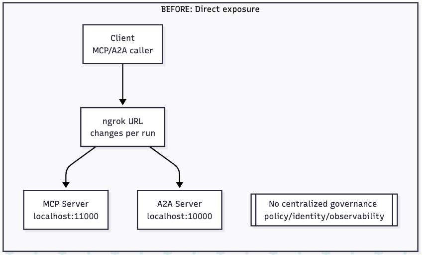
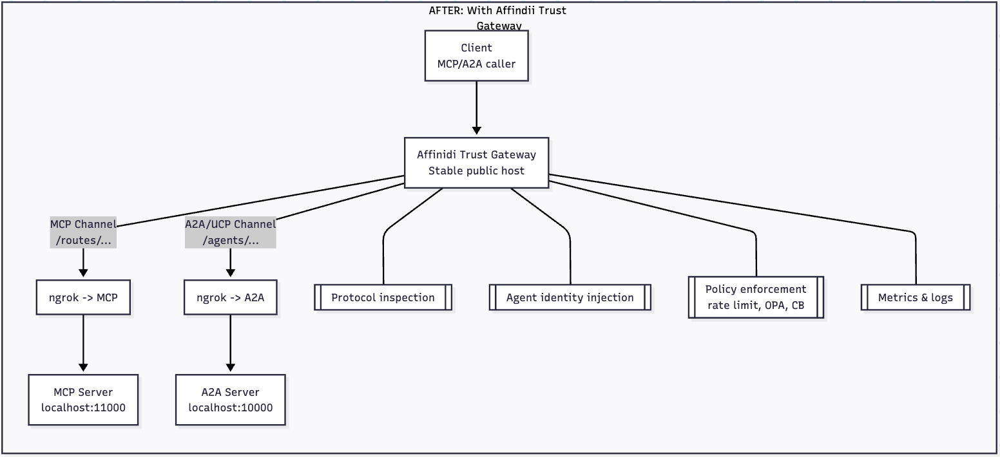

## 📋 Table of Contents

- [Try it in GitHub Codespaces](#-try-it-in-github-codespaces-no-local-setup-required)
- [Overview](#overview)
- [Project Structure](#project-structure)
- [Part 1: Run Agents Without Trust Gateway](#part-1-run-agents-without-trust-gateway)
  - [Prerequisites](#prerequisites)
  - [A2A Server (Local)](#a2a-server-local)
  - [MCP Server (Local)](#mcp-server-local)
  - [A2A Vertex AI Agent](#a2a-vertex-ai-agent)
- [Part 2: Run Agents With Trust Gateway](#part-2-run-agents-with-trust-gateway)
  - [What is the Affinidi Trust Gateway?](#what-is-the-affinidi-trust-gateway)
  - [Prerequisites](#prerequisites-1)
  - [Setup Trust Gateway](#setup-trust-gateway)
  - [MCP Server via Trust Gateway](#mcp-server-via-trust-gateway)
  - [A2A Server via Trust Gateway](#a2a-server-via-trust-gateway)
  - [A2A Vertex AI Agent via Trust Gateway](#a2a-vertex-ai-agent-via-trust-gateway)
  - [Create Identity for MCP/A2A Client](#create-identity-for-mcpa2a-client)
  - [Sample MCP Request & Response Messages](#sample-mcp-request--response-messages)

---

## � Try it in GitHub Codespaces (No Local Setup Required)

Don't want to install anything on your computer? GitHub Codespaces gives you a ready-to-use development environment entirely in your browser. You get a terminal, an editor, and all the tools pre-installed — nothing to download or configure.

> **What you need:** A free GitHub account is required. Codespaces is included in all plans with **60 free hours per month** on free accounts — no credit card needed for this demo.

### Step 1 — Open the repository in Codespaces

1. Go to this repository on GitHub.
2. Click the green **`< > Code`** button near the top-right of the page.
3. Select the **`Codespaces`** tab. This tab is only visible when you are signed in — create a free GitHub account first if you have not done so already.
4. Click **`Create codespace on main`**.

   

> A new browser tab will open and the environment will take about a minute to set up. You will see a VS Code editor appear in your browser when it is ready.
> 

> **Heads up:** Codespaces automatically pauses after **30 minutes of inactivity** to save your free quota. If your server stops responding, just reopen the Codespace, re-run `./run.sh`, and re-forward the port.

### Step 2 — Open a terminal

If terminal tab is not visible inside the Codespace, click **Terminal → New Terminal** from the top menu bar (or press `` Ctrl+` ``). A terminal panel will appear at the bottom of the screen.

### Step 3 — Run the MCP Server

In the terminal, run:

```bash
cd mcp
./run.sh
```

You will see a message like `MCP server running on port 11000`. Leave this terminal running.


### Step 4 — Forward the port and get your public URL

Codespaces automatically detects that port `11000` is in use and shows a notification. You can also find it yourself:

1. Click the **`Ports`** tab at the bottom of the screen (next to Terminal).
2. Find port **`11000`** in the list.
3. Right-click the row and choose **`Port Visibility → Public`** so the URL can be used from outside.
4. Copy the **`Forwarded Address`** URL — it looks like `https://<random-name>-11000.app.github.dev`.


> **Tip:** This forwarded URL acts as your public endpoint, just like ngrok would on a local machine. You do **not** need to install ngrok.

### Step 5 — Test the MCP Server

Open a **second terminal** (Terminal → New Terminal) and run:

```bash
cd mcp
./test.sh https://<your-forwarded-address>
```

Replace `<your-forwarded-address>` with the URL you copied in Step 4. The test client will connect, list the available tools, and call the calculator and weather tools.

A successful run will print something like:

```
Connected to MCP server
Available tools: calculator, weather_forecast
Calculation: 15 + 27 = 42
Weather forecast for London: Partly cloudy, 18°C
```

If you see results like this, everything is working correctly.

---

### Running the A2A Server

Follow the same steps, but use the `a2a/` folder and port `10000`:

**Terminal 1 — start the server:**

```bash
cd a2a
./run.sh
```

**Ports tab — make port `10000` public** and copy the forwarded URL.

**Terminal 2 — run the interactive client:**

```bash
cd a2a
./test.sh https://<your-forwarded-address-for-10000>
```

You can now type messages to the agent and see responses in real time.

---

### Connecting through the Trust Gateway from Codespaces

Once you have your Codespaces forwarded URLs, you can use them exactly like ngrok URLs in all the Trust Gateway steps in Part 2:

- When configuring an MCP channel, set the **Target Endpoint URL** to your Codespaces forwarded address for port `11000`.
- When configuring an A2A channel, set the **Target Endpoint URL** to your Codespaces forwarded address for port `10000`.


Everything else stays the same — the Codespace keeps the server running while the Trust Gateway routes traffic to it.

> **Note:** The Vertex AI agent (in `a2a-vertex-agent/`) still requires a Google Cloud account and cannot be set up through Codespaces alone. All other demos work fully.

---

## �🔍 Overview

| Component           | Description                                               |
| ------------------- | --------------------------------------------------------- |
| `a2a/`              | Local A2A echo agent server + interactive client          |
| `mcp/`              | Local MCP server with calculator and weather tools        |
| `a2a-vertex-agent/` | A2A agent deployed on Google Cloud Vertex AI Agent Engine |
| `rest-api/`         | REST API server with MCP proxy                            |

## 📁 Project Structure

```
affinidi-labs-tgw-get-started/
├── a2a/
│   ├── a2a_server.py        # A2A agent server implementation
│   ├── a2a_client.py        # Interactive A2A client
│   ├── requirements.txt
│   ├── run.sh               # Start the server
│   └── test.sh              # Test the server
├── mcp/
│   ├── mcp_server.py        # MCP server implementation
│   ├── mcp_client.py        # MCP test client
│   ├── requirements.txt
│   ├── run.sh               # Start the server
│   └── test.sh              # Test the server
├── a2a-vertex-agent/
│   ├── agent.py             # Vertex AI A2A agent definition
│   ├── a2a_client.py        # A2A client for the deployed agent
│   ├── deploy.py            # Deployment logic
│   ├── local_test.py        # Local testing
│   ├── requirements.txt
│   ├── run.sh               # Run local tests
│   ├── deploy.sh            # Deploy to Vertex AI
│   ├── test.sh              # Test the deployed agent
│   └── README.md            # Full Vertex AI setup guide
├── rest-api/
│   ├── api_server.py        # REST API server
│   ├── mcp_client.py        # MCP proxy client
│   └── run.sh
└── docs/
    └── images/              # Documentation images
```

---

# Part 1: Run Agents Without Trust Gateway

Run the agents locally or on Vertex AI and test them directly — no gateway involved.

## Prerequisites

- Python 3.10+
- pip and virtual environment support
- macOS/Linux (scripts use bash)
- ngrok (optional, for exposing local servers publicly)
- Google Cloud account with billing enabled (for Vertex AI agent only)

---

## A2A Server (Local)

A simple echo agent server implementing the A2A protocol.

### Start the Server

```bash
cd a2a
./run.sh [port]
```

Default port: `10000`

The script automatically creates a virtual environment, installs dependencies, and starts the server.

Available endpoints:

- `http://localhost:10000/.well-known/agent-card.json` - Agent card
- `http://localhost:10000/health` - Health check
- `http://localhost:10000/` - Root endpoint

### Test the Server

In a new terminal:

```bash
cd a2a

# Test locally
./test.sh http://localhost:10000

# Test via ngrok (if exposed publicly)
./test.sh https://<your-ngrok-url>
```

This starts an interactive client where you can chat with the agent. Type `exit` or press `Ctrl+C` to stop.

---

## MCP Server (Local)

A basic MCP server implementing JSON-RPC with calculator and weather tools.

### Start the Server

```bash
cd mcp
./run.sh
```

Default port: `11000`

Available endpoints:

- `http://localhost:11000/` - JSON-RPC endpoint
- `http://localhost:11000/health` - Health check

Available tools:

- `calculator` — Perform arithmetic operations (add, subtract, multiply, divide)
- `weather_forecast` — Get weather forecast (mock data)

### Test the Server

In a new terminal:

```bash
cd mcp

# Test locally
./test.sh http://localhost:11000

# Test via ngrok (if exposed publicly)
./test.sh https://<your-ngrok-url>
```

The test client initializes the connection, lists tools, calls the calculator and weather tools.

---

## A2A Vertex AI Agent

A Currency Exchange A2A agent deployed on Google Cloud Vertex AI Agent Engine using Gemini.

> For the full setup guide covering installation, configuration, local testing and deployment, see **[a2a-vertex-agent/README.md](a2a-vertex-agent/README.md)**.

### Quick Steps

```bash
cd a2a-vertex-agent

# 1. Configure environment
cp .env.example .env        # Edit .env with your Google Cloud details

# 2. Install dependencies
pip install -r requirements.txt

# 3. Test locally (no deployment needed)
./run.sh

# 4. Deploy to Vertex AI (~5 minutes)
./deploy.sh

# 5. Test the deployed agent (direct Vertex AI)
./test.sh
```

---

# Part 2: Run Agents With Trust Gateway

Route your agents through the **Affinidi Trust Gateway** to add identity management, observability, policy enforcement, and governed routing to all agent communications.


## What is the Affinidi Trust Gateway?

The Affinidi Trust Gateway (Affinidi TGW) is an enterprise-grade gateway written in Rust for the Agent-to-Agent AI ecosystem. It provides:

- **Protocol inspection** — understands A2A, MCP, UCP, AP2, OpenAI protocols
- **Identity management** — issues and validates decentralized identities (DIDs) for agents
- **Intelligent routing** — directs traffic based on channels, routes, and policies
- **Observability** — real-time metrics, logging, and payload inspection
- **Zero-downtime hot reload** — update channel configs without dropping in-flight requests

### About Channels

Channels are the fundamental routing unit. Each channel defines:

- Where to listen (external URL / load balancer)
- Where to forward (upstream endpoint or proxy)
- Which protocol (A2A, MCP, MPX, etc.)
- Identity management, policies, metadata injection, and logging

## Prerequisites

- Access to an Affinidi project with Trust Gateway enabled (whitelisted)
- Python 3.10+
- ngrok (for local MCP/A2A servers — **not needed** for Vertex AI agent)
- Ports 11000 and 10000 available
- Google Cloud account with billing enabled (for Vertex AI agent only)

---

## Setup Trust Gateway

### Step 1: Create Trust Gateway Configuration

1. Log in to the [Affinidi Developer Portal](https://portal.affinidi.com)
2. Select your project from the top left menu (only whitelisted projects can create a Trust Gateway)
3. Click on `Affinidi Trust Gateway` in the left menu
4. Click `Create Configuration` and provide a name and description

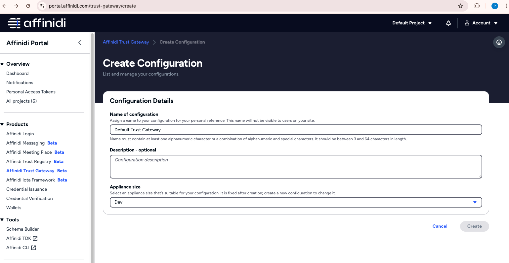

5. Wait until the deployment status is `Complete` (may take a few minutes)
6. Copy the Trust Gateway dashboard URL

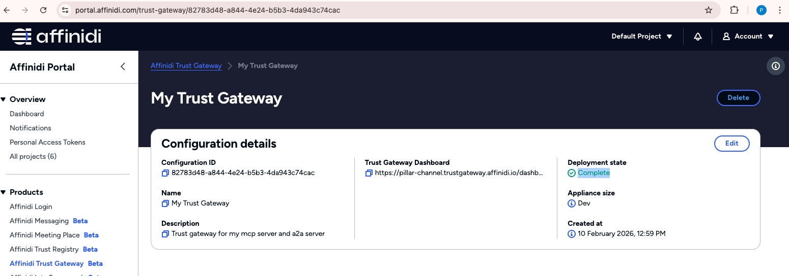

### Step 2: Register and Login to Trust Gateway Control Plane

1. Open the Trust Gateway dashboard URL in your browser
2. **First-time users:**
   - Click `Register here`, enter a `username`, click `Register Passkey` (first user becomes admin)

   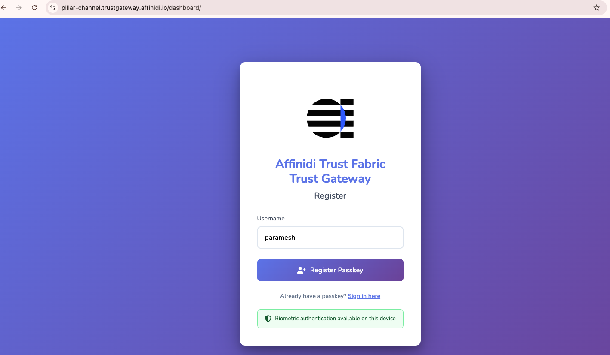

3. **Existing users:**
   - Enter your `username`, click `Sign in with Passkey`

   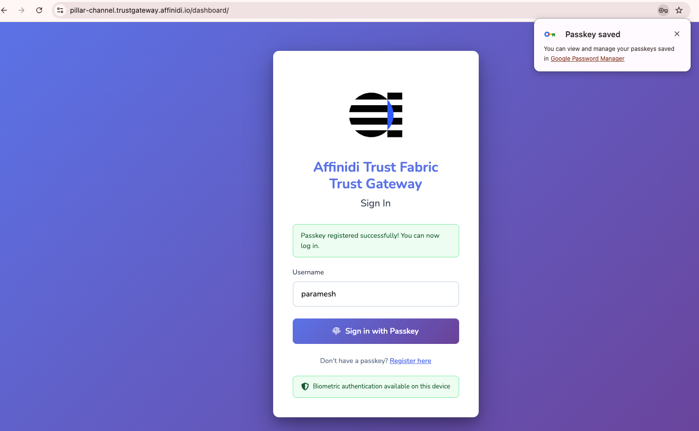

4. After login you will see the dashboard

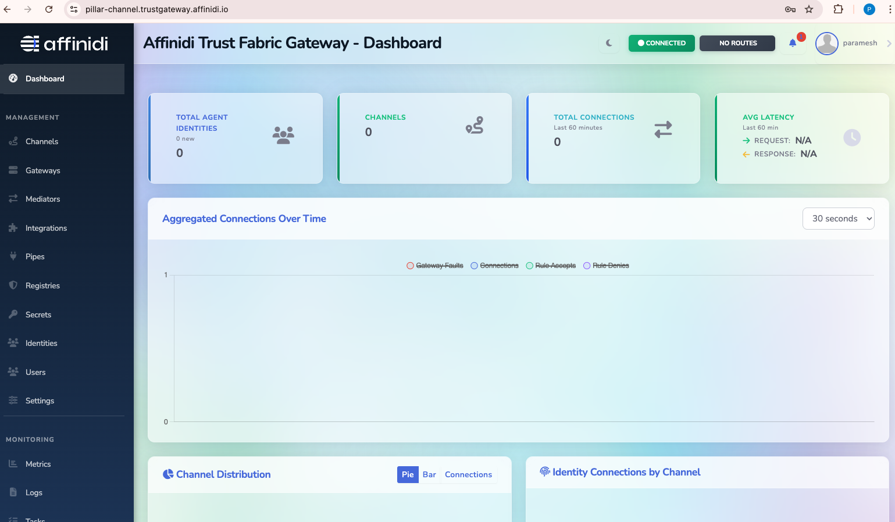

---

## MCP Server via Trust Gateway

**Goal:** Route MCP JSON-RPC through the Trust Gateway with observability.

**Result:** A stable Gateway route URL you can use from your MCP client.

### 1. Start the MCP Server Locally

```bash
cd mcp
./run.sh
```

### 2. Expose via ngrok

The MCP server must be publicly accessible for the Trust Gateway to route to it:

```bash
ngrok http 11000
```

For a static domain:

```bash
ngrok http --url=<YOUR_NGROK_HOST> 11000
```

### 3. Configure MCP Channel in Trust Gateway

1. Open the Trust Gateway dashboard → `Channels` → `Add Channel` → select `MCP` protocol

   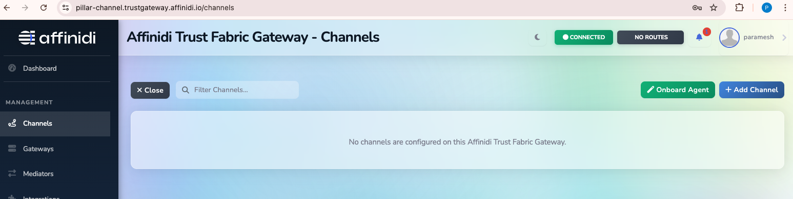
   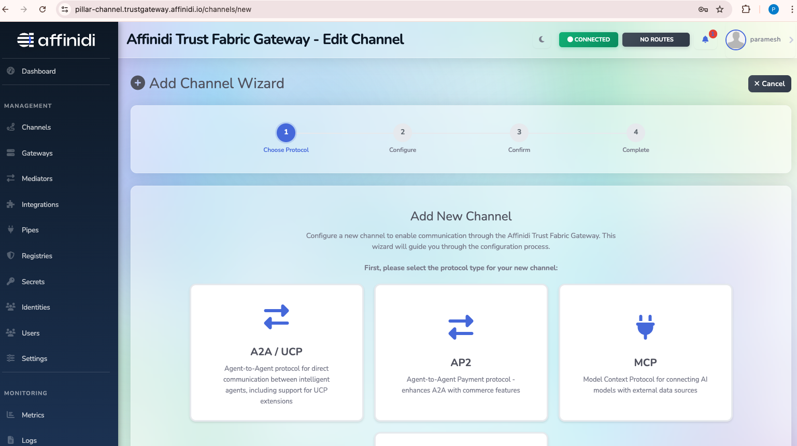

2. Enter the channel details and click `Next`:
   - **Channel Name:** `mcp-channel-weather`
   - **Listen Address:** Your Gateway base URL (e.g., `https://pillar-channel.trustgateway.affinidi.io`)
   - **Channel Prefix:** `routes`
   - **Target Endpoint Type:** `Direct URL`
   - **Target Endpoint URL:** Your ngrok URL

   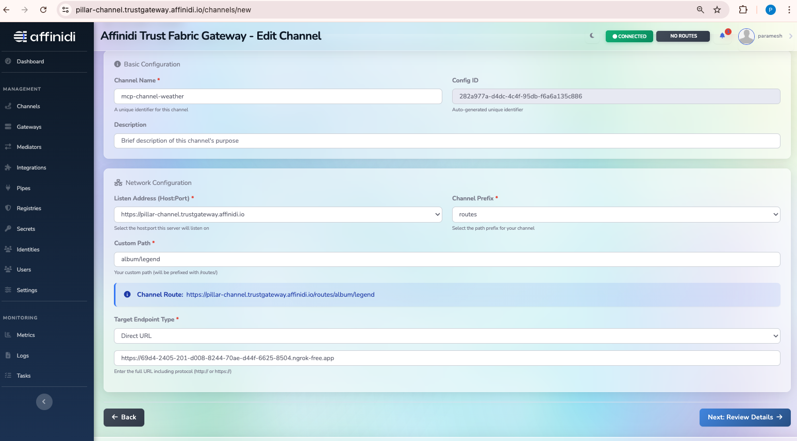

3. Review and click `Create Channel`

   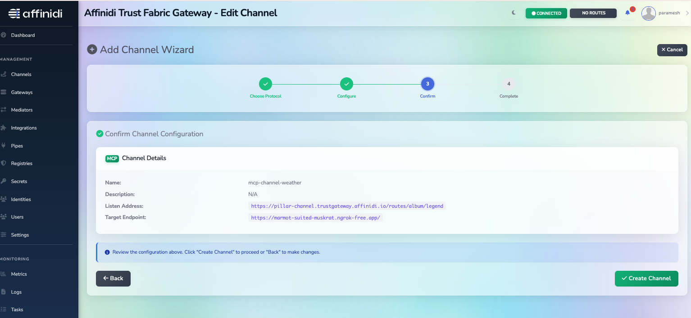

4. Open the newly created channel and copy the `Channel Route` URL

   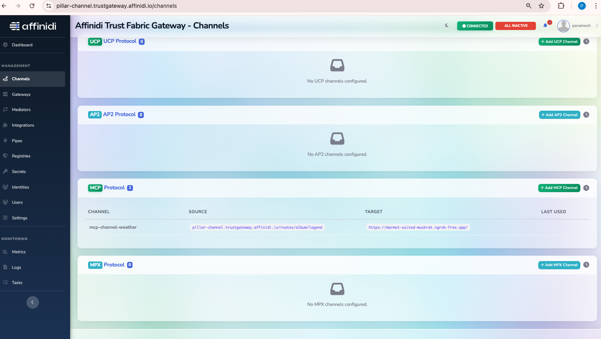
   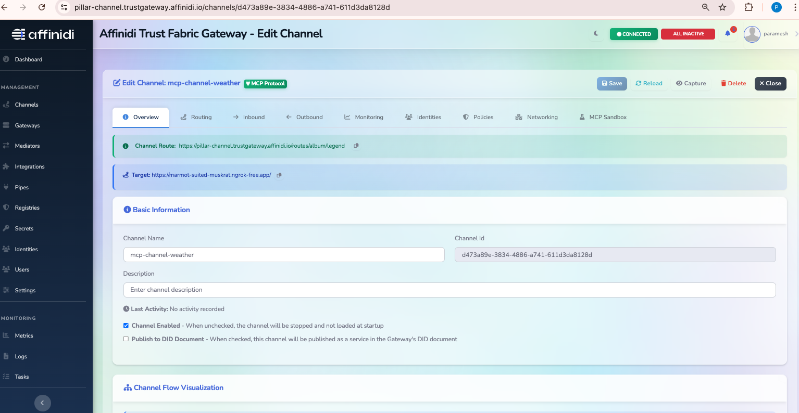

### 4. Test via Trust Gateway

```bash
cd mcp
./test.sh https://<GATEWAY_HOST>/routes/<CHANNEL_PATH>

# Example:
./test.sh https://pillar-channel.trustgateway.affinidi.io/routes/album/legend
```

View traffic metrics and logs in the channel dashboard after testing.

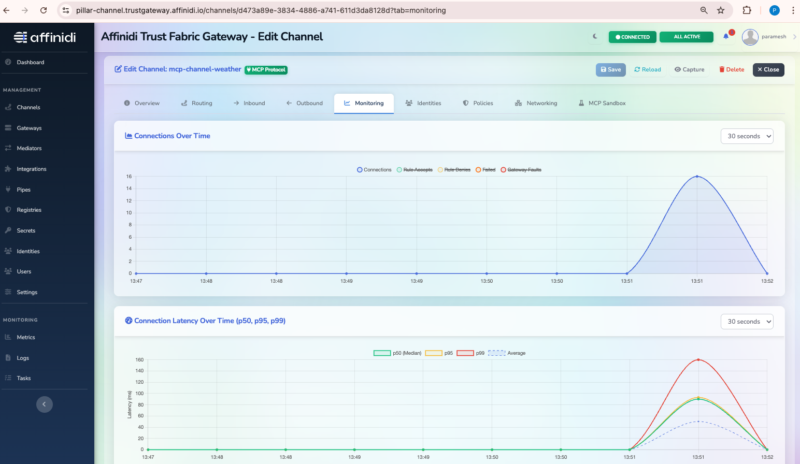
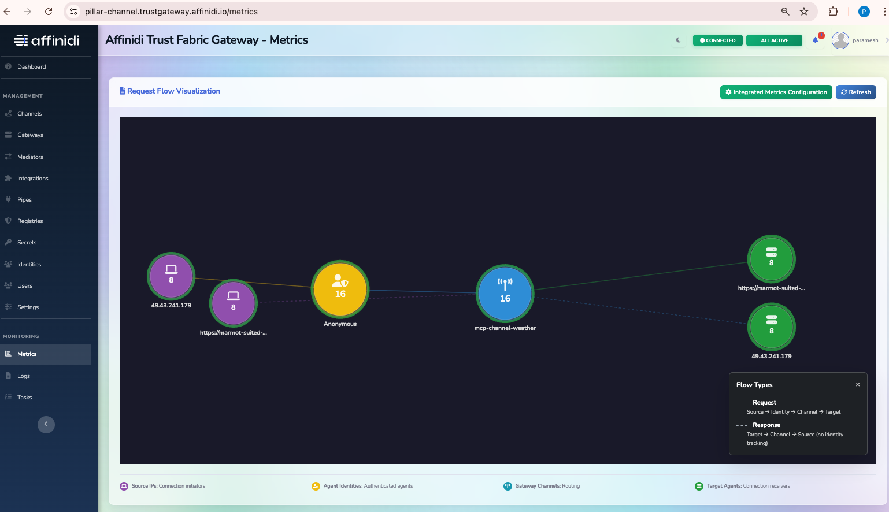

---

## A2A Server via Trust Gateway

**Goal:** Route A2A traffic through the Trust Gateway with observability.

**Result:** A stable Gateway route URL you can use from your A2A client.

### 1. Start the A2A Server Locally

```bash
cd a2a
./run.sh
```

### 2. Expose via ngrok

```bash
ngrok http 10000
```

For a static domain:

```bash
ngrok http --url=<YOUR_NGROK_HOST> 10000
```

### 3. Configure A2A Channel in Trust Gateway

1. Open the Trust Gateway dashboard → `Channels` → `Add Channel` → select `A2A/UCP` protocol

   
   

2. Enter the channel details and click `Next`:
   - **Channel Name:** `a2a-channel-chat`
   - **Listen Address:** Your Gateway base URL (e.g., `https://pillar-channel.trustgateway.affinidi.io`)
   - **Channel Prefix:** `agents`
   - **Target Endpoint Type:** `Direct URL`
   - **Target Endpoint URL:** Your ngrok URL

   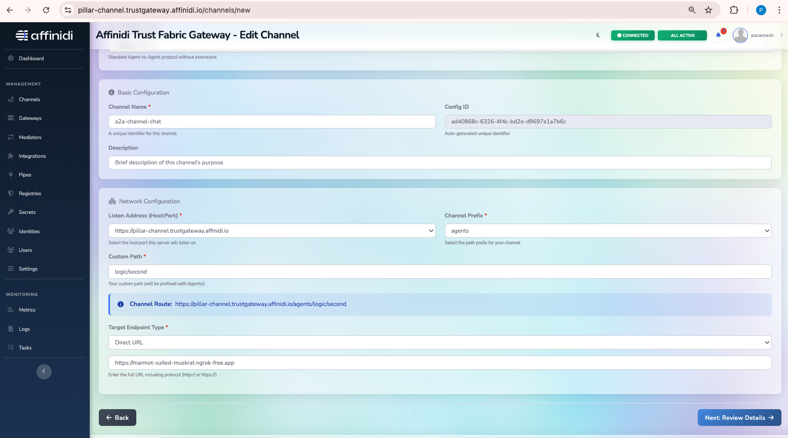

3. Review and click `Create Channel`

   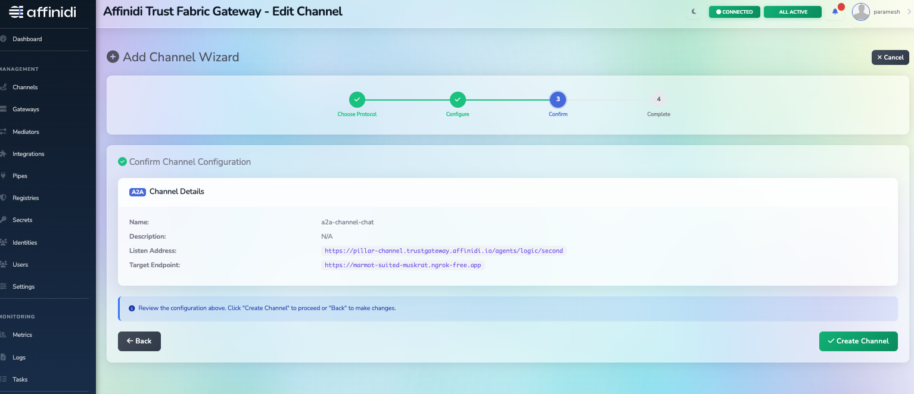

4. Open the newly created channel and copy the `Channel Route` URL

   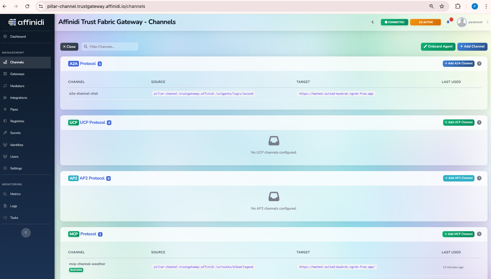
   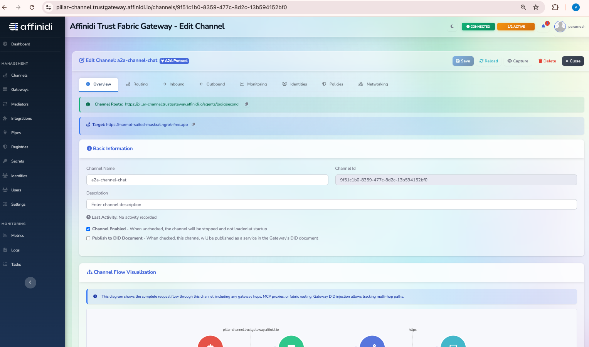

### 4. Test via Trust Gateway

```bash
cd a2a
./test.sh https://<GATEWAY_HOST>/agents/<CHANNEL_PATH>

# Example:
./test.sh https://pillar-channel.trustgateway.affinidi.io/agents/logic/second
```

View traffic metrics and logs in the channel dashboard after testing.

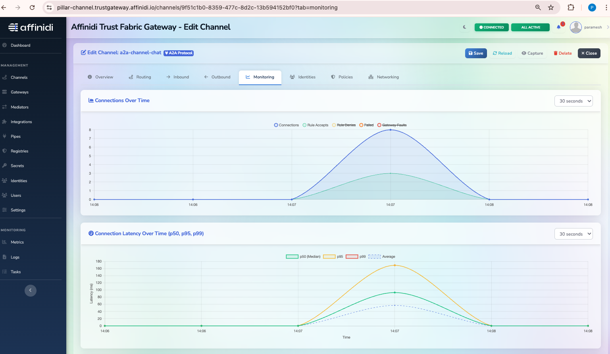
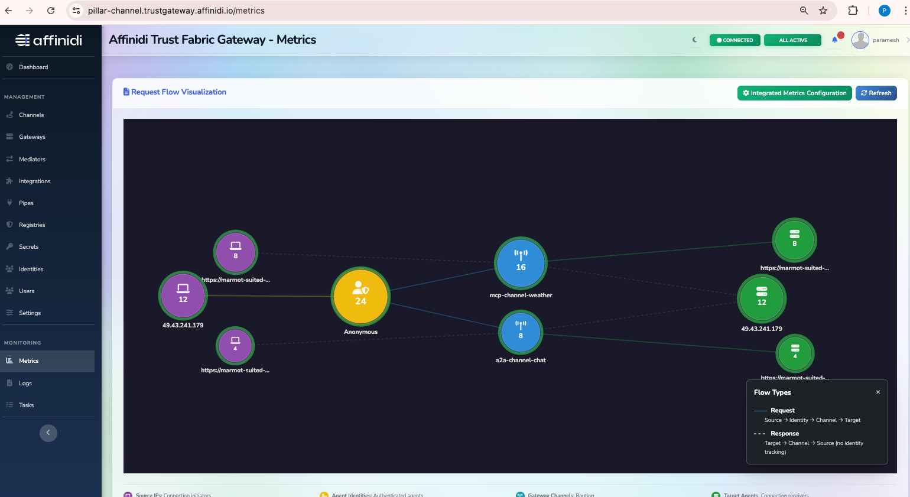

---

## A2A Vertex AI Agent via Trust Gateway

**Goal:** Route Vertex AI Agent Engine A2A traffic through the Trust Gateway.

**Result:** A stable Gateway route URL — your client talks to the Gateway instead of Vertex AI directly.

> No local server or ngrok needed. The Trust Gateway points directly to your Vertex AI A2A endpoint.

### 1. Deploy the Vertex AI Agent

Follow the full guide in **[a2a-vertex-agent/README.md](a2a-vertex-agent/README.md)** or run:

```bash
cd a2a-vertex-agent
./deploy.sh
```

After deployment you'll have a Vertex AI regional base URL:

```
https://<LOCATION>-aiplatform.googleapis.com
# Example: https://us-central1-aiplatform.googleapis.com
```

### 2. Configure A2A Channel in Trust Gateway

1. Open the Trust Gateway dashboard → `Channels` → `Add Channel` → select `A2A/UCP` protocol
   
   

2. Enter the channel details:
   - **Channel Name:** `a2a-channel-vertex`
   - **Listen Address:** Your Gateway base URL (e.g., `https://pillar-channel.trustgateway.affinidi.io`)
   - **Channel Prefix:** `agents`
   - **Target Endpoint Type:** `Direct URL`
   - **Target Endpoint URL:** Vertex AI regional base URL (e.g., `https://us-central1-aiplatform.googleapis.com`)

   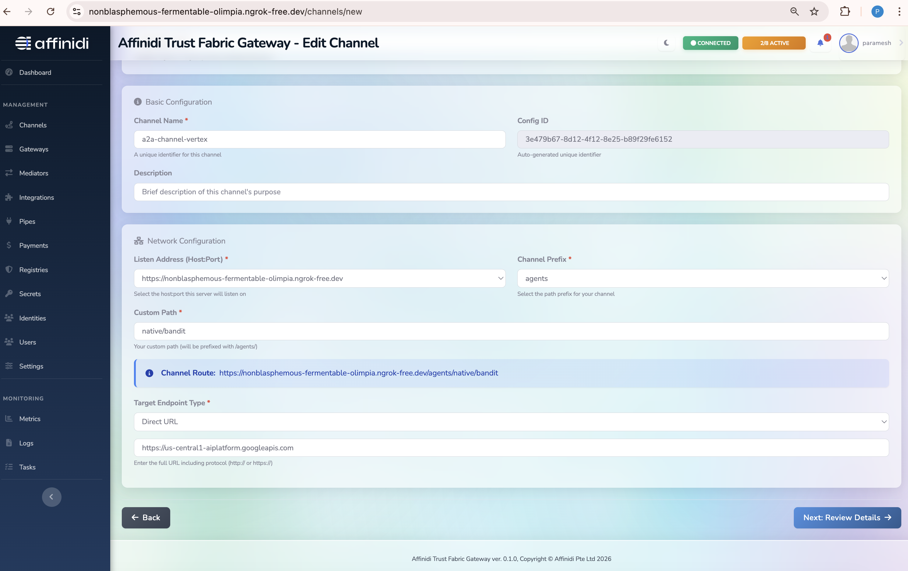

3. Review and click `Create Channel`
   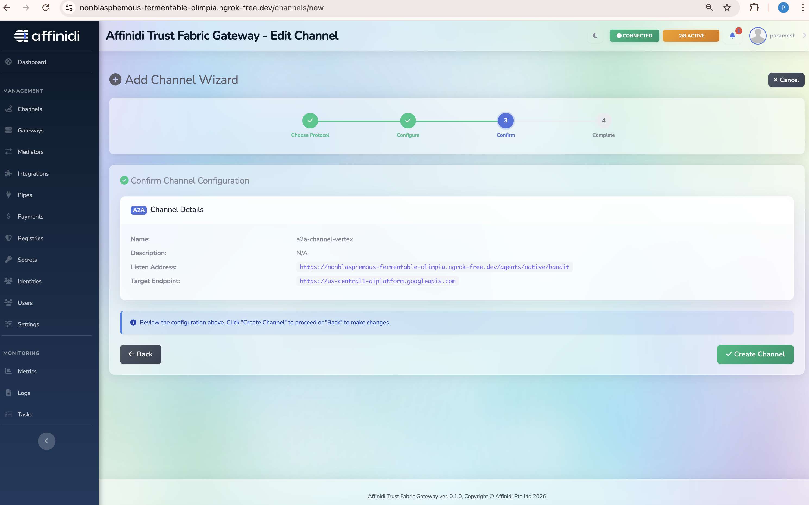

4. Copy the `Channel Route` URL:
   ```
   https://<GATEWAY_HOST>/agents/<CHANNEL_PATH>
   ```
   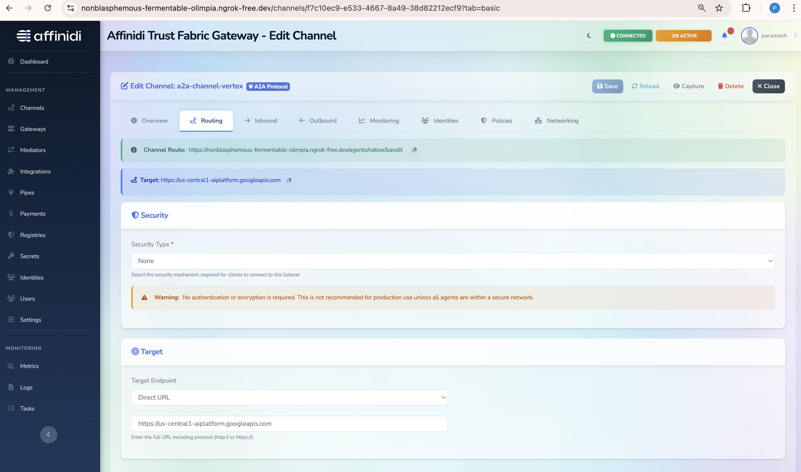

### 3. Test via Trust Gateway

```bash
cd a2a-vertex-agent
./test.sh https://<GATEWAY_HOST>/agents/<CHANNEL_PATH>

# Example:
./test.sh https://pillar-channel.trustgateway.affinidi.io/agents/native/bandit
```

Or run directly:

```bash
python a2a_client.py https://<GATEWAY_HOST>/agents/<CHANNEL_PATH>
```

> The client still contacts the real Vertex AI management API to look up the deployed agent, but all A2A messaging is routed through the Trust Gateway.

View traffic metrics and logs in the channel dashboard after testing.

---

## Create Identity for MCP/A2A Client

The Trust Gateway can issue decentralized identities (DIDs) for your clients on every request.

### Enable Identity for Inbound Clients

1. Edit the MCP/A2A channel you created
2. Click on the `Inbound` tab
3. Under `agentIdentity` meta field, click the `+` button
4. Enter JSON attribute name as `name`, select the `Identity` checkbox, and click save

   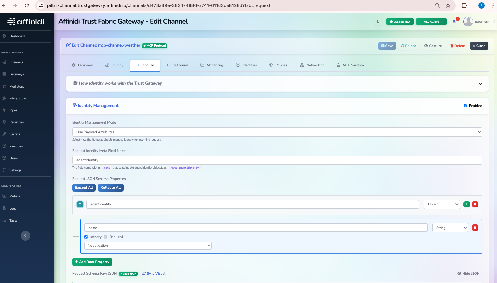

5. Test your client again — the Trust Gateway will now create a decentralized identity for each request

   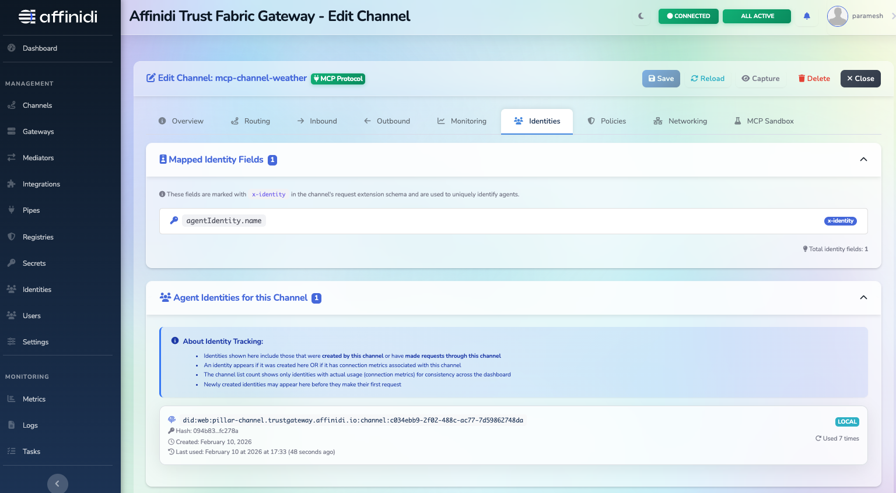
   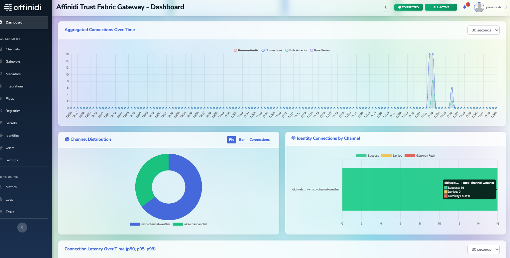

---

## Sample MCP Request & Response Messages

This section shows the complete message flow through the Trust Gateway and how requests are enriched with identity credentials.

### 1. Client Sends MCP Request

```json
{
  "jsonrpc": "2.0",
  "id": 3,
  "method": "tools/call",
  "_meta": {
    "agentIdentity": {
      "name": "MCP Test Client",
      "version": "1.0.0"
    }
  },
  "params": {
    "name": "calculator",
    "arguments": { "operation": "add", "a": 15, "b": 27 }
  }
}
```

### 2. Server Receives Request with Verifiable Identity

The Trust Gateway intercepts the request and injects a cryptographically signed W3C Verifiable Credential proving the agent's identity:

```json
{
  "jsonrpc": "2.0",
  "id": 3,
  "method": "tools/call",
  "_meta": {
    "https://fabric.affinidi.io/extensions/agent-identity-credential/v1": {
      "verifiablePresentation": {
        "@context": ["https://www.w3.org/ns/credentials/v2"],
        "type": ["VerifiablePresentation"],
        "holder": "did:web:pillar-channel.trustgateway.affinidi.io:channel:c034ebb9-2f02-488c-ac77-7d59862748da",
        "verifiableCredential": {
          "type": ["VerifiableCredential", "AgentIdentityCredential"],
          "credentialSubject": {
            "id": "did:web:pillar-channel.trustgateway.affinidi.io:channel:c034ebb9-...",
            "identityFields": { "agentIdentity.name": "MCP Test Client" }
          },
          "issuer": "did:web:pillar-channel.trustgateway.affinidi.io",
          "proof": {
            "type": "DataIntegrityProof",
            "cryptosuite": "eddsa-rdfc-2022",
            "...": "..."
          }
        }
      },
      "did": "did:web:pillar-channel.trustgateway.affinidi.io:channel:c034ebb9-..."
    }
  },
  "params": {
    "name": "calculator",
    "arguments": { "operation": "add", "a": 15, "b": 27 }
  }
}
```

Key fields in the injected credential:

- `holder` — the agent's DID (Decentralized Identifier)
- `credentialSubject.identityFields` — identity metadata from the original request
- `issuer` — the Trust Gateway's DID
- `proof` — cryptographic signature ensuring authenticity

### 3. Server Returns Response

```json
{
  "jsonrpc": "2.0",
  "id": 3,
  "result": {
    "content": [{ "type": "text", "text": "Calculation: 15 + 27 = 42" }]
  },
  "_meta": {
    "agentIdentity": { "name": "Simple MCP Server" }
  }
}
```

## Reporting technical issues

If you have a technical issue with the project's codebase, you can also create an issue directly in GitHub.
