# A2A Agent Identity — Decentralized Identity with Agent Gateway

## Table of Contents

- [1. Overview](#1-overview)
- [2. Run the App](#2-run-the-app)
- [3. Set Up A2A Surfaces in Agent Gateway](#3-set-up-a2a-surfaces-in-agent-gateway)
- [4. Update the GW Route URLs in Settings](#4-update-the-gw-route-urls-in-settings)
- [5. Enable Agent Identity for Your Agents](#5-enable-agent-identity-for-your-agents)
- [6. Fetch the Agent Identity Cards](#6-fetch-the-agent-identity-cards)
- [7. Sample A2A Message Exchange](#7-sample-a2a-message-exchange)

---

## 1. Overview

This lab demonstrates how to give AI agents a **cryptographic, decentralized identity** using [Affinidi Trust Fabric](https://docs.affinidi.com/products/affinidi-trust-fabric/) — a secure proxy infrastructure that provides cryptographic identity, policy enforcement, and observability for AI agent communication.

Instead of trusting an agent just because it says who it is, the Agent Gateway automatically generates a unique **Decentralised Identifier (DID)** for each agent and issues a **Verifiable Presentation (VP)** — cryptographically proving its identity credentials to any caller, verified with Ed25519 signatures.

The identity fields can be **anything you define** — this lab uses `name`, `role`, and `model` as an example. What matters is that the fields declared in your agent card match the schema you configure in the Agent Gateway surface.

The Agent Gateway acts as an intercepting proxy that:

1. **Verifies identity** — assigns a unique DID to each agent based on configurable identity fields
2. **Enforces policies** — applies access rules, rate limits, and circuit breakers
3. **Routes traffic** — forwards requests to target agents or services
4. **Injects metadata** — embeds the signed VP into the agent card response

### Architecture

**Without Agent Gateway — direct A2A traffic**

```
Client / Caller
      │
      ▼
┌─────────────────────────────────────────┐
│            Multi-Agent Server            │
│  ┌─────────────────┐  ┌──────────────┐  │
│  │ Personal Agent  │─▶│ Finance Agent│  │
│  │ /a2a/personal-  │  │ /a2a/finance-│  │
│  │ agent/          │  │ agent/       │  │
│  └─────────────────┘  └──────────────┘  │
└─────────────────────────────────────────┘
```

**With Agent Gateway — agent identity-enabled A2A traffic**

```
         Client / Caller
               │
     ┌─────────┴──────────┐
     ▼                    ▼
┌──────────────┐  ┌──────────────────────┐
│    GW        │  │       GW             │
│  A2A Surface │  │    A2A Surface       │
│  (Personal)  │  │    (Finance)         │
│  Issues VP ✓ │  │    Issues VP ✓       │
└──────┬───────┘  └──────────┬───────────┘
       │  VP injected         │  VP injected
       ▼                      ▼
┌─────────────────────────────────────────┐
│            Multi-Agent Server            │
│  ┌─────────────────┐  ┌──────────────┐  │
│  │ Personal Agent  │─▶│ Finance Agent│  │
│  │  name: Personal │  │  name: Finance│ │
│  │  role: assistant│  │  role: finance│ │
│  │  model: claude  │  │  model: claude│ │
│  └─────────────────┘  └──────────────┘  │
└─────────────────────────────────────────┘
```

The agent's identity fields are **fully customisable** — you define what goes into the credential. This lab uses `name`, `role`, and `model` as the example schema (defined in `identity-extension.json`):

| Field   | Description                 |
| ------- | --------------------------- |
| `name`  | Human-readable agent name   |
| `role`  | The agent's functional role |
| `model` | The underlying LLM model    |

You can add, remove, or rename these fields — as long as the schema in your agent card extension and the identity schema configured in the Agent Gateway surface match.

---

## 2. Run the App

```bash
./run.sh
```

You will be prompted:

```
Use ngrok tunnel? [Y/n]:
```

- Press **Enter** (or type `Y`) to expose the app publicly via ngrok
- Type `n` to run on `localhost:10000` only

Once started, the banner will show your app URL:

```
============================================================
  App is running!
  URL:               https://<your-ngrok-domain>/
  Personal Agent:    https://<your-ngrok-domain>/a2a/personal-agent/
  Finance Agent:     https://<your-ngrok-domain>/a2a/finance-agent/
  Health:            https://<your-ngrok-domain>/health
============================================================
```

**View Agent Cards**

Open each agent card URL in your browser or with curl:

```bash
# Personal Agent
curl https://<your-app-url>/a2a/personal-agent/.well-known/agent.json

# Finance Agent
curl https://<your-app-url>/a2a/finance-agent/.well-known/agent.json
```

Each card contains plain-text identity fields:

**Personal Agent**

```json
{
  "name": "Personal Assistant",
  "description": "...",
  "version": "1.0.0",
  "capabilities": {
    "extensions": [
      {
        "uri": "https://fabric.affinidi.io/extensions/agent-identity-credential/v1",
        "params": {
          "name": "Personal Assistant",
          "role": "Personal Assistant Server",
          "model": "bedrock/claude-3.5-sonnet"
        }
      }
    ]
  }
}
```

**Finance Agent**

```json
{
  "name": "Finance Agent",
  "description": "...",
  "version": "1.0.0",
  "capabilities": {
    "extensions": [
      {
        "uri": "https://fabric.affinidi.io/extensions/agent-identity-credential/v1",
        "params": {
          "name": "Finance Agent",
          "role": "Finance Agent Server",
          "model": "bedrock/claude-3.5-sonnet"
        }
      }
    ]
  }
}
```

---

## 3. Set Up A2A Surfaces in Agent Gateway

You will create **two surfaces** — one for each agent.

1. Log in to the [Affinidi Developer Portal](https://portal.affinidi.com) and open your Agent Gateway instance.
2. Navigate to **Surfaces** and click **Create Agent Surface**.
3. Select the **A2A Surface Starter** template.
4. For the **Personal Agent surface**, set the Target URL:

   ```
   https://<your-ngrok-domain>/a2a/personal-agent
   ```

5. Repeat steps 2–4 for the **Finance Agent surface**, setting the Target URL:

   ```
   https://<your-ngrok-domain>/a2a/finance-agent
   ```

6. Complete surface creation. You will see both surfaces in the list.

   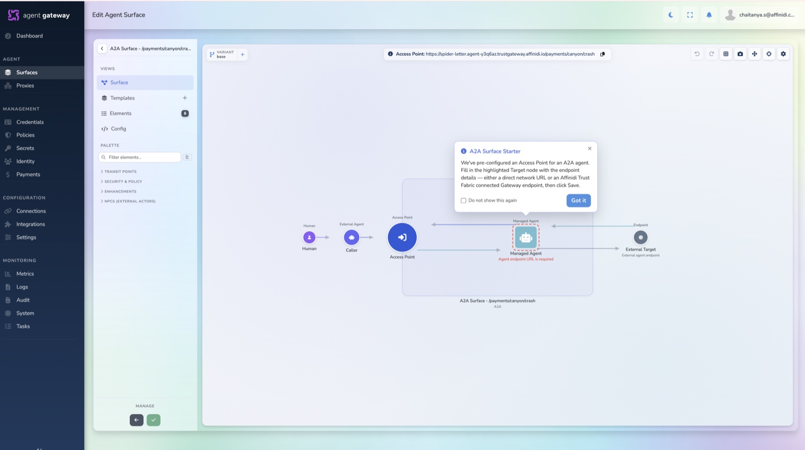
   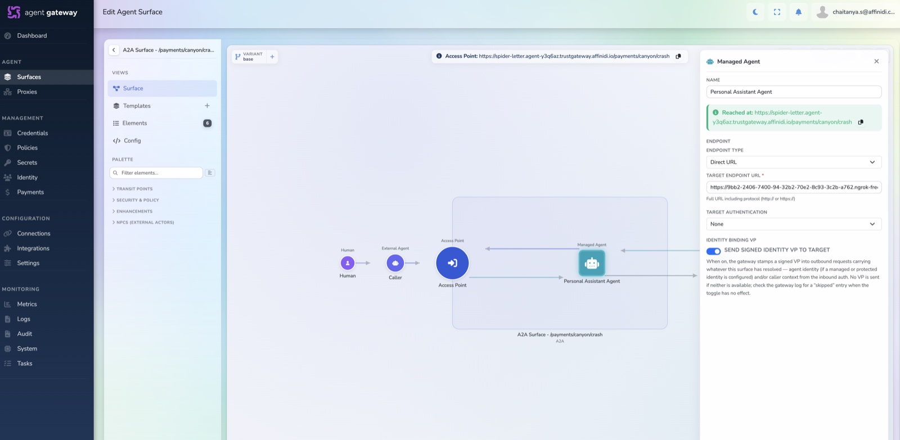
   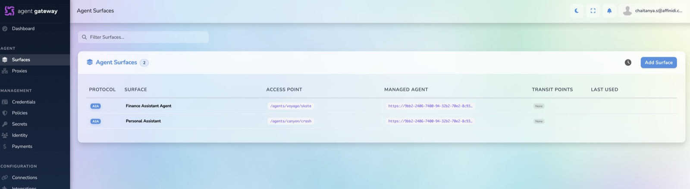

---

## 4. Update the GW Route URLs in Settings

1. Copy the **GW Route URL** from each surface you created.
2. Update your `.env` with both surface Access Point URLs, below is e.g:
   ```
   PERSONAL_AGENT_TG_URL=https://my-gateway.agent-6oduza.agentgateway.affinidi.io/agents/meter/icon
   FINANCE_AGENT_TG_URL=https://my-gateway.agent-6oduza.agentgateway.affinidi.io/agents/budget/magenta
   ```
3. Restart the app. All traffic to both agents will now route through the Agent Gateway instead of hitting them directly.

   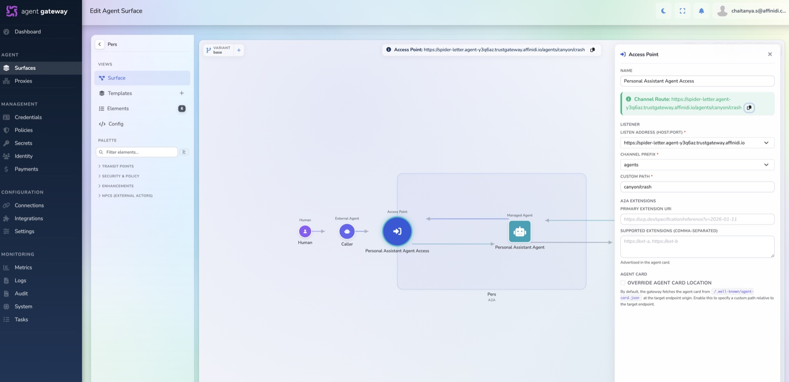
   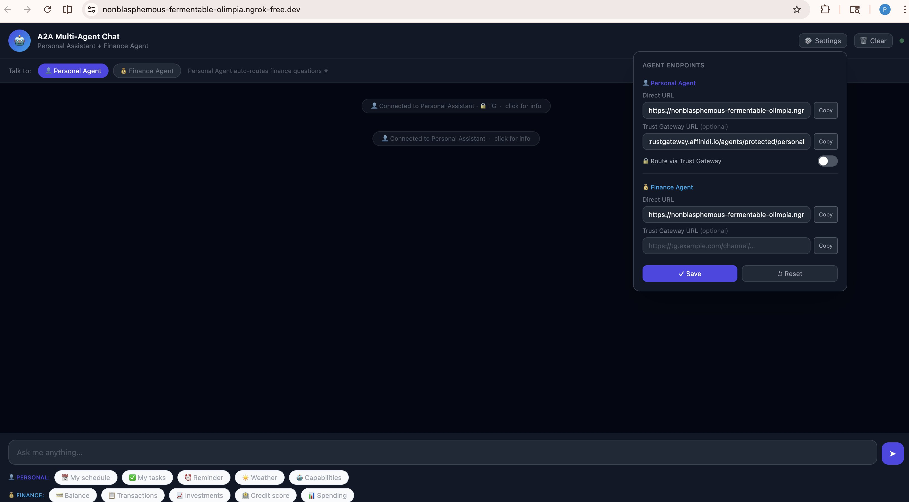
   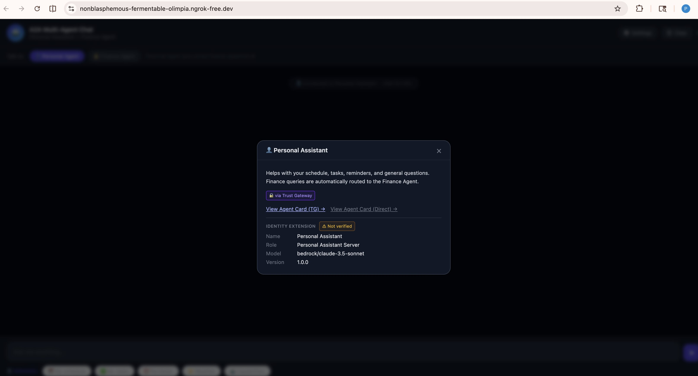

---

## 5. Enable Agent Identity for Your Agents

Repeat the following steps for **both** the Personal Agent surface and the Finance Agent surface.

> **Prerequisite:** For the Agent Gateway to issue a VP, your agent card **must** expose the identity extension (`https://fabric.affinidi.io/extensions/agent-identity-credential/v1`) with your chosen identity fields in its `capabilities.extensions`. This is already configured in this app — see `personal_agent.py` and `finance_agent.py`.

1. Open the surface in the Developer Portal.
2. From the **Enhancements** palette, drag the **Identity** element 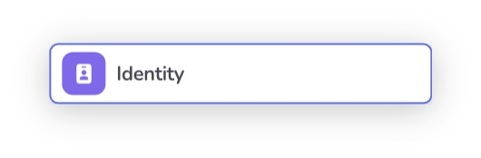 between the Managed Agent and the Access Point, as shown below.

   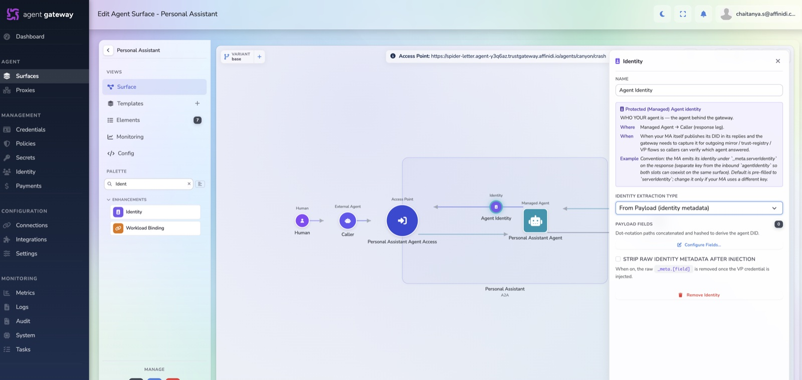

3. Configure the Identity element to derive the agent identity from payload metadata.
4. Paste the identity schema that matches the fields declared in your agent card. This lab uses the schema from `identity-extension.json`:

   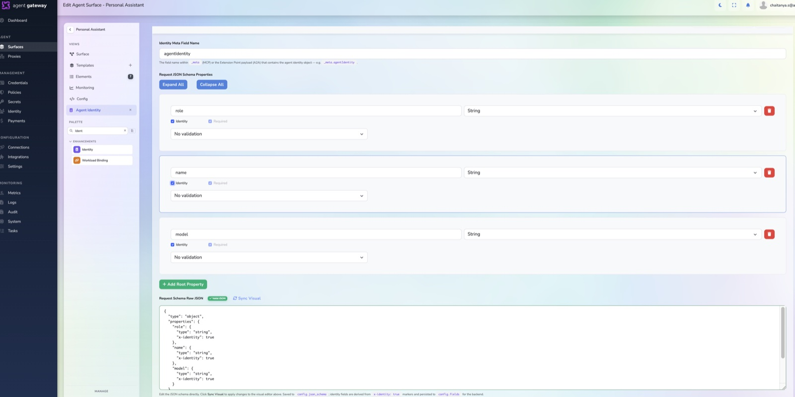

   ```json
   {
     "type": "object",
     "properties": {
       "role": { "type": "string", "x-identity": true },
       "name": { "type": "string", "x-identity": true },
       "model": { "type": "string", "x-identity": true }
     },
     "required": ["role", "name", "model"]
   }
   ```

   > The fields here must match what your agent card exposes in its identity extension params. You can use any field names — they just need to be consistent between the agent card and this schema.

   ```

   This tells the Agent Gateway which fields to read from that agent's card and include in the issued Verifiable Credential.
   ```

> **Note:** Each surface issues a VP specific to its target agent — the Personal Agent surface issues credentials with `"name": "Personal Assistant"` and the Finance Agent surface issues credentials with `"name": "Finance Agent"`.

---

## 6. Fetch the Agent Identity Cards

Now call each agent card through its **GW Route URL**:

```bash
# Personal Agent via Agent Gateway
curl https://<personal-tgw-channel-url>/.well-known/agent.json

# Finance Agent via Agent Gateway
curl https://<finance-tgw-channel-url>/.well-known/agent.json
```

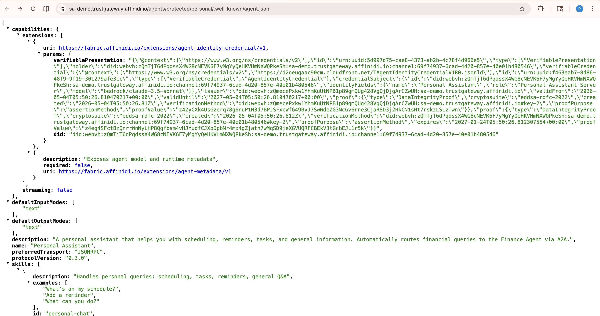
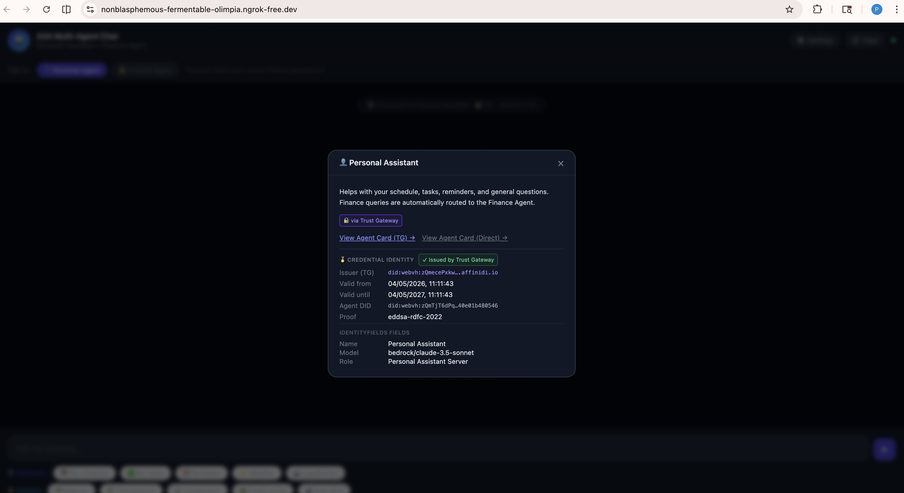

The Agent Gateway will:

1. Call the agent's real card at the target URL
2. Read the identity fields (`name`, `role`, `model`) from the card
3. Issue a **Verifiable Presentation (VP)** signed by the Agent Gateway
4. Inject the VP into the agent card response

**Personal Agent** — returned card with decoded VP:

```json
{
  "name": "Personal Assistant",
  "capabilities": {
    "extensions": [
      {
        "uri": "https://fabric.affinidi.io/extensions/agent-identity-credential/v1",
        "params": {
          "did": "did:webvh:<agent-did>",
          "verifiablePresentation": {
            "@context": ["https://www.w3.org/ns/credentials/v2"],
            "id": "urn:uuid:<uuid>",
            "type": ["VerifiablePresentation"],
            "holder": "did:webvh:<agent-did>",
            "verifiableCredential": {
              "@context": [
                "https://www.w3.org/ns/credentials/v2",
                "https://d2oeuqaac90cm.cloudfront.net/TAgentIdentityCredentialV1R0.jsonld"
              ],
              "type": ["VerifiableCredential", "AgentIdentityCredential"],
              "issuer": "did:webvh:<tgw-did>",
              "validFrom": "2026-05-04T06:21:14Z",
              "validUntil": "2027-05-04T06:21:14Z",
              "credentialSubject": {
                "id": "did:webvh:<agent-did>",
                "identityFields": {
                  "name": "Personal Assistant",
                  "role": "Personal Assistant Server",
                  "model": "bedrock/claude-3.5-sonnet"
                }
              },
              "proof": {
                "type": "DataIntegrityProof",
                "cryptosuite": "eddsa-rdfc-2022",
                "proofPurpose": "assertionMethod",
                "verificationMethod": "did:webvh:<tgw-did>#key-2",
                "proofValue": "<signature>"
              }
            },
            "proof": {
              "type": "DataIntegrityProof",
              "cryptosuite": "eddsa-rdfc-2022",
              "proofPurpose": "assertionMethod",
              "verificationMethod": "did:webvh:<agent-did>#key-2",
              "proofValue": "<signature>"
            }
          }
        }
      }
    ]
  }
}
```

> **Note:** In the actual API response, `verifiablePresentation` is returned as an escaped JSON string. The above shows it decoded for readability.

This VP proves: **"This agent is presenting identity credentials issued by the Agent Gateway"** — cryptographically verifiable by any caller.

---

## 7. Sample A2A Message Exchange

### Request

A caller sends a message to the Personal Agent via the GW Route. The request includes the caller's own identity metadata in `extensions` and `metadata`:

```json
{
  "jsonrpc": "2.0",
  "id": "e03f7173-9c0a-46ab-9ede-67bd596fb7de",
  "method": "message/send",
  "params": {
    "message": {
      "role": "user",
      "parts": [
        {
          "kind": "text",
          "text": "What's my account balance?"
        }
      ],
      "messageId": "6abbfe12-2260-4564-8551-cfe6a04ee4ba",
      "extensions": ["https://fabric.affinidi.io/extensions/agent-identity/v1"],
      "metadata": {
        "https://fabric.affinidi.io/extensions/agent-identity/v1": {
          "name": "Chat App Client",
          "role": "chat app",
          "model": "no modal",
          "version": "1.0.0"
        }
      }
    }
  }
}
```

### Response

The agent responds with the answer. The Agent Gateway injects the agent's **Verifiable Presentation** into the response message's `metadata` under `https://fabric.affinidi.io/extensions/agent-identity-credential/v1`. The VP is decoded below for readability:

```json
{
  "id": "e03f7173-9c0a-46ab-9ede-67bd596fb7de",
  "jsonrpc": "2.0",
  "result": {
    "id": "01ad8024-a2ce-4c36-aaa1-ca32f2825d7d",
    "kind": "task",
    "contextId": "b971635d-ee1a-4016-9d9d-081746718cb6",
    "status": {
      "state": "completed",
      "timestamp": "2026-05-04T12:07:42.796070",
      "message": {
        "role": "agent",
        "kind": "message",
        "messageId": "3c03870c-0cc3-418e-a533-8dc4cd6a6b98",
        "taskId": "01ad8024-a2ce-4c36-aaa1-ca32f2825d7d",
        "contextId": "b971635d-ee1a-4016-9d9d-081746718cb6",
        "parts": [
          {
            "kind": "text",
            "text": "🔀 *Routed to Finance Agent*\n\n💰 **Account Balances for Alex Johnson**\n\n• Checking (****4821): $12,480.55\n• Savings: $34,210.00\n• Investments: $98,750.30\n\n**Total Net Worth (approx):** $145,440.85"
          }
        ],
        "extensions": [
          "https://fabric.affinidi.io/extensions/agent-identity-credential/v1"
        ],
        "metadata": {
          "https://fabric.affinidi.io/extensions/agent-identity-credential/v1": {
            "did": "did:webvh:zQmTjT6dPqd...channel:69f74937",
            "verifiablePresentation": {
              "@context": ["https://www.w3.org/ns/credentials/v2"],
              "id": "urn:uuid:b2ec7d6a-3d5a-4d24-928b-b77699a45314",
              "type": ["VerifiablePresentation"],
              "holder": "did:webvh:zQmTjT6dPqd...channel:69f74937",
              "verifiableCredential": {
                "@context": [
                  "https://www.w3.org/ns/credentials/v2",
                  "https://d2oeuqaac90cm.cloudfront.net/TAgentIdentityCredentialV1R0.jsonld"
                ],
                "id": "urn:uuid:dc132946-ce1d-494f-a241-228bbe71ba68",
                "type": ["VerifiableCredential", "AgentIdentityCredential"],
                "issuer": "did:webvh:zQmecePxkw1Y...sa-demo.trustgateway.affinidi.io",
                "validFrom": "2026-05-04T06:37:42Z",
                "validUntil": "2027-05-04T06:37:42Z",
                "credentialSubject": {
                  "id": "did:webvh:zQmTjT6dPqd...channel:69f74937",
                  "identityFields": {
                    "name": "Personal Assistant",
                    "role": "Personal Assistant Server",
                    "model": "bedrock/claude-3.5-sonnet"
                  }
                },
                "proof": {
                  "type": "DataIntegrityProof",
                  "cryptosuite": "eddsa-rdfc-2022",
                  "proofPurpose": "assertionMethod",
                  "verificationMethod": "did:webvh:zQmecePxkw1Y...#key-2",
                  "proofValue": "zZXoceXUGpeNKttd...proofValue"
                }
              },
              "proof": {
                "type": "DataIntegrityProof",
                "cryptosuite": "eddsa-rdfc-2022",
                "proofPurpose": "assertionMethod",
                "verificationMethod": "did:webvh:zQmTjT6dPqd...channel:69f74937#key-2",
                "proofValue": "z5hJP8K7NcWZhEhN...proofValue"
              }
            }
          }
        }
      }
    }
  }
}
```

**Key observations:**

- The caller identifies itself in the **request** `metadata` using `agent-identity/v1` (name, version)
- The agent's **response** `metadata` carries `agent-identity-credential/v1` — the VP injected by the Agent Gateway
- `credentialSubject.identityFields` contains the identity values read from the agent's card (`name`, `role`, `model`)
- The VP has two `DataIntegrityProof` signatures: one from the **Gateway issuer** (signing the credential) and one from the **channel holder DID** (signing the presentation)
