# A2A DID Auth Lab

A minimal, three-phase demo showing how Agent Gateway can protect an A2A agent
with **DID Auth** — with **zero changes to the agent itself**. Everything
(agent, portal, and the DID Auth caller flow) runs locally; only the gateway
piece needs a public URL.

- `agent.py` — a minimal A2A echo agent. It has no authentication code at all.
- `portal/` — a small web portal used to drive and visualize all three phases,
  showing the exact request/response at every step.

## Table of contents

- [Current flow vs. desired flow](#current-flow-vs-desired-flow)
- [Prerequisites](#prerequisites)
- [Getting started](#getting-started)
- [Phase A — Direct to Agent (no gateway)](#phase-a--direct-to-agent-no-gateway)
- [Phase B — Through the Gateway (no DID Auth yet)](#phase-b--through-the-gateway-no-did-auth-yet)
- [Phase C — Gateway + DID Auth](#phase-c--gateway--did-auth)
- [How the DID Auth flow works](#how-the-did-auth-flow-works)

## Current flow vs. desired flow

**Phase A flow** — you manually walk through three phases in the portal
to see how protection is added incrementally, without touching the agent:

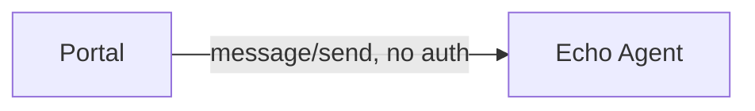

**Phase B flow (Gateway without DID Auth)** — the gateway simply proxies requests
to the agent without any authentication checks:

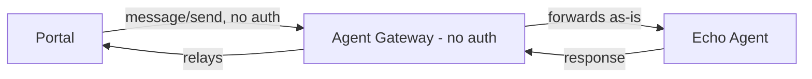

**Phase C flow (Gateway with DID Auth)** — the gateway enforces DID Auth:
every caller must complete a challenge/response to get a session token before
the gateway will forward any A2A traffic:

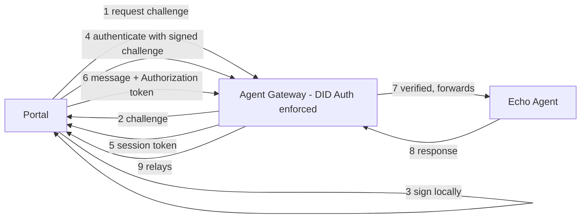

The agent code never changes across all three phases — only what sits in
front of it (nothing → gateway → gateway + DID Auth) changes.

## Prerequisites

- Python 3.10+
- An Agent Gateway instance, for Phases B and C (see
  [feature-guide/gateway-guide.md](../feature-guide/gateway-guide.md) if you
  don't have one yet)
- A public URL for the agent, for Phases B and C (ngrok, GitHub Codespaces, or
  any tunnel) — the gateway needs to reach your agent over the internet

## Getting started

```bash
cd a2a-did-auth
./run.sh
```

This starts both the Echo Agent and the DID Auth Portal, reading ports and
URLs from `.env`. Open the portal at `http://localhost:8090`.

---

## Phase A — Direct to Agent (no gateway)

Message goes straight from the portal to the agent. No gateway, no identity,
no headers.

1. After running the app, open the portal.
2. **Agent Info** shows what the agent does and its URL.

   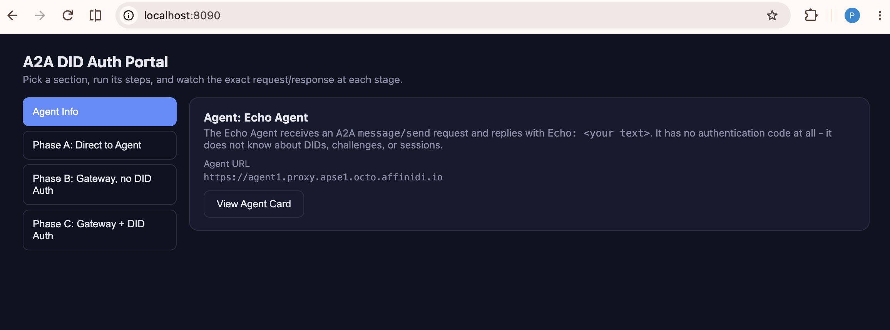

3. Switch to **Phase A** and chat directly with the agent.

   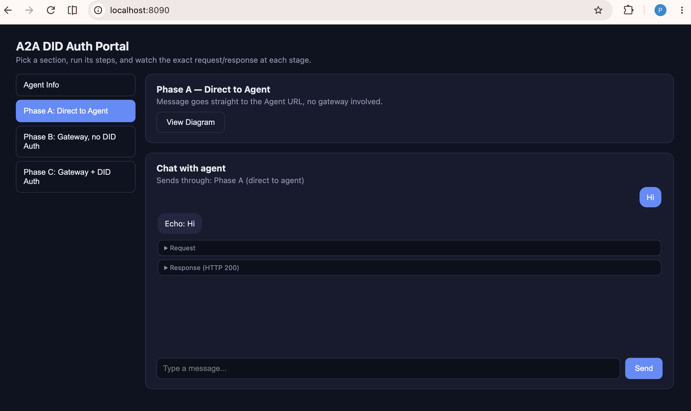

> To move on to Phases B/C, the agent needs to be reachable via a public URL
> (ngrok, GitHub Codespaces, or similar) since Agent Gateway proxies it over
> the internet. Once you have a public URL, update `AGENT_URL` in `.env`.

---

## Phase B — Through the Gateway (no DID Auth yet)

Same plain message, now routed through a gateway surface that simply proxies
to the agent — no authentication is enforced yet.

**Prerequisite:** you need an Agent Gateway. If you don't have one, follow
[feature-guide/gateway-guide.md](../feature-guide/gateway-guide.md) to create
one first.

1. Log in to the gateway dashboard, select **Surfaces** on the left, then
   click **Add surface**.

   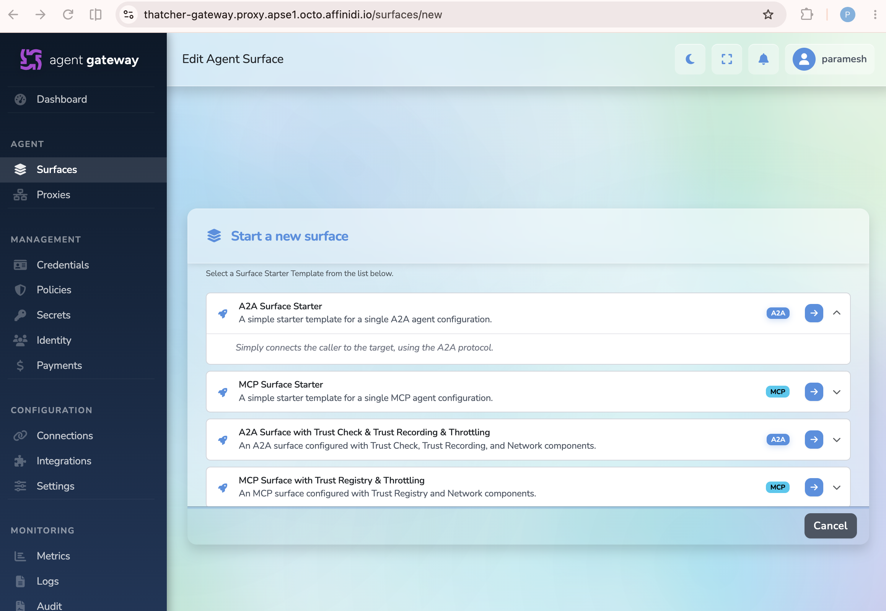

2. Select **A2A surface** and click the arrow button — the gateway scaffolds
   a simple A2A surface for you.

   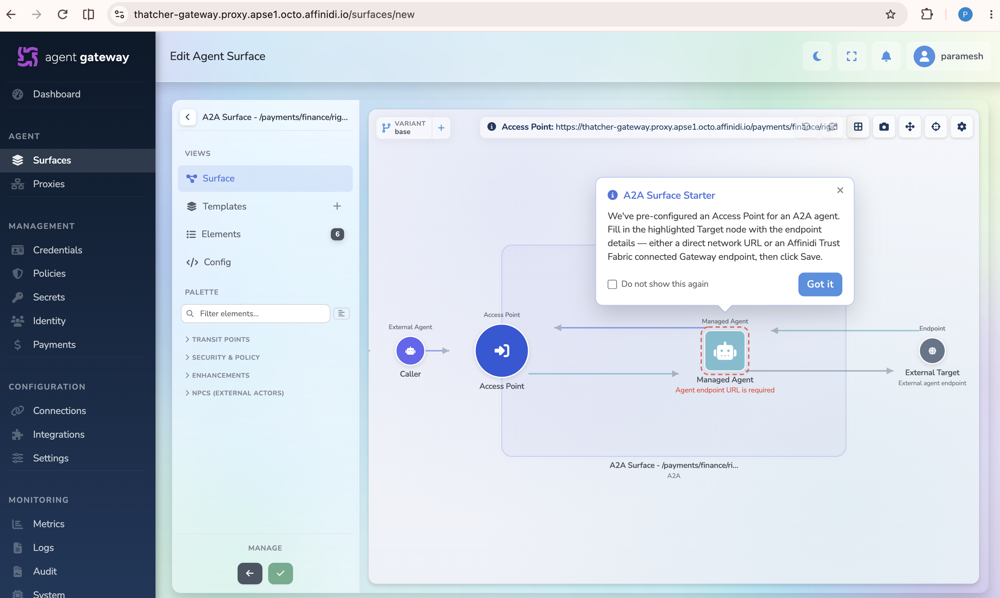

3. Select the surface area and give it a name, e.g. `A2A DID Auth Lab`.

   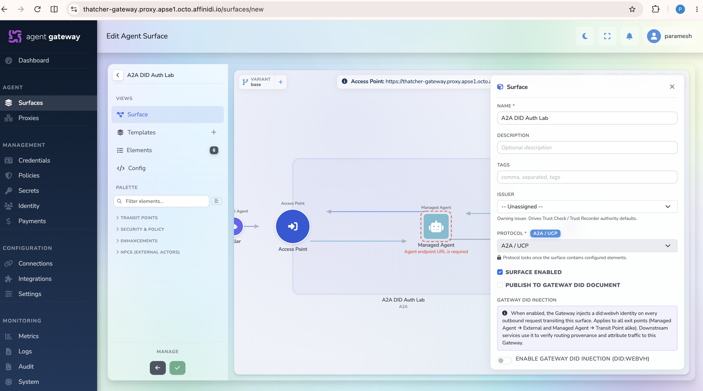

4. Select the **Managed Agent** element inside the surface area and enter
   your public agent URL under **Target Endpoint URL**.

   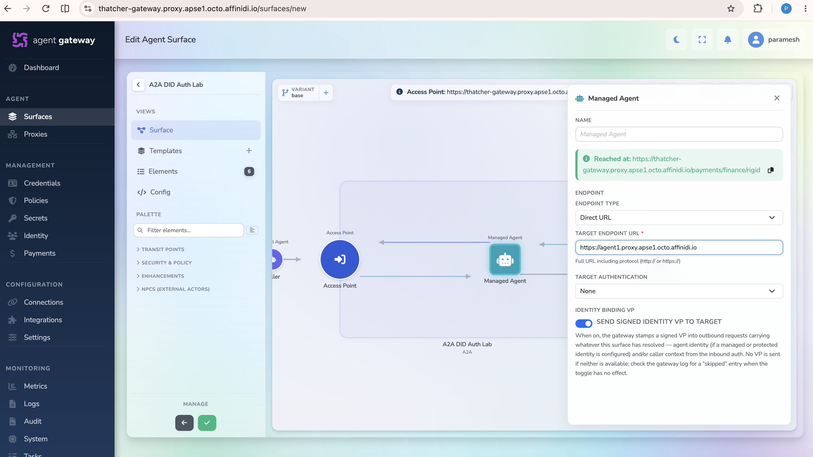

5. Select the **Access Point** element, choose a channel prefix (e.g.
   `agents`), enter a custom path of your choice, copy the resulting channel
   route, then click **Save**.

   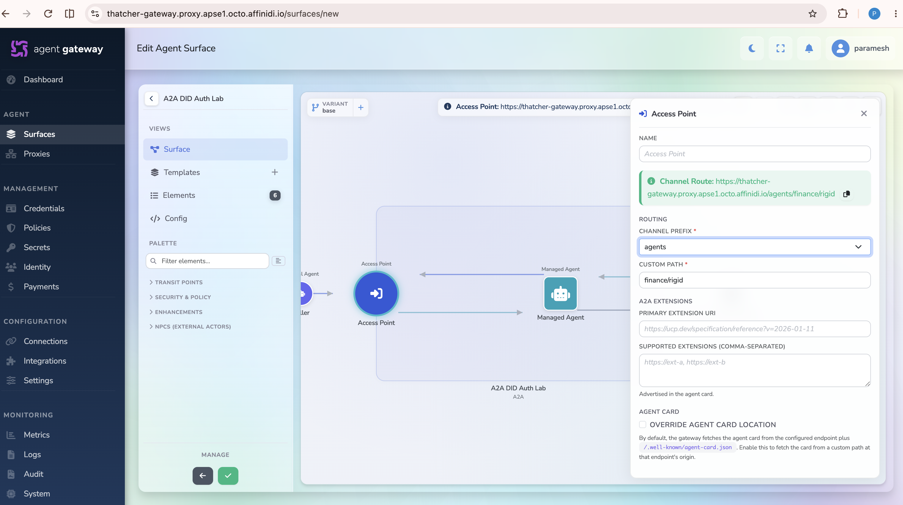
   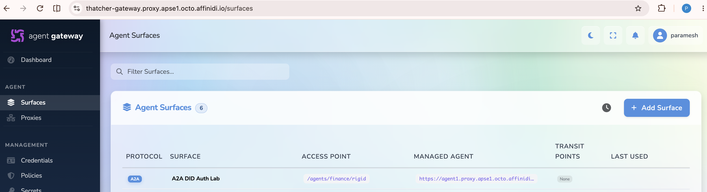

6. Update `GATEWAY_AGENT_URL` in `.env` to the gateway access point URL, e.g.:

   ```env
   GATEWAY_AGENT_URL=https://thatcher-gateway.proxy.apse1.octo.affinidi.io/agents/finance/rigid
   ```

7. Restart the server (`./run.sh`), open the portal, and click the **Phase B**
   tab — you should see the gateway URL pre-filled.

   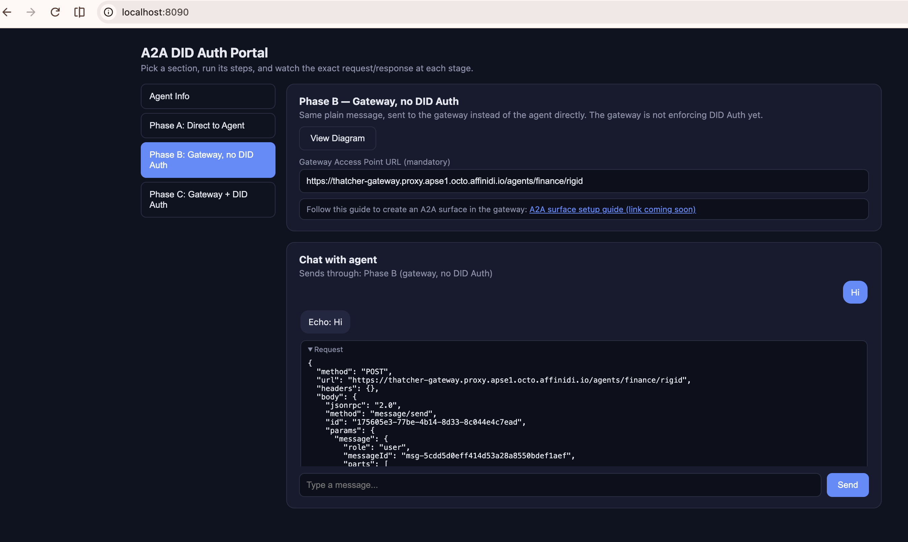

8. Send a message to the agent via the gateway, and observe the traffic
   arriving at the gateway.

   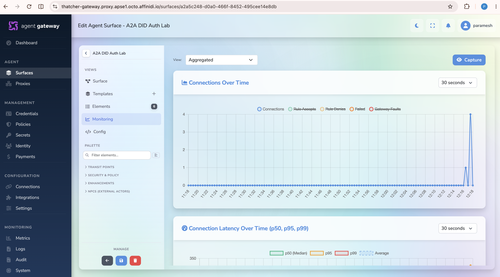

---

## Phase C — Gateway + DID Auth

**Prerequisite:** Phase B must be completed first (the surface already
exists).

1. Open the A2A surface created in Phase B.

   

2. Right now the surface is plain: requests come in through the access point
   and the gateway forwards them straight to the target Echo Agent.

   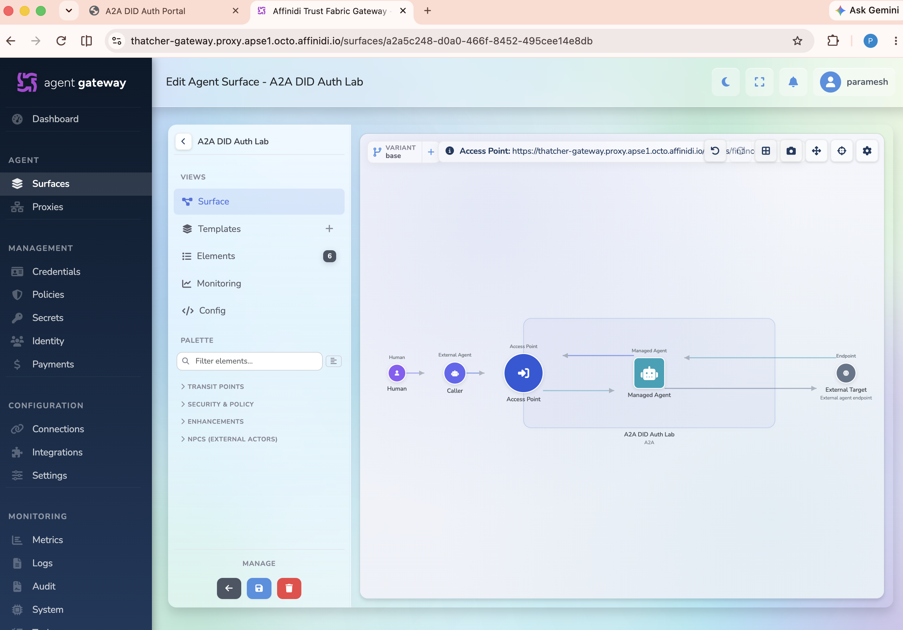

3. Add DID Auth to the access point so a valid DID Auth session token must be
   presented, otherwise the gateway rejects the request with `401`.

   Find the **Caller Context** element in the left palette, under
   **Security & Policy**. Drag it between the **Access Point** and the
   **Managed Agent**, set the authentication method to **DID Auth**, and
   click **Save surface**.

   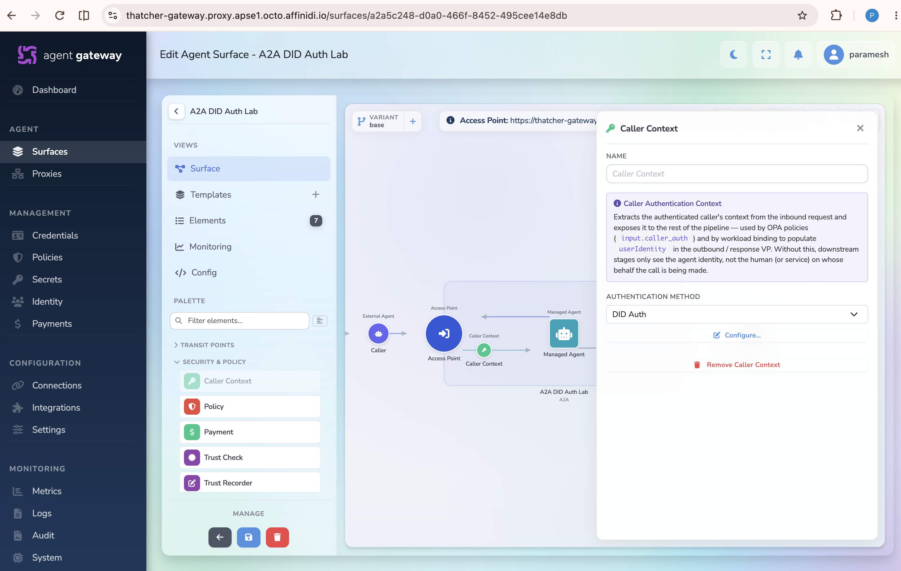

4. Back in the portal, click the **Phase C** tab and try sending a message.
   This time the gateway responds with `401` because no DID Auth session
   token has been established yet — this is expected.

   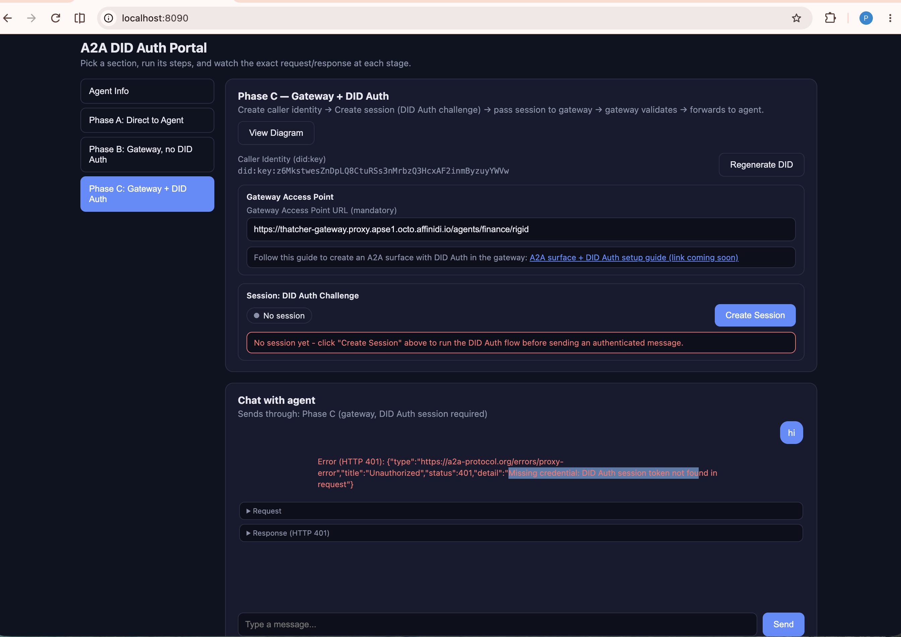

5. Create a DID Auth session using the **Create Session** button. This walks
   through the DID Auth flow: **Request Challenge → Sign Challenge →
   Authenticate**.

   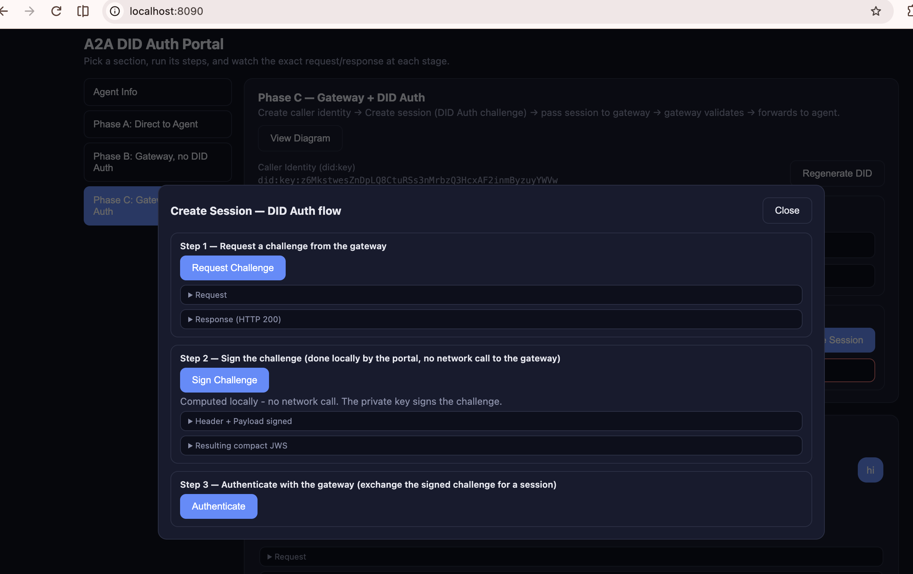

6. Once a session token exists (with its own expiry), sending a message again
   works: the gateway receives the token, validates it, and forwards the
   request to the agent.

   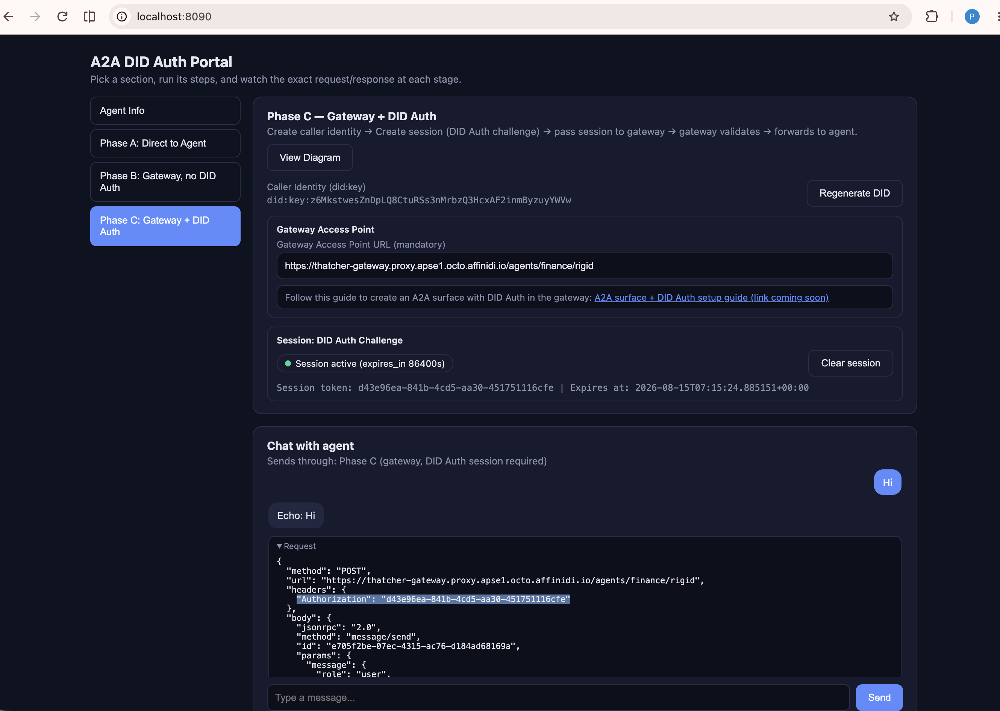

### How the DID Auth flow works

- **Caller Identity (DID)**: the portal creates (or reuses) a `did:key`
  identity for itself. This is a one-time setup, not part of each session.
- **Request Challenge**: the portal asks the gateway for a one-time,
  short-lived challenge tied to its DID.
- **Sign Challenge**: the portal signs the challenge locally with its DID's
  private key, producing a compact EdDSA JWS — no network call is made for
  this step.
- **Authenticate**: the portal submits the signed challenge to the gateway.
  If the signature is valid, the gateway issues a session token with an
  expiry.
- **Authenticated request**: every subsequent A2A message includes the
  session token in the `Authorization` header. The gateway verifies the
  token, resolves the caller's DID, applies any policy, and only then
  forwards the request to the agent — which never sees any of this and
  needs no changes.
