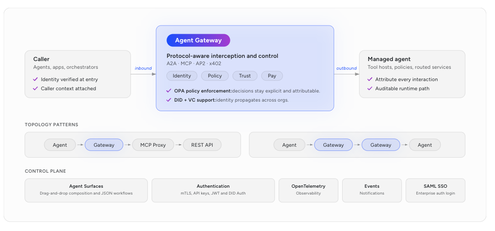

# Agent Gateway

Agent Gateway is an intercepting proxy that sits between callers and managed agent backends, applying identity verification, OPA policy enforcement, and observability to every request — from one configuration layer, without modifying agent or backend code.

Every call becomes verifiable, governed, and auditable.

> **Official Docs:** [Agent Gateway](https://docs.affinidi.com/products/affinidi-trust-fabric/agent-gateway/) · [Overview](https://docs.affinidi.com/products/affinidi-trust-fabric/agent-gateway/overview/)

---

## Agent Gateway Runtime Architecture

---

## What It Does

Agent Gateway sits between callers (agents, apps, orchestrators) and managed backends. It intercepts traffic on both inbound and outbound paths to enforce:

- **Identity** — Derives a deterministic W3C DID from every unique agent configuration. No prior registration or key management required.
- **Access control** — Evaluates OPA Rego policies per request. Allow or deny based on agent identity, JWT claims, or payload content.
- **Trust** — Validates agent identities against a Trust Registry before allowing cross-org communication to proceed.
- **Observability** — Emits metrics to Prometheus, logs to cloud providers, and traces via OpenTelemetry with a correlation ID on every request.
- **Protocol support** — Protocol-aware handling for A2A, MCP, AP2, and x402.
- **Traffic management** — Mirroring, retry logic, circuit breaker, rate limiting, timeouts, URL rewriting, and TLS.

---

## Connection Topologies

| Topology                                | When to use                                                                                                             |
| --------------------------------------- | ----------------------------------------------------------------------------------------------------------------------- |
| **Single Gateway**                      | One organisation, one gateway. Routes all requests through a single control point with identity and policy enforcement. |
| **Gateway to Gateway**                  | Two gateways connected over a DIDComm v2.1 tunnel. No VPN or shared network required.                                   |
| **Gateway to Gateway + Trust Registry** | Cross-org traffic where agent identities must be verified against a shared registry at runtime.                         |

---

## Learn More

| Resource                                                                                          | Description                                                             |
| ------------------------------------------------------------------------------------------------- | ----------------------------------------------------------------------- |
| [Overview](https://docs.affinidi.com/products/affinidi-trust-fabric/agent-gateway/overview/)      | Architecture, capabilities, and adoption patterns                       |
| [Quickstart](https://docs.affinidi.com/products/affinidi-trust-fabric/agent-gateway/get-started/) | Create a surface and send your first governed request                   |
| [Core Concepts](https://docs.affinidi.com/products/affinidi-trust-fabric/agent-gateway/concepts/) | Architecture, protocols, identity model, and federation                 |
| [Guides](https://docs.affinidi.com/products/affinidi-trust-fabric/agent-gateway/how-to-guides/)   | Step-by-step configuration guides                                       |
| [Reference](https://docs.affinidi.com/products/affinidi-trust-fabric/agent-gateway/reference/)    | Field-level reference for surfaces, gateways, and trust registries      |
| [FAQ](https://docs.affinidi.com/products/affinidi-trust-fabric/agent-gateway/faq/)                | Common questions on protocols, identity, access control, and deployment |

---

## Feature Guides

Step-by-step guides in this repository for setting up Agent Gateway and Trust Fabric. Follow the core guides in order.

### Core Guides

1. [Create Agent Gateway](./feature-guide/gateway-guide.md)
2. [Mediator Guide](./feature-guide/mediator-guide.md)
3. [Fabric Connection Guide](./feature-guide/fabric-connection-guide.md)
4. [Trust Registry Guide](./feature-guide/trust-registry-guide.md)

### Additional Guides

- [JWT Strategy Guide](./feature-guide/jwt-strategy-guide.md)
- [Policy Guide](./feature-guide/policy-guide.md)

---

## Next Steps

After completing these guides, use [README.md](./README.md) for the end-to-end examples in this repository, including MCP, A2A, identity, and observability scenarios.
