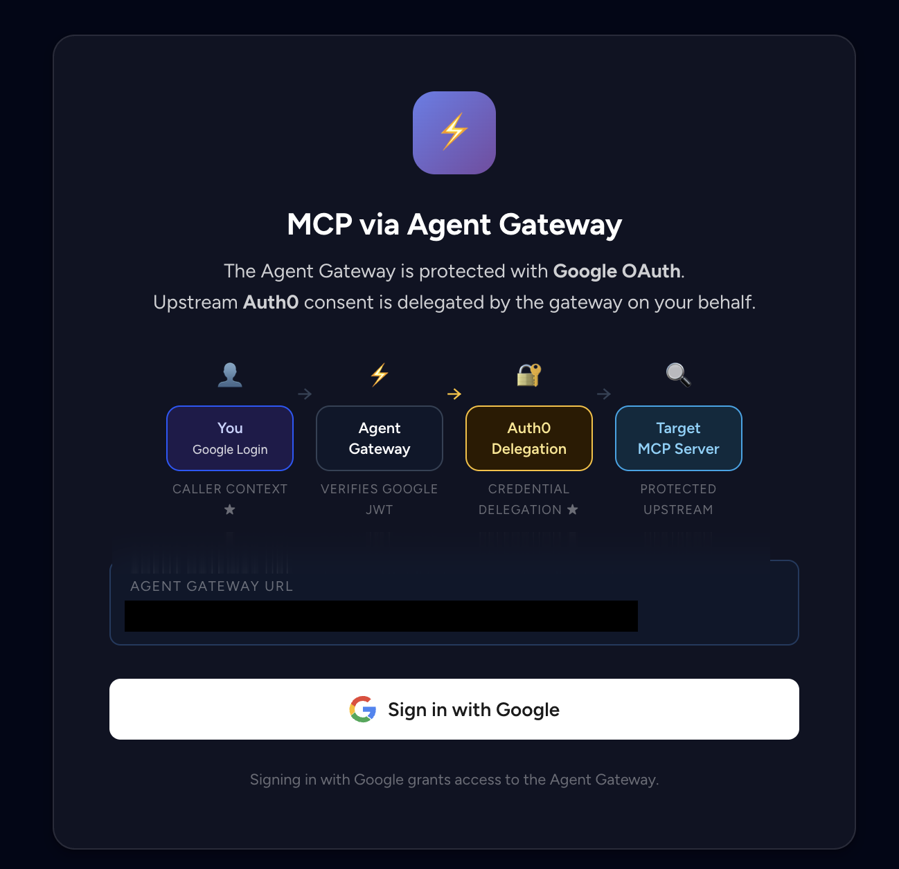
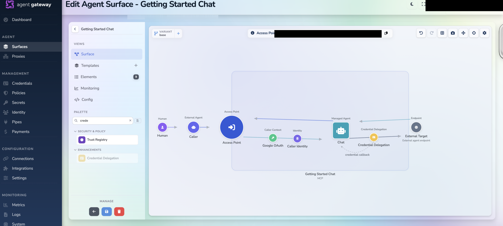
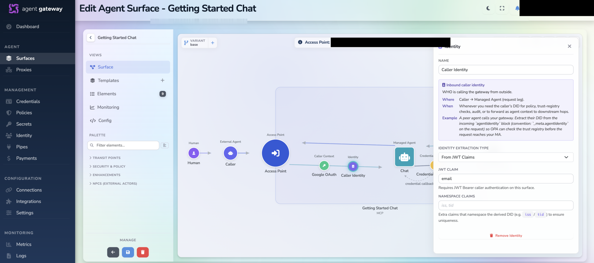
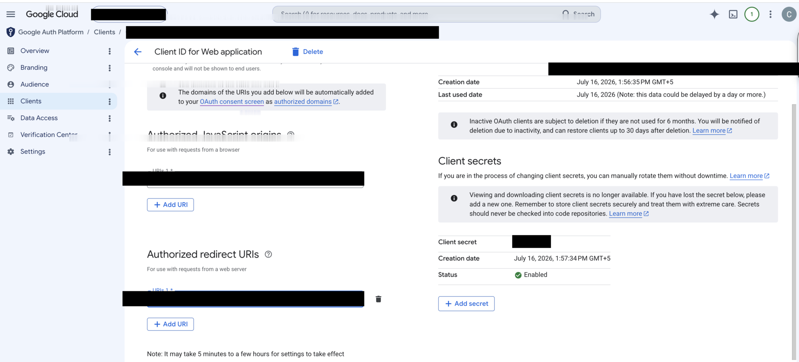
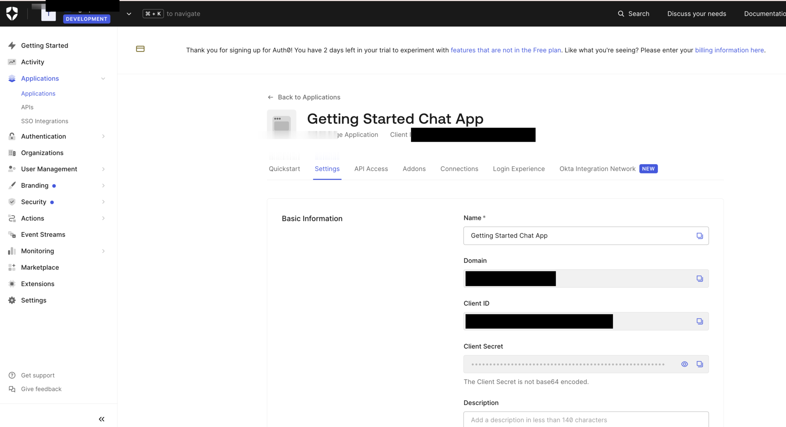
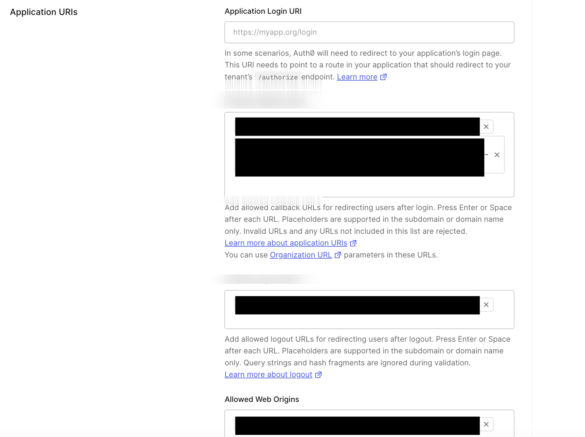
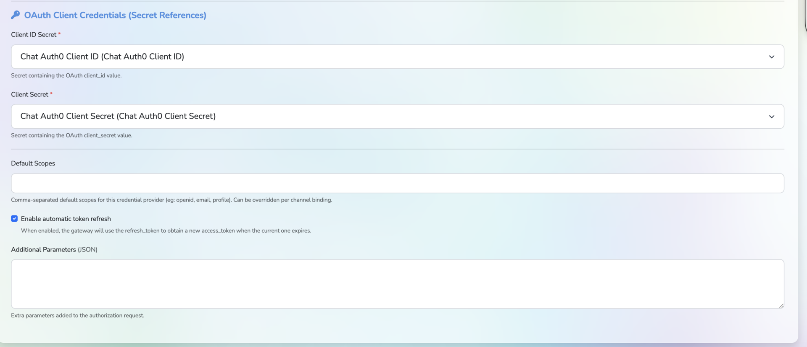
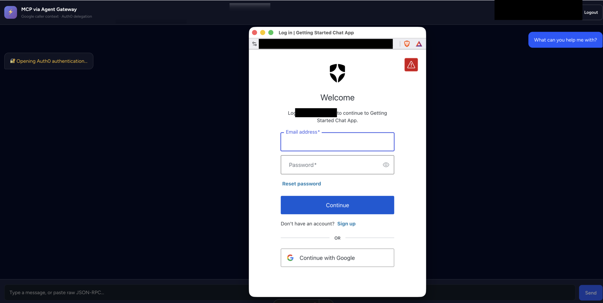

# Getting Started: MCP via Agent Gateway — Google Caller Context + Auth0 Delegation

This guide walks you through the **complete** setup of the `auth0-mcp-surface`
chat demo: a browser app where users sign in with **Google OAuth** (the caller
context), and the **Affinidi Trust Gateway** delegates **Auth0** credentials to
an upstream MCP server on their behalf — with an automatic, popup-based consent
flow.

By the end you will have configured Google, Auth0, and the Trust Gateway, wired
up the app's environment, exposed it publicly, and had a real conversation that
crosses all three trust boundaries.

---

## Overview

The demo exercises **three trust boundaries**:

| Boundary | Mechanism | What it proves |
|----------|-----------|----------------|
| Human → Trust Gateway | Google OAuth JWT (**caller context**) | Who the user is |
| User identity | `email` claim from the Google JWT | Scopes stored credentials per user |
| Trust Gateway → MCP Server | Auth0 OAuth (**credential delegation**) | The upstream credential acted on the user's behalf |

The landing page summarizes the flow:



**Components:**

- **Frontend** — Astro + Alpine.js (served by the backend in single-origin mode)
- **Backend** — FastAPI (Python); proxies MCP requests to the gateway with the Google JWT as a bearer token
- **MCP Server** — Python MCP server exposing a `chat` tool (answers via AWS Bedrock when configured)
- **Trust Gateway** — verifies the Google JWT, delegates Auth0 credentials, and builds a Verifiable Presentation for the MCP server

---

## Prerequisites

- An **Auth0** account (free tier is fine)
- **Google Cloud Console** access (to create an OAuth 2.0 client)
- Access to an **Affinidi Trust Gateway** instance
- **Python 3.10+** and **Node.js 18+**
- **AWS credentials** with Bedrock access (optional — enables real LLM answers; otherwise the `chat` tool runs in stub mode)
- **ngrok** *or* your own public hosting — see [Part 1](#part-1-expose-services-publicly-required)

> ⚠️ **localhost will not work.** OAuth callbacks (Google and Auth0) and the
> gateway's credential-delegation redirect all require **publicly reachable
> HTTPS URLs**. `http://localhost:8642`, `:9740`, `:5137` are fine for the
> processes themselves, but every URL you register with Google, Auth0, and the
> Trust Gateway must be a public ngrok or hosted URL.

---

## Part 1: Expose services publicly (required)

OAuth callbacks require publicly reachable HTTPS URLs — **localhost will not
work**.

Start by exposing your MCP server so you have the public URL needed for configuring the Agent Gateway in Part 2.

### Option A — ngrok (quickest for local dev)

```bash
# Terminal 1 — expose the MCP server
ngrok http 9740
# → Save this HTTPS URL — you'll need it for Part 2 (Agent Gateway Managed Agent configuration)
```

> 💡 **Save this URL** — you'll configure the Agent Gateway's Managed Agent to point at this MCP server URL in Part 2.

You'll also need to expose the backend (port 8642) later, but the MCP server URL is needed first.

### Option B — your own hosting

Deploy behind your company's domain and reverse-proxy ports **8642** (backend)
and **9740** (MCP server). A container build is provided:

```bash
cd auth0-mcp-surface
docker compose up --build
```

### After any URL change, remember to update

- Trust Gateway **External Target** — `https://YOUR_MCP_SERVER_URL` (Part 2)
- Auth0 **Allowed Callback URLs** — from Part 2 credential provider
- Google **Authorized redirect URIs** — Agent Gateway Access Point URL from Part 2
- `backend/.env` — `GATEWAY_URL` (Access Point URL from Part 2)

> ngrok free URLs change on every restart — re-update all places each time.

---

## Part 2: Set up the Trust Gateway MCP surface

Go to **Surfaces → Add Surface → MCP Surface Starter** and build the flow
**Human → Caller → Access Point → Chat (Managed Agent) → External Target**:



### Configure the Managed Agent

1. Select the **Managed Agent** element (labeled "Chat")
2. Set the **Endpoint Type:** `Direct URL`
3. Set the **Target Endpoint URL:** to your MCP server public URL from Part 1
   - Example: `https://your-ngrok-url.ngrok-free.app` or `https://getting-started-chat-mcp.yourcompany.com`


### Configure Access Point

1. **Access Point** — Caller = *Human*
2. **Caller Context** — Select the `Google OAuth` JWT verification strategy (you'll create this in Part 7)

### Configure Caller Identity

Extract the user identity from the JWT:
- **Identity Extraction Type:** `From JWT Claims`
- **JWT Claim:** `email`



### Configure Credential Delegation

Add a delegation to the external target:
- **Provider:** `Chat Auth0 Provider` (you'll create this in Part 6)
- **Binding:** `credential-callback`

### Save and copy URLs

After completing the surface configuration, **copy and save** these two URLs:

1. **Access Point URL** — This is where your app sends MCP requests
   - Example: `https://YOUR_TGW_HOST/routes/CHANNEL_PATH`
   - You'll use this as:
     - `GATEWAY_URL` in `backend/.env` (Part 8)
     - Google OAuth **Authorized redirect URIs** (Part 3)

2. **Credential Provider Callback URL** — This is the Auth0 delegation callback
   - Format: `https://YOUR_TGW_HOST/v1/identity/oauth/callback/chat-auth0-provider`
   - You'll register this in Auth0's **Allowed Callback URLs** (Part 4)

> ⚠️ **Save these URLs now** — you'll need them in Parts 3, 4, and 8.

---

## Part 3: Set up Google OAuth (caller context)

1. In **Google Cloud Console → Google Auth Platform → Clients**, create an
   **OAuth 2.0 Client ID** of type **Web application**.

2. Add **Authorized redirect URIs:**
   - Use the **Access Point URL** from Part 2
   - Example: `https://YOUR_TGW_HOST/routes/CHANNEL_PATH`
   - ⚠️ **NOT** `https://YOUR_BACKEND_URL/api/auth/callback` — the Agent Gateway handles the OAuth callback, not your backend

3. Save the **Client ID** and **Client Secret** — you'll add them to `backend/.env` in Part 8.



---

## Part 4: Set up the Auth0 application

1. In the **Auth0 Dashboard → Applications**, create an application (a **Regular
   Web Application** works well for this demo).

2. Note the **Domain**, **Client ID**, and **Client Secret** from the settings
   page — these become Trust Gateway secrets in [Part 5](#part-5-create-trust-gateway-secrets).

   

3. Configure the **Application URIs**:
   - **Allowed Callback URLs** — add the **Credential Provider Callback URL** from Part 2:
     - `https://YOUR_TGW_HOST/v1/identity/oauth/callback/chat-auth0-provider`
     - ⚠️ This is the **Trust Gateway's** callback, not your app's callback
   - **Allowed Logout URLs** and **Allowed Web Origins** — your frontend URL (optional)

   

> 💡 The authorization and token endpoints are derived from your domain:
> `https://YOUR_AUTH0_DOMAIN/authorize` and `https://YOUR_AUTH0_DOMAIN/oauth/token`.
> See [Discovering Auth0 OAuth endpoints](#reference-discovering-auth0-oauth-endpoints).

---

## Part 5: Create Trust Gateway secrets

In the Trust Gateway console, go to **Secrets** and create the credentials the
gateway will reference (values are never shown again after creation):

| Secret name | Value |
|-------------|-------|
| `Chat Auth0 Client ID` | Auth0 application Client ID (Part 4) |
| `Chat Auth0 Client Secret` | Auth0 application Client Secret (Part 4) |


> **Note:** Google OAuth credentials are configured in `backend/.env` (Part 8), not in the Trust Gateway.

---

## Part 6: Create the Trust Gateway credential provider

Go to **Credentials → New Provider** and configure an OAuth 2.0 provider that
represents Auth0:

- **Name:** `Chat Auth0 Provider`
- **Provider Type:** `OAuth 2.0 — Authorization Code (3-legged, user consent)`
- **Authorization Endpoint:** `https://YOUR_AUTH0_DOMAIN/authorize`
- **Token Endpoint:** `https://YOUR_AUTH0_DOMAIN/oauth/token`
- **Callback URL Host:** `https://YOUR_TGW_HOST`
- **Callback URL Route:** `/v1/identity/oauth/callback/chat-auth0-provider`


For the OAuth client credentials, reference the secrets created in Part 5 (the
provider stores **references**, not the raw values):

- **Client ID Secret:** `Chat Auth0 Client ID`
- **Client Secret:** `Chat Auth0 Client Secret`



> **Important:** Verify the callback URL matches what you registered in Auth0's **Allowed Callback URLs** (Part 4).

---

## Part 7: Set up JWT verification (Google OAuth)

Under **Credentials → JWT Verification**, create a strategy so the gateway can
verify the incoming Google token as the caller context:

- **Name:** `Google OAuth`
- **Expected Issuer:** `https://accounts.google.com`
- **JWKS Source:** Remote URL
- **JWKS URI:** `https://www.googleapis.com/oauth2/v3/certs`


> 🔁 **Return to Part 2** and link this JWT verification strategy to the Access Point's Caller Context if you haven't already.

---

## Part 8: Configure the backend environment

```bash
cd auth0-mcp-surface/backend
cp .env.example .env
```

Fill in:

```bash
GOOGLE_CLIENT_ID=<from Part 3>
GOOGLE_CLIENT_SECRET=<from Part 3>
GATEWAY_URL=<Access Point URL from Part 2>
BACKEND_URL=<your public backend URL>      # e.g. https://<subdomain>.ngrok-free.app
FRONTEND_URL=<your public frontend URL>    # leave unset for single-origin
```

> **Backend URL:** If you haven't exposed the backend yet, run:
> ```bash
> ngrok http 8642
> ```
> Copy the HTTPS URL into `BACKEND_URL`.

See [configuration.md](configuration.md) for the full variable reference.

---

## Part 9: Configure the MCP server environment

```bash
cd auth0-mcp-surface/mcp-server
cp .env.example .env
```

For real LLM answers (otherwise the `chat` tool runs in stub mode):

```bash
BEDROCK_MODEL_ID=anthropic.claude-3-haiku-20240307-v1:0
AWS_REGION=ap-southeast-1
# AWS credentials come from the standard chain (env, shared profile, or SSO role).
# `make chat-auth0-mcp` auto-refreshes them from AWS SSO.
PORT=9740
```

---

## Part 10: Run the application

### What you will build

A browser-based chat interface where:
- Users sign in with **Google OAuth** (landing page with Google sign-in button)
- After login, they see a chat screen with a message input
- First message triggers **automatic Auth0 consent popup** if no credentials are stored
- After consent, the chat works seamlessly — messages are answered by the `chat` tool
- The `chat` tool uses **AWS Bedrock** (Claude Haiku) when configured, otherwise returns stub responses


### Start the services

From the repo root:

```bash
make chat-auth0-mcp          # MCP server on :9740 (auto-refreshes AWS SSO creds)
make chat-auth0-local-up     # frontend :5137 + backend :8642 + MCP server
```

### Test the flow

1. Open your **public backend URL** (ngrok or hosted) in the browser.
2. Click **Sign in with Google**. After login you land on the chat screen.
3. Send your **first message**. The gateway verifies your Google JWT and, if it
   has no stored Auth0 credential for you yet, an **Auth0 login popup opens
   automatically**:

   

4. Authenticate with Auth0. The popup closes, the request **retries
   automatically**, and the chat response appears — powered by AWS Bedrock (if configured) or stub mode.

> **Note:** The chat MCP server's `chat` tool uses **AWS Bedrock** (Claude Haiku) when `BEDROCK_MODEL_ID` is set in `mcp-server/.env`. Without AWS credentials, it runs in stub mode with mock responses.

See [docs/delegation-and-consent.md](docs/delegation-and-consent.md) for the full
consent/retry mechanics.

---

## Troubleshooting

**OAuth errors**
- *Redirect URI mismatch* — the URL registered in Google must match the **Access Point URL** from Part 2.
- *Invalid callback URL* — the gateway delegation callback must be in Auth0's
  **Allowed Callback URLs** (Part 4).
- *Popup blocked* — allow popups for your domain; a manual fallback link is shown.

**Authentication errors**
- *`consent_required` persists after auth* — check the provider's Client
  ID/Secret **references** point at the correct secrets (Part 6).
- *Google login fails* — verify the Google client credentials in `backend/.env`.

**Service errors**
- *Bedrock error* — check AWS credentials / region in `mcp-server/.env`.
- *Connection refused* — MCP server not running, or the gateway can't reach the
  External Target URL.
- *CORS errors* — see [cors-and-preflight.md](cors-and-preflight.md).

**Common mistakes**
- Using localhost URLs (OAuth requires public URLs).
- Forgetting to update all URL locations after an ngrok restart.
- Using backend URL for Google OAuth redirect (should be Access Point URL).

---

## Architecture explained

**Boundary 1 — Human → Trust Gateway.** The user's Google OAuth JWT is the
caller context; the gateway validates its signature against Google's JWKS.

**Boundary 2 — Trust Gateway → MCP Server.** The gateway delegates the user's
Auth0 credential and builds a **Verifiable Presentation** for the MCP server.

**Boundary 3 — User identity.** The `email` claim is the identity used to scope
the stored Auth0 credential in the gateway vault.

More detail in [architecture.md](architecture.md).

---

## Reference: Discovering Auth0 OAuth endpoints

Rather than hand-typing the authorization/token endpoints, use the **OpenID
Connect Discovery** document every Auth0 tenant exposes:

```bash
curl https://YOUR_AUTH0_DOMAIN/.well-known/openid-configuration \
  | jq -r '.authorization_endpoint, .token_endpoint'
```

Example response (trimmed):

```json
{
  "issuer": "https://YOUR_AUTH0_DOMAIN/",
  "authorization_endpoint": "https://YOUR_AUTH0_DOMAIN/authorize",
  "token_endpoint": "https://YOUR_AUTH0_DOMAIN/oauth/token",
  "jwks_uri": "https://YOUR_AUTH0_DOMAIN/.well-known/jwks.json"
}
```

Copy `authorization_endpoint` and `token_endpoint` straight into the credential
provider (Part 6). This is standard across all OpenID providers (Auth0, Okta,
Google, Azure AD) and stays correct even if endpoint layouts change.
