# Getting Started: MCP via Agent Gateway — OAuth Caller Context + Credential Delegation

This guide walks you through setting up a complete MCP chat demo with OAuth-based identity and credential delegation through the Affinidi Agent Gateway.

By the end, you'll have a browser app where users sign in with Google OAuth, and the Agent Gateway automatically delegates Auth0 credentials to an upstream MCP server with a seamless, popup-based consent flow.

---

## What You Will Build

A browser-based chat interface demonstrating the complete trust flow:

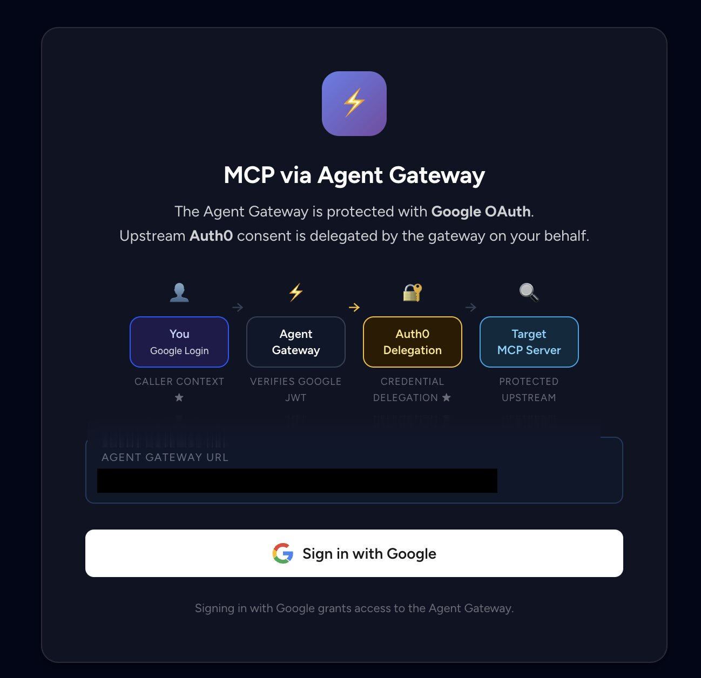

- Users sign in with Google OAuth (caller context)
- After login, they see a chat screen
- First message triggers automatic Auth0 consent popup if credentials aren't stored
- After consent, chat works seamlessly — messages answered by the `chat` tool (AWS Bedrock or stub mode)

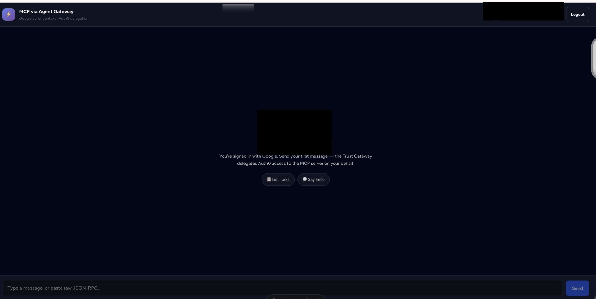

---

## Understanding the Three Trust Boundaries

This demo exercises three distinct trust boundaries:

| Boundary | Mechanism | What it proves |
|----------|-----------|----------------|
| **Human → Agent Gateway** | Google OAuth JWT (caller context) | Who the user is |
| **User identity** | `email` claim from the Google JWT | Scopes stored credentials per user |
| **Agent Gateway → MCP Server** | Auth0 OAuth (credential delegation) | The upstream credential acted on the user's behalf |

For more details, see the [Agent Gateway Overview](https://docs.affinidi.com/products/affinidi-trust-fabric/agent-gateway/) and [architecture documentation](docs/architecture.md).

**Components:**

- **Frontend** — Astro + Alpine.js (served by backend in single-origin mode)
- **Backend** — FastAPI (Python); proxies MCP requests to the gateway with Google JWT as bearer token
- **MCP Server** — Python MCP server exposing a `chat` tool (uses AWS Bedrock when configured, otherwise stub mode)
- **Agent Gateway** — verifies Google JWT, delegates Auth0 credentials, builds Verifiable Presentation for MCP server

---

## Prerequisites

Before starting, ensure you have:

- **Auth0** account (free tier works)
- **Google Cloud Console** access (to create OAuth 2.0 client)
- Access to an **Affinidi Agent Gateway** instance
- **Python 3.10+** and **Node.js 18+**
- **ngrok** or your own public hosting (see [Part 1](#part-1-expose-the-mcp-server))
- **AWS credentials** with Bedrock access (optional — enables real LLM answers; otherwise runs in stub mode)

**Important:** Localhost will NOT work. OAuth callbacks (Google and Auth0) and the gateway's credential-delegation redirect all require publicly reachable HTTPS URLs. `http://localhost:8642`, `:9740`, `:5137` are fine for the processes themselves, but every URL you register with Google, Auth0, and the Agent Gateway must be a public ngrok or hosted URL.

---

## Part 1: Expose the MCP Server

Why this comes first: The Agent Gateway needs the MCP server's public URL during configuration (Part 3). You must expose it before setting up the Gateway.

### 1. Start the MCP server locally

```bash
cd auth0-mcp-surface/mcp-server
cp .env.example .env
# Edit .env if you want real LLM responses (AWS Bedrock) — optional, stub mode works without it
python -m venv venv
source venv/bin/activate  # On Windows: venv\Scripts\activate
pip install -r requirements.txt
python mcp_server.py
# Server starts on port 9740
```

**AWS Bedrock (optional):** If `BEDROCK_MODEL_ID` is set in `mcp-server/.env`, the `chat` tool uses AWS Bedrock (Claude Haiku). Without AWS credentials, it runs in stub mode with mock responses. See `mcp-server/.env.example` for configuration details.

### 2. Expose the MCP server publicly

OAuth requires publicly reachable HTTPS URLs — localhost will not work.

#### Option A — ngrok (quickest for local dev)

```bash
# In a new terminal
ngrok http 9740
```

Copy the HTTPS URL (e.g., `https://abc123.ngrok-free.app`).

**Save this URL** — you'll configure the Agent Gateway's Managed Agent to point at this MCP server URL in Part 3.

#### Option B — your own hosting

Deploy behind your company's domain and reverse-proxy port 9740. A Docker build is provided:

```bash
cd auth0-mcp-surface
docker compose up --build
```

### 3. After any URL change, remember to update

- Agent Gateway **External Target** — `https://YOUR_MCP_SERVER_URL` (Part 3)
- Auth0 **Allowed Callback URLs** — from Part 3 credential provider
- Google **Authorized redirect URIs** — Agent Gateway Access Point URL from Part 3
- `backend/.env` — `GATEWAY_URL` (Access Point URL from Part 3)

**Note:** ngrok free URLs change on every restart — you'll need to re-update all places each time.

---

## Part 2: Set Up External OAuth Providers

Create the Google and Auth0 applications now, but don't configure callback URLs yet — you'll get the correct URLs from the Agent Gateway in Part 3.

These two steps can be done in parallel.

### Part 2A — Google OAuth Client

1. Go to **Google Cloud Console → Google Auth Platform → Clients**
2. Create an **OAuth 2.0 Client ID** of type **Web application**
3. Save the **Client ID** and **Client Secret** — you'll add them to `backend/.env` in Part 5

**Don't configure Authorized redirect URIs yet** — the Agent Gateway Access Point URL is needed first (you'll get it in Part 3).

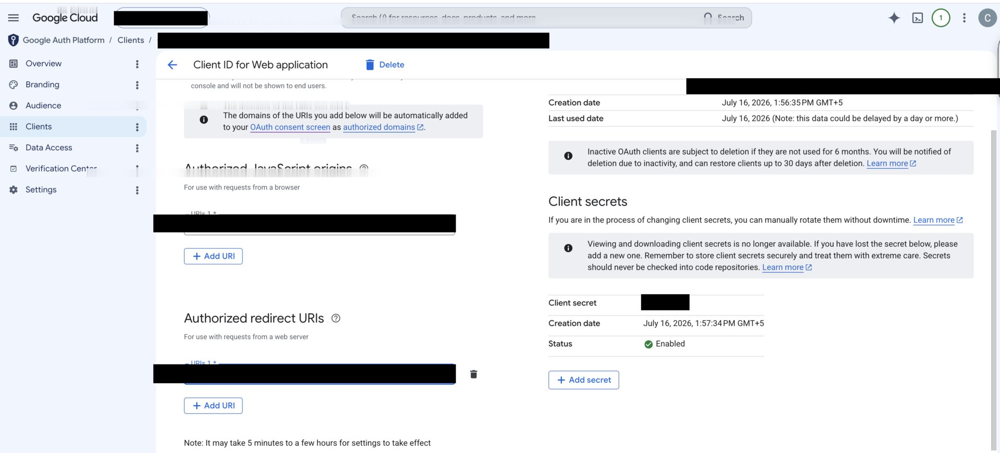

### Part 2B — Auth0 Application

1. In **Auth0 Dashboard → Applications**, create a **Regular Web Application**
2. Note the **Domain**, **Client ID**, and **Client Secret** from the settings page — these become Agent Gateway secrets in Part 3

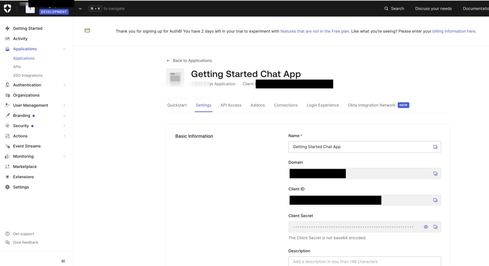

**Don't configure Allowed Callback URLs yet** — the Agent Gateway Credential Provider Callback URL is needed first (you'll get it in Part 3).

For help discovering Auth0 OAuth endpoints, see the [Reference section](#reference-discovering-auth0-oauth-endpoints) at the end.

---

## Part 3: Configure the Agent Gateway

Now you'll set up the complete MCP surface in the Agent Gateway. This produces the critical URLs needed for Parts 4 and 5.

For more background on surfaces, caller context, and credential delegation, see the [Agent Gateway Core Concepts](https://docs.affinidi.com/products/affinidi-trust-fabric/agent-gateway/core-concepts/) documentation.

### Step 1: Create Gateway Secrets

The Agent Gateway stores credentials as secrets — you'll reference these (not paste the raw values) in the Credential Provider.

1. Go to the Agent Gateway console → **Secrets**
2. Create the following secrets with values from Part 2B:

| Secret name | Value |
|-------------|-------|
| `Chat Auth0 Client ID` | Auth0 application Client ID (Part 2B) |
| `Chat Auth0 Client Secret` | Auth0 application Client Secret (Part 2B) |

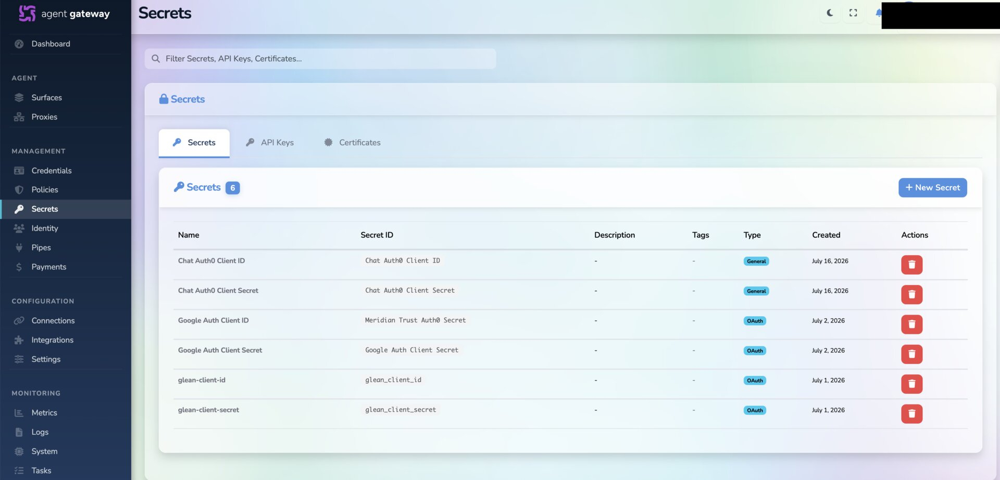

**Note:** Values are never shown again after creation — save them if you need a copy. Google OAuth credentials are configured in `backend/.env` (Part 5), not in the Agent Gateway.

### Step 2: Create JWT Verification Strategy

The Gateway needs to verify incoming Google OAuth JWTs (caller context).

1. Go to **Credentials → JWT Verification**
2. Create a new strategy:
   - **Name:** `Google OAuth`
   - **Expected Issuer:** `https://accounts.google.com`
   - **JWKS Source:** Remote URL
   - **JWKS URI:** `https://www.googleapis.com/oauth2/v3/certs`

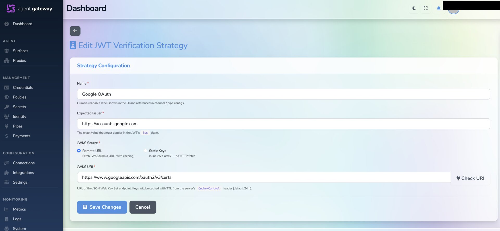

<!-- TODO: Add link to JWT Verification docs when available -->

### Step 3: Create Credential Provider

The Credential Provider handles Auth0 OAuth delegation (gateway → MCP server).

1. Go to **Credentials → New Provider**
2. Configure the OAuth 2.0 provider:
   - **Name:** `Chat Auth0 Provider`
   - **Provider Type:** `OAuth 2.0 — Authorization Code (3-legged, user consent)`
   - **Authorization Endpoint:** `https://YOUR_AUTH0_DOMAIN/authorize`
   - **Token Endpoint:** `https://YOUR_AUTH0_DOMAIN/oauth/token`
   - **Callback URL Host:** `https://YOUR_GW_HOST`
   - **Callback URL Route:** `/v1/identity/oauth/callback/chat-auth0-provider`

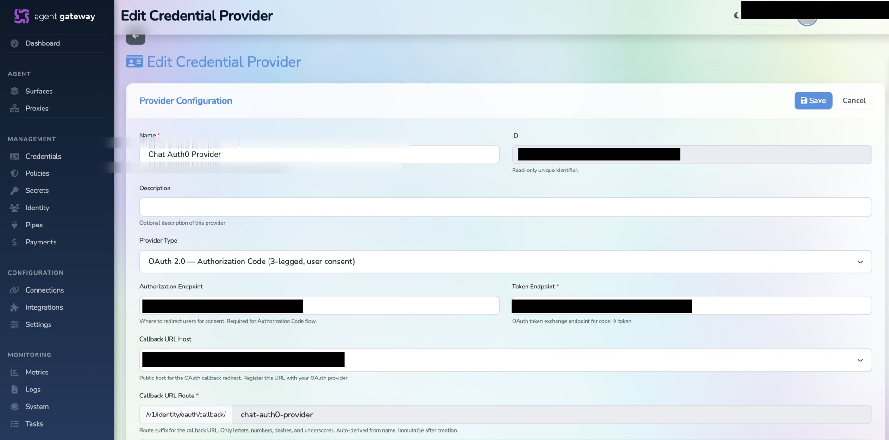

3. For the OAuth client credentials, reference the secrets created in Step 1:
   - **Client ID Secret:** `Chat Auth0 Client ID`
   - **Client Secret:** `Chat Auth0 Client Secret`

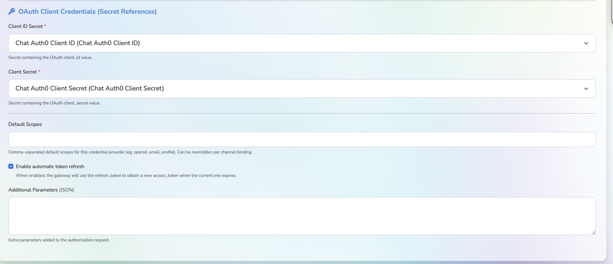

**Save the Callback URL** — you'll register this in Auth0's Allowed Callback URLs in Part 4.

Format: `https://YOUR_GW_HOST/v1/identity/oauth/callback/chat-auth0-provider`

<!-- TODO: Add link to Credential Delegation docs when available -->

### Step 4: Create the MCP Surface

Now you'll build the complete flow: Human → Caller → Access Point → Chat (Managed Agent) → External Target

1. Go to **Surfaces → Add Surface → MCP Surface Starter**

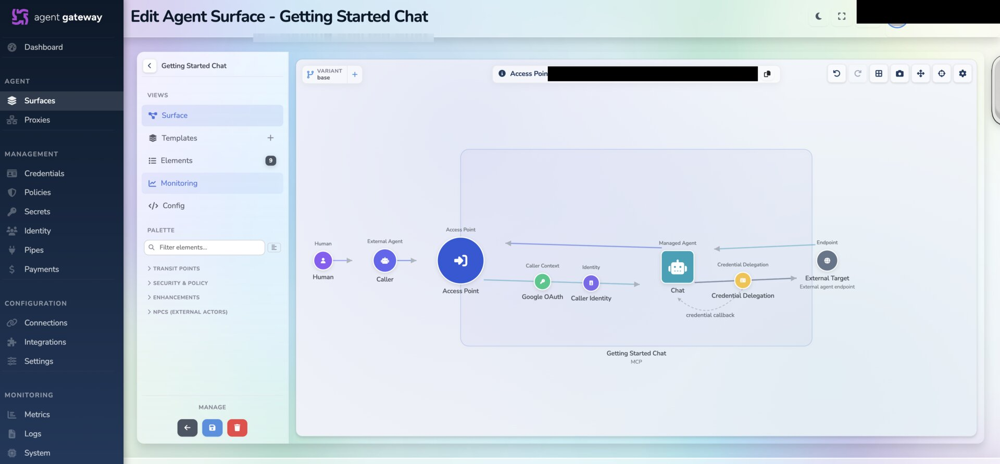

2. Configure the Managed Agent (labeled "Chat"):
   - Select the **Managed Agent** element
   - Set **Endpoint Type:** `Direct URL`
   - Set **Target Endpoint URL:** to your MCP server public URL from Part 1
     - Example: `https://your-ngrok-url.ngrok-free.app` or `https://getting-started-chat-mcp.yourcompany.com`

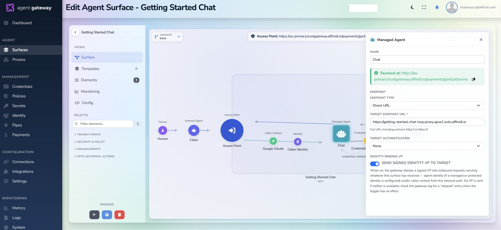

3. Configure the Access Point:
   - **Caller:** Human
   - **Caller Context:** Select the `Google OAuth` JWT verification strategy (created in Step 2)

4. Configure Caller Identity:
   - Extract the user identity from the JWT to scope credentials per user
   - **Identity Extraction Type:** `From JWT Claims`
   - **JWT Claim:** `email`

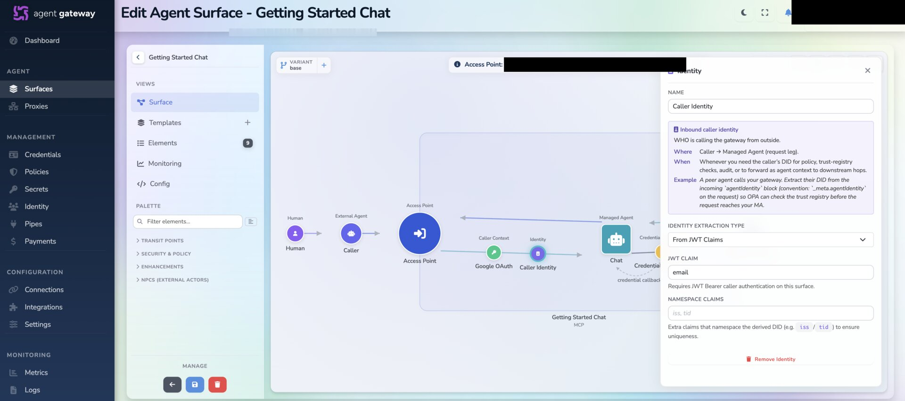

5. Configure Credential Delegation:
   - Add a delegation to the external target
   - **Provider:** `Chat Auth0 Provider` (created in Step 3)
   - **Binding:** `credential-callback`

6. Save the surface and give it a name (e.g., `Chat MCP Surface`)

### Step 5: Copy Critical URLs

After saving the surface, copy and save these two URLs:

1. **Access Point URL** — This is where your app sends MCP requests
   - Format: `https://YOUR_GW_HOST/routes/CHANNEL_PATH`
   - You'll use this as:
     - `GATEWAY_URL` in `backend/.env` (Part 5)
     - Google OAuth Authorized redirect URIs (Part 4)

2. **Credential Provider Callback URL** — This is the Auth0 delegation callback
   - Format: `https://YOUR_GW_HOST/v1/identity/oauth/callback/chat-auth0-provider`
   - You'll register this in Auth0's Allowed Callback URLs (Part 4)

**Save these URLs now** — you'll need them in Parts 4 and 5.

<!-- TODO: Add link to MCP Surfaces guide when available -->

---

## Part 4: Register OAuth Callbacks

Now that you have the Gateway URLs, configure the OAuth redirect URIs.

### Google OAuth Redirect URIs

1. Go back to your **Google Cloud Console OAuth 2.0 Client** (from Part 2A)
2. Add **Authorized redirect URIs:**
   - Use your backend callback URL: `https://YOUR_BACKEND_URL/api/auth/callback`
   - Example: `https://abc123.ngrok-free.app/api/auth/callback`

**Note:** The backend handles the Google OAuth flow directly. The Gateway verifies the resulting JWT but doesn't participate in the OAuth redirect.

<!-- TODO: Screenshot of Google OAuth redirect URI configuration -->

### Auth0 Callback URLs

1. Go back to your **Auth0 Application** (from Part 2B) → Settings
2. Configure **Application URIs:**
   - **Allowed Callback URLs** — add the **Credential Provider Callback URL** from Part 3, Step 5:
     - `https://YOUR_GW_HOST/v1/identity/oauth/callback/chat-auth0-provider`
   - **Allowed Logout URLs** and **Allowed Web Origins** — your frontend URL (optional)

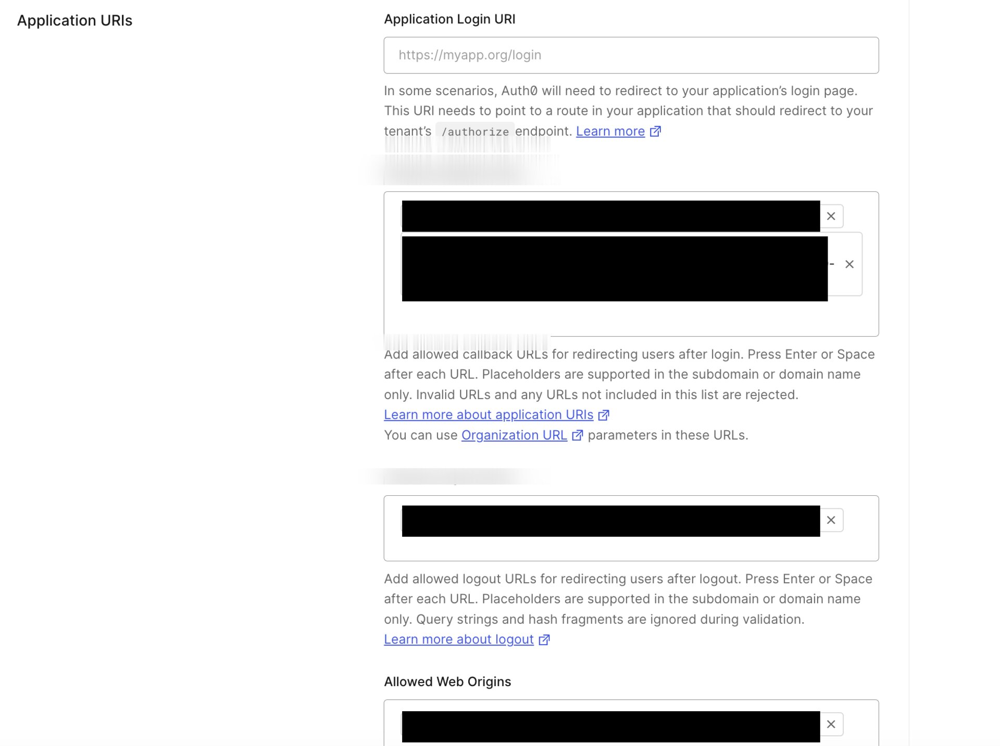

This is the Agent Gateway's callback, not your app's callback.

---

## Part 5: Configure the Application

### Backend environment

```bash
cd auth0-mcp-surface/backend
cp .env.example .env
```

Fill in:

```bash
GOOGLE_CLIENT_ID=<from Part 2A>
GOOGLE_CLIENT_SECRET=<from Part 2A>
GATEWAY_URL=<Access Point URL from Part 3>
BACKEND_URL=<your public backend URL>      # e.g. https://<subdomain>.ngrok-free.app
FRONTEND_URL=<your public frontend URL>    # leave unset for single-origin
```

**Backend URL:** If you haven't exposed the backend yet, run `ngrok http 8642` and copy the HTTPS URL into `BACKEND_URL`.

See [configuration.md](configuration.md) for the full variable reference.

### MCP server environment

The MCP server environment was configured in Part 1. If you want to enable real LLM answers:

```bash
cd auth0-mcp-surface/mcp-server
# Edit .env
BEDROCK_MODEL_ID=anthropic.claude-3-haiku-20240307-v1:0
AWS_REGION=ap-southeast-1
# AWS credentials come from the standard chain (env, shared profile, or SSO role).
# `make chat-auth0-mcp` auto-refreshes them from AWS SSO.
PORT=9740
```

Otherwise, stub mode works without AWS configuration.

---

## Part 6: Run and Test

### Available Make Targets

All make targets are defined in `auth0-mcp-surface/Makefile`. You can run them either from the repo root or from within the `auth0-mcp-surface/` directory.

**From the auth0-mcp-surface directory (recommended):**

```bash
cd auth0-mcp-surface

# See all available targets
make help

# Option 1: Run everything (recommended for first-time setup)
make local-up          # Frontend :5137 + backend :8642 + MCP server :9740
                       # Auto-refreshes AWS SSO credentials if AWS_PROFILE_NAME set

# Option 2: Run only the MCP server
make mcp               # MCP server only on :9740
                       # Auto-refreshes AWS SSO credentials if AWS_PROFILE_NAME set

# Option 3: Run only the backend
make backend           # Backend only on :8642 (honors backend/.env)

# Option 4: Development mode with hot-reload
make dev               # Two-server hot-reload (frontend :5137 + backend :8642)

# Option 5: Docker deployment
make docker-up         # Build and run in Docker (single container, honors backend/.env)

# Stop services
make local-down        # Stop all services (frees ports :8642, :5137, :9740)
make docker-down       # Stop Docker container
```

**From the repo root (shortcut):**

```bash
# Run the full demo from repo root
make chat-auth0-local-up
```

**AWS Setup Notes:**
- By default, `AWS_PROFILE_NAME` is empty → MCP server runs in stub mode (mock responses)
- To use AWS Bedrock: Set `AWS_PROFILE_NAME=your-profile` or configure AWS credentials in `mcp-server/.env`
- Example: `AWS_PROFILE_NAME=my-aws-profile make mcp`

### Start the services

For a complete local setup, run:

```bash
cd auth0-mcp-surface
make local-up
```

This starts:
- Frontend on http://localhost:5137
- Backend on http://localhost:8642
- MCP server on http://localhost:9740

### Test the complete flow

1. Open your public backend URL (ngrok or hosted) in the browser
2. Click **Sign in with Google**. After login you land on the chat screen
3. Send your first message. The gateway verifies your Google JWT and, if it has no stored Auth0 credential for you yet, an Auth0 login popup opens automatically:

   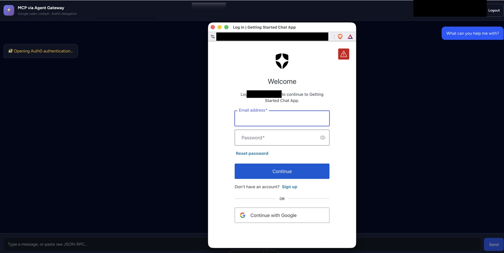

4. Authenticate with Auth0. The popup closes, the request retries automatically, and the chat response appears — powered by AWS Bedrock (if configured) or stub mode

For more details on the consent/retry mechanics, see [Delegation and Consent](docs/delegation-and-consent.md).

**Note:** The chat MCP server's `chat` tool uses AWS Bedrock (Claude Haiku) when `BEDROCK_MODEL_ID` is set in `mcp-server/.env`. Without AWS credentials, it runs in stub mode with mock responses.

---

## Part 7: Troubleshooting

### Common Mistakes

- Using localhost URLs (OAuth requires public URLs)
- Forgetting to update all URL locations after an ngrok restart
- Using backend URL for Google OAuth redirect (should be Access Point URL)
- Configuring OAuth callbacks before having the Gateway URLs

### OAuth Errors

**Redirect URI mismatch**
- The URL registered in Google must match the Access Point URL from Part 3

**Invalid callback URL**
- The gateway delegation callback must be in Auth0's Allowed Callback URLs (Part 4)

**Popup blocked**
- Allow popups for your domain; a manual fallback link is shown

### Authentication Errors

**`consent_required` persists after auth**
- Check the provider's Client ID/Secret references point at the correct secrets (Part 3, Step 3)

**Google login fails**
- Verify the Google client credentials in `backend/.env`

### Service Errors

**Bedrock error**
- Check AWS credentials and region in `mcp-server/.env`

**Connection refused**
- MCP server not running, or the gateway can't reach the External Target URL

**CORS errors**
- See [cors-and-preflight.md](docs/cors-and-preflight.md)

---

## Part 8: Architecture & References

### How It Works

**Boundary 1 — Human → Agent Gateway.** The user's Google OAuth JWT is the caller context; the gateway validates its signature against Google's JWKS.

**Boundary 2 — Agent Gateway → MCP Server.** The gateway delegates the user's Auth0 credential and builds a **Verifiable Presentation** for the MCP server.

**Boundary 3 — User identity.** The `email` claim is the identity used to scope the stored Auth0 credential in the gateway vault.

More detail in [architecture.md](architecture.md).

### Reference: Discovering Auth0 OAuth Endpoints

Rather than hand-typing the authorization/token endpoints, use the **OpenID Connect Discovery** document every Auth0 tenant exposes:

```bash
curl https://YOUR_AUTH0_DOMAIN/.well-known/openid-configuration \
  | jq -r '.authorization_endpoint, .token_endpoint'
```

Example response (trimmed):

```json
{
  "issuer": "https://YOUR_AUTH0_DOMAIN/",
  "authorization_endpoint": "https://YOUR_AUTH0_DOMAIN/authorize",
  "token_endpoint": "https://YOUR_AUTH0_DOMAIN/oauth/token",
  "jwks_uri": "https://YOUR_AUTH0_DOMAIN/.well-known/jwks.json"
}
```

Copy `authorization_endpoint` and `token_endpoint` straight into the credential provider (Part 3, Step 3). This is standard across all OpenID providers (Auth0, Okta, Google, Azure AD) and stays correct even if endpoint layouts change.

### Related Documentation

- [authentication.md](docs/authentication.md) — Google OAuth flow details
- [delegation-and-consent.md](docs/delegation-and-consent.md) — consent mechanics and automatic retry
- [configuration.md](docs/configuration.md) — complete environment variable reference
- [deployment-topologies.md](docs/deployment-topologies.md) — single-origin vs split/proxied modes
- [cors-and-preflight.md](docs/cors-and-preflight.md) — CORS troubleshooting
- [change-log.md](docs/change-log.md) — recent changes and resolved issues

---

## Feedback

If you encounter issues with the setup flow or documentation, please [create an issue](https://github.com/affinidi/affinidi-labs-tgw-get-started/issues) in the GitHub repository.
