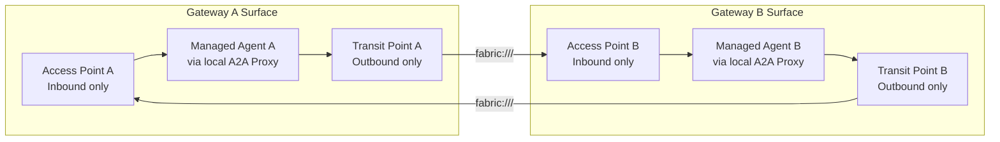

# Copilot Studio Two-Agent A2A Gateway Guide

## Overview

This guide explains how to enable governed A2A communication between two Copilot Studio agents hosted behind two different gateways.

Typical pattern:

- Agent A: orchestrator
- Agent B: worker
- Each agent can be in a different tenant
- Each gateway owns and governs its local agent surface

The objective is to let both agents communicate through gateways with consistent controls for security, governance, and observability.

## Why This Pattern

Copilot Studio agents can be connected directly, but gateway-mediated communication adds control points that are important in enterprise environments:

- Authentication at ingress
- Policy enforcement at inbound and outbound boundaries
- Trust verification with Trust Registry checks
- Identity extraction and signed identity propagation
- Consistent telemetry and audit trails across gateways

## Core Architecture

Each gateway has one surface per local managed agent.

Each surface has two independent request classes:

1. Access Point flow (inbound): external agent -> Access Point -> managed agent
2. Transit Point flow (outbound): managed agent -> Transit Point -> external endpoint

In this guide, the external endpoint for outbound is the remote gateway surface route (`fabric://...`), which enters the remote gateway through its Access Point.



## A Note on Fabric Connection

Fabric creates a governed gateway-to-gateway trust channel so traffic does not rely on direct public coupling between agent endpoints.

Security characteristics:

- DIDComm-based peer channel:
  - Gateway peers establish an explicit trusted relationship before exchanging traffic.
- Encrypted inter-gateway transport:
  - Payloads are protected in transit across tenant boundaries.
- Scoped routing:
  - Transit routes target a specific remote gateway and surface via `fabric://<gateway_id>/<surface_id>`.
- Dual policy boundaries:
  - Policy checks run before egress on the sender gateway and again on ingress at the receiver gateway.
- Trust continuity:
  - Trust Check and identity context can be validated end-to-end.

Primary benefits:

- Lower exposure surface for cross-tenant agent communication
- Centralized governance and easier auditability
- Cleaner operational ownership per tenant while still allowing inter-agent collaboration

### Important Clarification

- Access Point and Transit Point are separate
- Transit Point is executed only when the managed agent makes an outbound call

## What You Need Before Starting

- Admin access to both hosted gateway UIs
- Two Copilot Studio agents (orchestrator and worker)
- Direct Line secret for each Copilot Studio agent
- A naming convention for routes, secrets, proxies, and policies
- Agreement between teams on API key exchange and rotation

## Recommended Naming Convention

- Surfaces: `agent-a-surface`, `agent-b-surface`
- Proxies: `agent-a-cps-proxy`, `agent-b-cps-proxy`
- Transit points: `tp-to-agent-b`, `tp-to-agent-a`
- Secrets: `agent_a_ap_api_key`, `agent_b_ap_api_key`
- Policies: `inbound-trust-check-enforced`, `transit-outbound-policy`

## Implementation Approach

Apply the same sequence on both gateways.

### Step 1: Create Policies

Create two policy categories:

- Inbound Access Point policy (Trust Check enforced)
- Transit Point outbound policy (check if target is trusted before sending message)

Baseline inbound policy on Access Point:

```rego

package surface.policy

default allow := false

allow if {
  trust_registry_authorized
}

trust_registry_authorized if {
  every r in input.trust_check_results.caller { r.ok }
}

deny_reason := "Caller failed Trust Registry verification" if {
  not trust_registry_authorized
}

```

Baseline outbound transit policy:

```rego
package surface.policy

default allow := false

allow if {
  trust_registry_authorized
}

trust_registry_authorized if {
  every r in input.trust_check_results.target { r.ok }
}

deny_reason := "Target failed Trust Registry verification" if {
  not trust_registry_authorized
}

```

### Step 2: Connect Gateways

Set up the gateway-to-gateway (GW-GW) DIDComm connection by following the dedicated guide:

- [Gateway to Gateway Connection (Fabric Connection)](../../feature-guide/fabric-connection-guide.md)

After setup, capture both gateway IDs for transit targets:

- `fabric://<remote_gateway_id>/<remote_surface_id>`

### Step 3: Configure Trust Registry

Configure Trust Registry integration by following the dedicated guide:

- [Trust Registry Integration with Affinidi Gateway](../../feature-guide/trust-registry-guide.md)

Use the connected registry in caller-leg Trust Check queries on Access Points.

### Step 4: Create Secrets

Create secrets for:

- Local Copilot Direct Line credential
  - Follow this guide: [Copilot Studio setup - Add a secret for direct link](../README.md#2-add-a-secret-for-direct-link)
- Remote Access Point API key (used by local agent surface to connect to target agent on transit point leg)
  - It will be provided by other gateway agent where you want to connect

### Step 5: Create Access Point API Keys

For each surface: ( this will be given to other gateway and they save in secret as in 4.2 )

- Create API key for callers of that surface
- Exchange keys securely between teams
- Store remote key in local secrets for transit outbound auth

### Step 6: Create A2A Proxies

Create one local A2A proxy per managed agent by following:

- [Copilot Studio setup - Add an A2A proxy and use the secret](../README.md#3-add-an-a2a-proxy-and-use-the-secret)

Apply these values in each gateway:

- Backend kind: `copilot_direct_line`
- Secret: local Direct Line secret (created in Step 4)
- Base URL: `https://directline.botframework.com/v3/directline`

### Step 7: Build Surface A (Orchestrator)

Import the Surface A JSON template (orchestrator) that you will add to this repo.

After import, update these gateway-specific values:

- Access Point caller auth: `api_key_provider` via `Authorization` header
- Inbound policy: `inbound-trust-check-enforced`
- Trust Check: caller-leg query enabled
- Target endpoint type: local A2A proxy (from Step 6)
- Transit endpoint: `fabric://<gateway_b_id>/<surface_b_id>`
- Transit target auth: remote Access Point API key secret (from Step 4/5)
- Transit policy: `transit-outbound-policy`

Optional but recommended for Copilot interoperability:

- Header metadata extension: `https://fabric.affinidi.io/extensions/header-metadata/v1`
- Map Copilot headers (agent id, tenant id, session id, correlation id)
- Enable managed identity extraction from mapped metadata

### Step 8: Build Surface B (Worker)

Import the Surface B JSON template (worker) that you will add to this repo.

Apply the same configuration pattern as Step 7, with mirrored values:

- Transit endpoint: `fabric://<gateway_a_id>/<surface_a_id>`
- Remote Access Point API key secret for Gateway A
- Local A2A proxy for worker agent

## Validation Strategy

### Configuration Validation (UI)

On each gateway confirm:

- Surface is active
- A2A proxy is active
- Trust Registry is connected
- Gateway connection is active
- Access Point has caller auth, policy, and Trust Check
- Transit Point has fabric target, target auth, and transit policy

### Runtime Validation

Validate both directions:

- Trigger Agent A (API call or autonomous flow) and verify it can reach Agent B through transit
- Trigger Agent B (API call or autonomous flow) and verify it can reach Agent A through transit

### Governance Validation

Confirm observability and controls:

- Trust Check results visible on caller leg
- Policy decisions include clear allow/deny behavior and reasons
- Trace correlation works across both gateways

## Troubleshooting

- 401/403 at Access Point:
  - Incorrect API key, header format, or caller auth setup
- Trust Check denial:
  - Registry disconnected, wrong registry selected, or caller not recognized/authorized
- Transit forwarding failure:
  - Wrong `fabric://` target or inactive gateway connection
- Proxy/backend failure:
  - Wrong proxy configuration or invalid Direct Line secret
- Outbound target auth failure:
  - Missing or incorrect static secret for remote Access Point key

## Security and Operations Recommendations

1. Replace permissive transit policy with least-privilege outbound policy.
2. Rotate Direct Line secrets and API keys on a fixed cadence.
3. Keep trust checks mandatory on inbound Access Points.
4. Monitor policy and trust-check events by trace ID.
5. Maintain a simple environment handover sheet (gateway IDs, surface IDs, routes, secret names, rotation owner).

## Outcome

After implementation, each managed agent is protected by its own gateway surface for inbound access and has a governed outbound channel to the other agent through Transit Point plus fabric routing. This provides controlled, auditable, and tenant-safe inter-agent communication.
