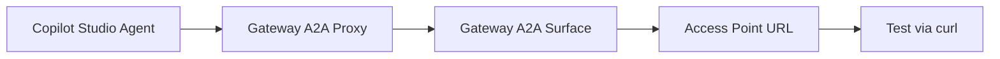
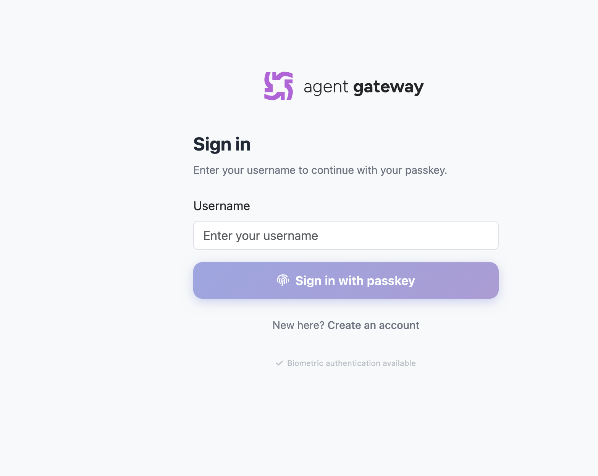
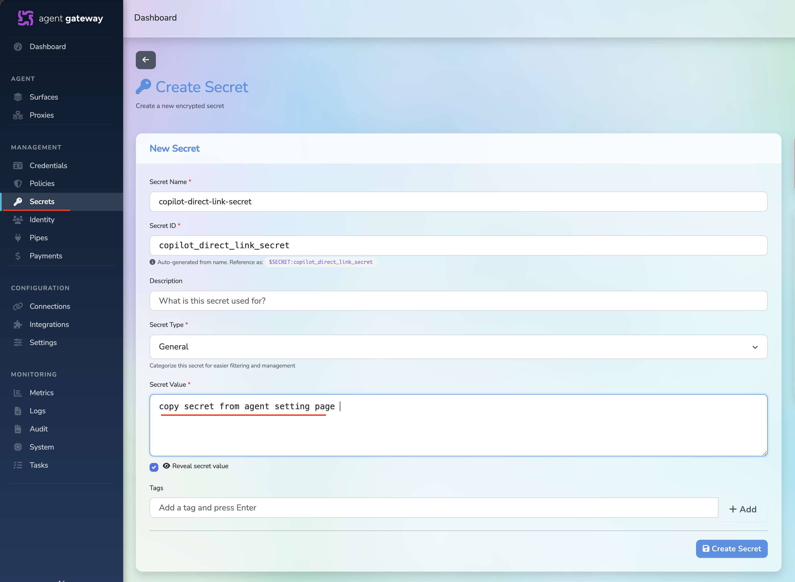
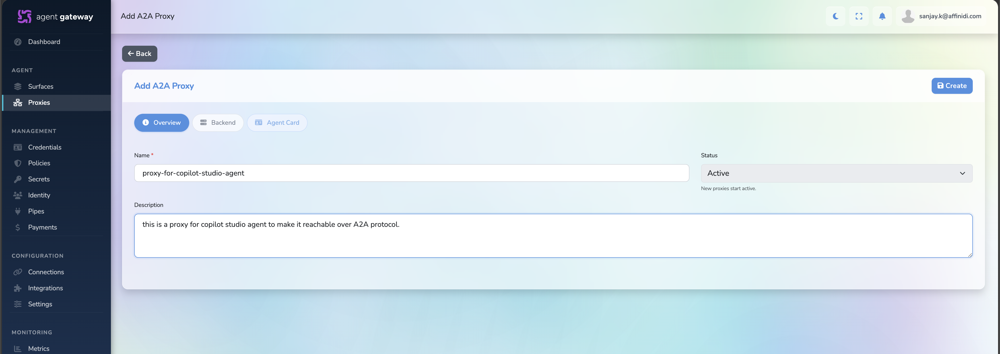
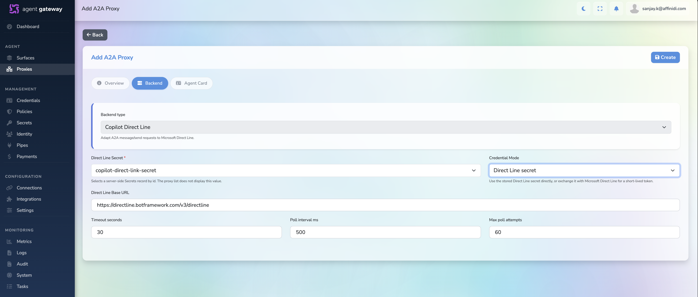
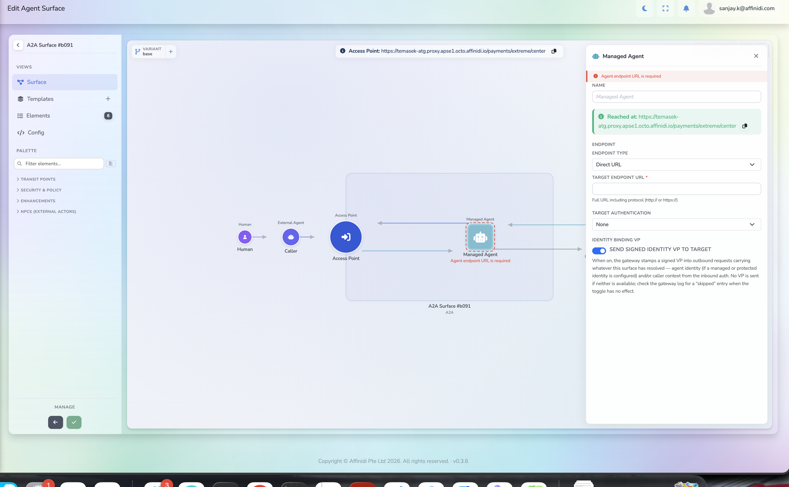

# Copilot Studio + Gateway Developer Guide (Simple)

This guide shows the fastest way to expose a Copilot Studio agent through Gateway using Direct Line credentials and an A2A surface.

## Why this guide is needed

Copilot Studio agents do not provide A2A ingress by default. If your clients or platforms communicate through A2A, you need a Gateway layer to bridge requests to Copilot Studio safely.

This guide explains how to:

- Enable a Copilot Studio agent behind a Gateway A2A proxy and A2A surface
- Route traffic through a stable Access Point URL
- Validate end-to-end behavior with curl
- Monitor request flow and logs in Gateway

## Flow overview



## Prerequisites

- Copilot Studio access to create/publish an agent
- Gateway admin access to create secrets, proxies, and surfaces
- A terminal with curl
- A test prompt/message for validation

## Part 1: Copilot Studio setup (basic only)

Reference pages:

- https://learn.microsoft.com/en-us/microsoft-copilot-studio/fundamentals-get-started
- https://learn.microsoft.com/en-us/microsoft-copilot-studio/configure-web-security

### 1. Create a Copilot agent

1. Sign in to Copilot Studio: https://copilotstudio.microsoft.com

   

2. On Home, describe your agent and create it. Keep it simple.

   

3. Wait until the agent Overview page is ready.

   

4. Optional: update instructions to something simple like: "You are a helper agent."

### 2. Configure Direct Line security for Gateway

Reference page:

- https://learn.microsoft.com/en-us/microsoft-copilot-studio/configure-web-security

1. Open your agent in Copilot Studio.
2. Go to Settings -> Security -> Web channel security.

   

3. Turn on Require secured access.
4. Wait for propagation (can take up to 2 hours).
5. For quick testing only, you can temporarily disable secured access.

Production note:

- Always keep secured access enabled in production.
- Use a proper authentication model for client access.

Important notes:

- When secured access is on, requests must include Direct Line secret or token.
- You do not need to publish again for this security toggle to take effect.
- Do not put secret values in browser code.

### 3. Obtain Direct Line secrets (for Gateway secret store)

1. In Settings -> Security -> Web channel security, copy Secret 1 or Secret 2.
2. Store that value in Gateway Secrets (coming later in Part 2).

## Part 2: Gateway setup

### 1. Create a Gateway

You may need Gateway access first, so request it if needed.

1. Open the Affinidi developer portal and request Agent Gateway setup.
2. Wait until your Gateway is provisioned.
3. Open the Gateway URL, then create an account if this is your first time.
4. Sign in to Agent Gateway.



### 2. Add a secret for direct link

1. From the left menu, go to Secrets.
2. Create a new secret for the Copilot direct link secret.
3. Name it clearly, for example: copilot-direct-link-secret.
4. Save the secret.



### 3. Add an A2A proxy and use the secret

1. In the left menu, go to Proxies.
2. Create an A2A proxy.
3. Provide a name for the proxy.



4. Go to the Backend tab and select the secret created in the previous step.



5. Click Create to save the proxy.

### 4. Create an A2A surface and target the proxy

1. In the left menu, click Surfaces and then Add Surface.


2. Select an A2A surface and choose Managed Agent.



3. Set the target to the A2A proxy created above.
4. Choose endpoint type Via A2A proxy, then select your proxy from the dropdown.


5. Save the surface (Cmd/Ctrl + S or use the check/save button).

### 5. Get the access point URL

1. Open the created A2A surface.
2. Copy the Access Point URL displayed at top.
3. Keep this URL for testing.

## Part 3: Test with curl

Use a minimal request first.

```bash
curl -X POST "<ACCESS_POINT_URL>" \
    -H "Content-Type: application/json" \
    -d '{
        "message": "Hello from curl",
        "sessionId": "test-session-1"
    }'
```

If your surface requires auth headers, add them in the same command.

Expected result:

- HTTP 200 or success status from Gateway
- Response body contains agent output

## Part 4: Watch logs and monitor

After sending curl traffic:

1. Open Gateway logs.
2. Open the surface and go to Monitoring to view traffic.
3. Confirm the request reaches surface, proxy, and Copilot target.

## Quick troubleshooting

- 401 or 403: secret mismatch or missing auth configuration
- 404: wrong surface URL or undeployed surface
- 5xx from proxy: target endpoint error or invalid payload mapping
- Timeout: network path, endpoint reachability, or policy rule blocking

## Done criteria

Setup is complete when:

- A2A surface is deployed
- curl returns agent output
- logs show successful end-to-end routing from surface to Copilot and back
