# Gateway to Gateway Connection (Fabric Connection)

## Overview

This guide explains how to establish a secure gateway-to-gateway connection (fabric connection) using the DIDComm protocol and a mediator. This enables two Affinidi Gateways to communicate securely through an intermediary mediator, allowing them to exchange messages and share surfaces.

For additional information, refer to: [Affinidi Trust Fabric - Connect Gateways](https://docs.affinidi.com/products/affinidi-trust-fabric/agent-gateway/how-to-guides/connections/connect-gateways/)

## Prerequisites

Before you begin, ensure you have:

1. **A DIDComm Mediator** - Create one from the Affinidi Developer Portal if you don't already have one
   - See [Mediator Guide](./mediator-guide.md) for detailed instructions on creating and configuring a mediator
2. **Two Affinidi Gateways** - Both must be created from the Affinidi Developer Portal (portal.affinidi.com)
   - You must have admin privileges to both gateways
   - Each gateway will have a unique URL (AG1 and AG2)
   - Note: Gateway URLs will be used throughout this process

## High-Level Connection Flow

The gateway-to-gateway connection follows these steps:

1. Add mediator to both gateways
2. Initiating gateway creates a connection endpoint (generates OOB URL and secret key)
3. Receiving gateway connects using the OOB URL and secret
4. Initiating gateway approves the connection request
5. Connection is established between both gateways
6. Verify connectivity using ping/heartbeat from each gateway
7. Use the connection when configuring surfaces

---

## Step 1: Add Mediator to Each Gateway

Before establishing a gateway-to-gateway connection, you must add the mediator to both gateways.

**Note:** For detailed instructions on creating a mediator and adding it to gateways, see [Mediator Guide](./mediator-guide.md)

### Quick Reference:

- Navigate to **Connections > Mediators** tab in each gateway's dashboard
- Click **Add Mediator**
- Paste the mediator DID and follow the configuration steps
- Verify the mediator heartbeat is working

---

## Step 2: Create Connection Endpoint (Initiating Gateway)

The initiating gateway creates a connection point that will be shared with the receiving gateway.

### Process:

1. Open the **initiating gateway dashboard** and navigate to **Connections > Gateways**

2. Click on **Create Connection Point** button
   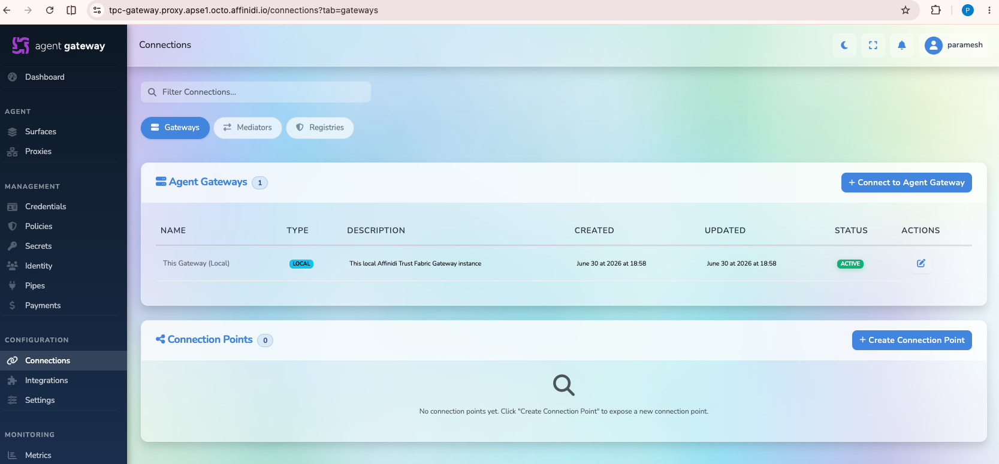

3. **Select the Mediator**
   - Choose the mediator you previously added to this gateway
   - Click **Next**

   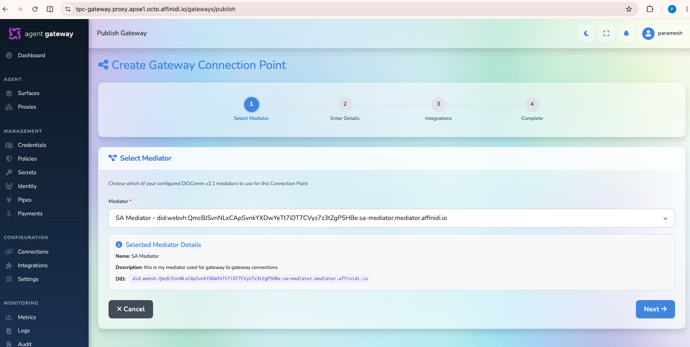

4. **Enter Connection Point Details**

   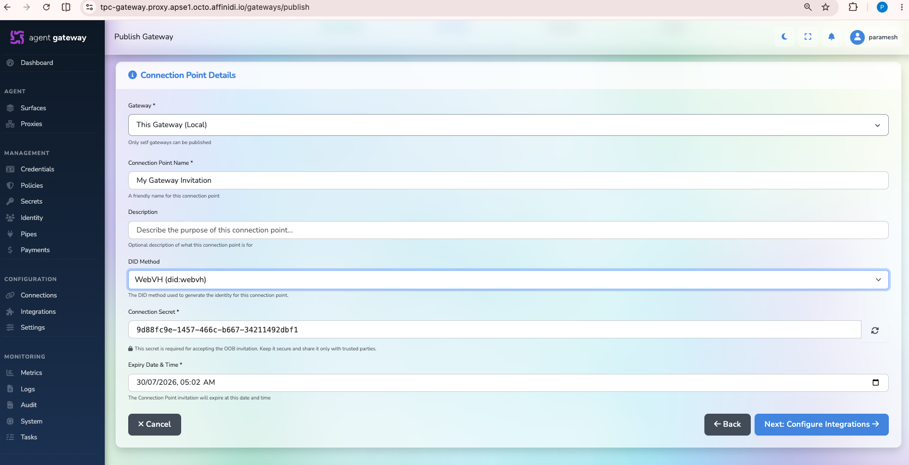

   Configure the following:
   - **Connection Point Name**: `My Gateway Invitation` (or your preferred name)
   - **DID Method**: `did:webVH`
   - **Connection Secret**: A secure string will be auto-generated, or you can provide your own
   - Click **Next**

5. **Skip Integration Step**

   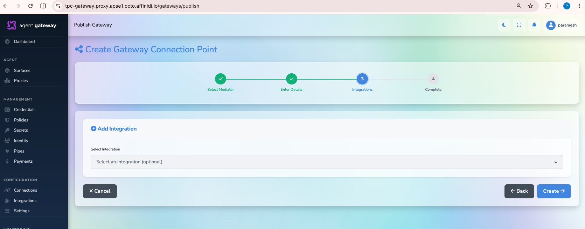
   - Click **Create** to proceed without adding integrations

6. **Connection Point Created Successfully**

   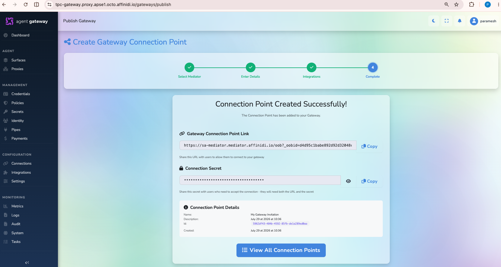

   Upon success, you will receive:
   - **Gateway Connection Point Link** (OOB URL) - Share this with the receiving gateway
   - **Connection Secret** - Share this securely with the receiving gateway

   **⚠️ Important:** Copy and securely store both values to share with the other gateway

---

## Step 3: Connect to Agent Gateway (Receiving Gateway)

The receiving gateway now initiates a connection to the initiating gateway using the shared details.

### Prerequisites:

- You must have the gateway connection point link and secret from the initiating gateway
- The receiving gateway must have the same mediator added (see Step 1)

### Process:

1. Open the **receiving gateway dashboard** and navigate to **Connections > Gateways**

2. Click on **Connect to Agent Gateway** button

   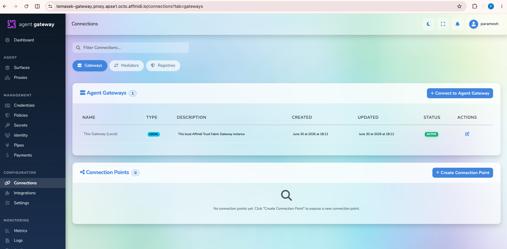

3. **Enter Remote Gateway Details**

   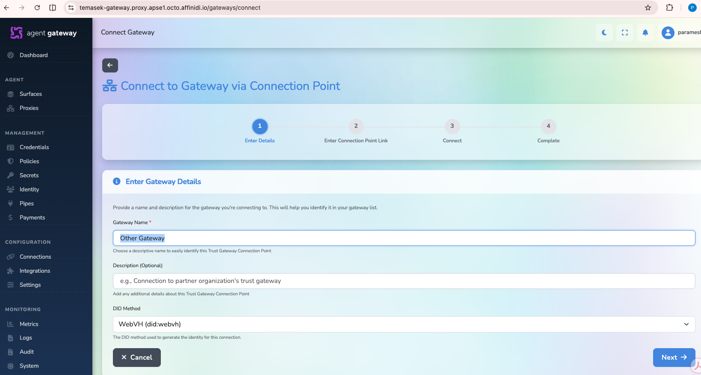

   Configure:
   - **Gateway Name**: `Other Gateway` (or the actual name of the initiating gateway)
   - **DID Method**: `WebVH`
   - Click **Next**

4. **Enter Invitation Link and Secret**

   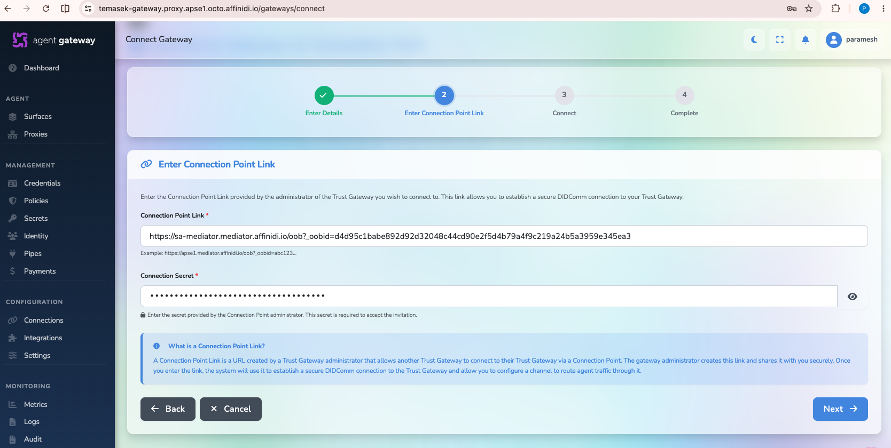

   Paste the information from the initiating gateway:
   - **Gateway Invitation Link**: The OOB URL
   - **Connection Secret**: The secret key
   - Click **Next**

5. **Authentication and Validation**

   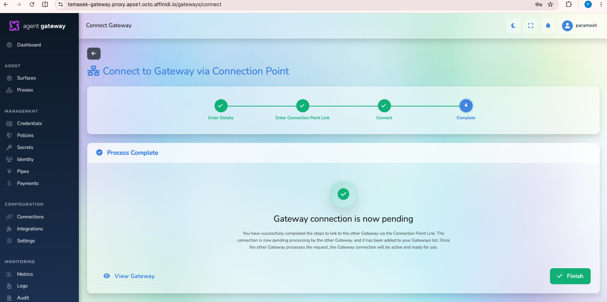

   The receiving gateway will:
   - Validate the invitation link
   - Perform DIDComm authentication challenge
   - If successful, send an approval request to the initiating gateway
   - You'll see a confirmation message

6. **Connection Request Pending**

   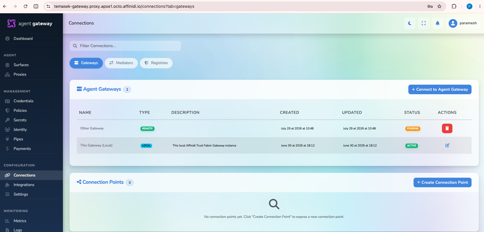

   The connection status will show as **Pending** while waiting for the initiating gateway to approve

---

## Step 4: Approve Connection (Initiating Gateway)

The initiating gateway must approve the connection request from the receiving gateway.

### Process:

1. Return to the **initiating gateway dashboard**

   Navigate to **Connections > Gateways**

   You will see a pending approval request from the receiving gateway

2. **Approve the Connection Request**

   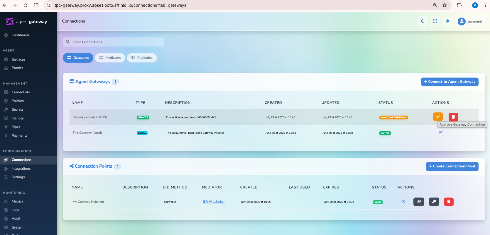

   Click the **Approve Gateway Connection** icon (check/approve icon) in the actions column

3. **Enter Remote Gateway Details**

   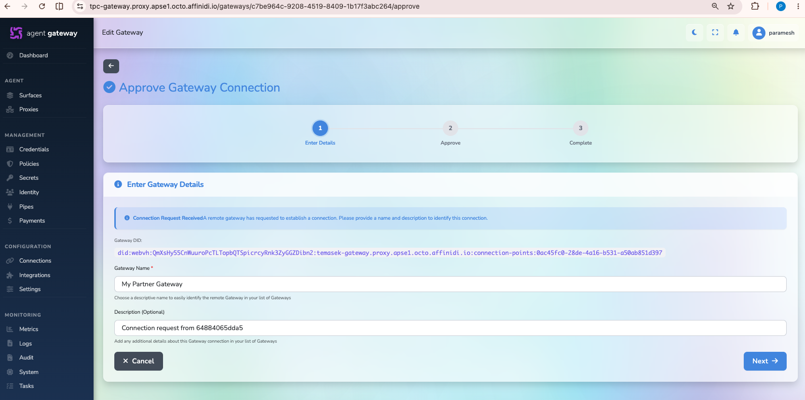
   - **Remote/Receiver Gateway Name**: Enter the name of the receiving gateway
   - Click **Next**

4. **Confirm Approval**

   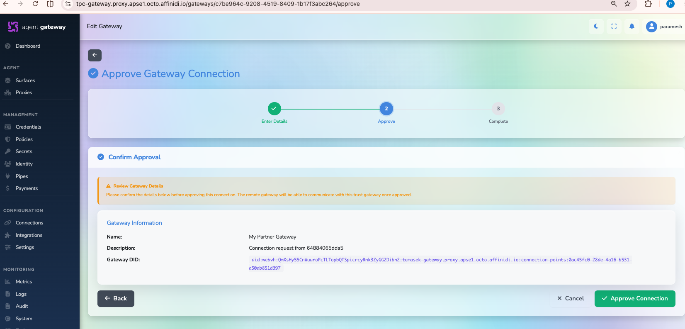

   Review the connection details and click **Approve Connection**

5. **Connection Established**

   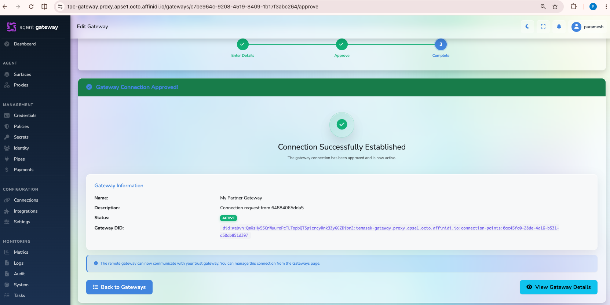

   Upon successful approval:
   - A success message confirms the connection is established
   - The connection status changes to **Active**

6. **Verify Connection**

   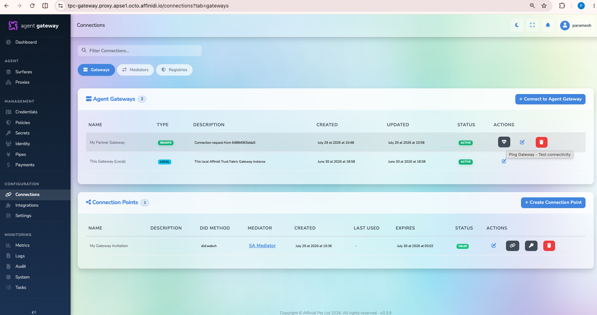
   - Click **Back to Gateways** to return to the gateways list
   - You should see the remote gateway with an **Active** status
   - You can click the **Heartbeat** icon to ping the remote gateway and verify connectivity

---

## Step 5: Verify Connection on Both Gateways

Confirm that the connection is established and active on both sides.

### On Both Gateways:

1. Navigate to **Connections > Gateways**

   

2. Verify the connection status:
   - You should see the remote gateway in your gateways list (in addition to your local gateway)
   - The **Status** column should show **Active** for the remote gateway

   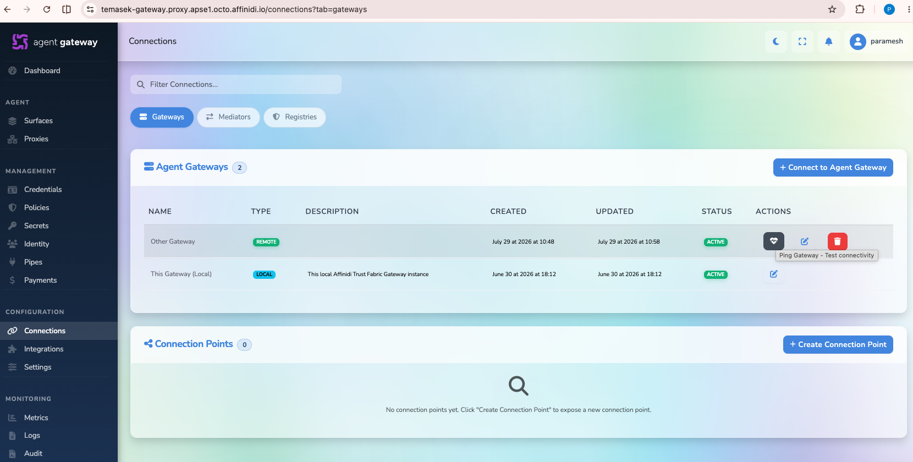

3. **Test Connectivity**:
   - Click the **Heartbeat** icon under the Actions column
   - This will send a ping to the remote gateway to verify the connection is working

**Congratulations!** Your gateway-to-gateway connection is now established and ready to use.

---

## Step 6: Using Gateway Connections with Surfaces

Once the gateway-to-gateway connection is established, you can use it when configuring surfaces.

### Process:

1. Open the **gateway dashboard** and navigate to **Surfaces**

2. Click **Add Surface**

3. **Select a Surface Template**
   - Choose any surface template suitable for your needs (e.g., A2A Surface, MCP Surface)
   - Click the **Use Template** button (arrow icon)

   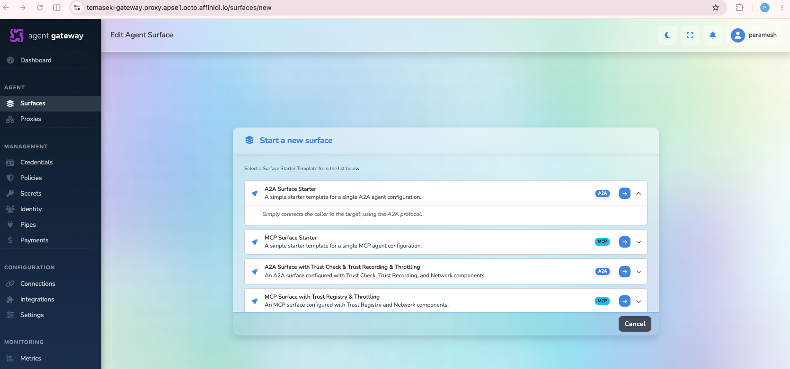

4. **Configure the Surface with Remote Gateway Connection**

   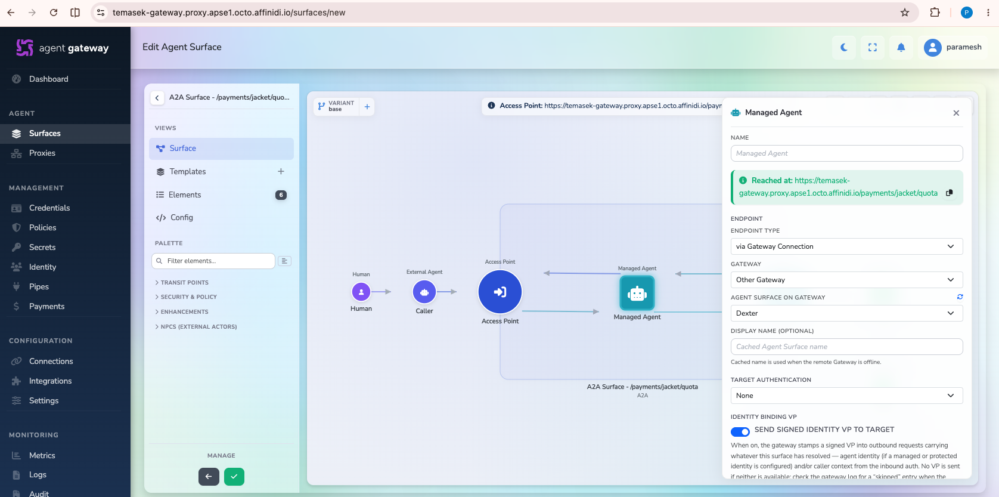
   - Select the **Manage Agent** element within the surface
   - Under **Endpoint Type**, select **'via Gateway Connection'**
   - A dropdown will appear listing all your remote gateways
   - Select the target gateway from the list
   - The system will then display all available surfaces on the remote gateway
   - Select the appropriate surface from the remote gateway

   **Note:** The available surfaces will be filtered based on surface type:
   - A2A surfaces will show A2A surfaces from remote gateways
   - MCP surfaces will show MCP surfaces from remote gateways

5. **Save the Surface**
   - Complete the surface configuration as needed
   - Save your changes

### Result:

With this configuration, all communication between surfaces will now flow through the gateway-to-gateway connection using the secure DIDComm protocol via the mediator, rather than direct connections.

---

## Troubleshooting

### Connection Point Creation Issues

- **Problem:** Cannot select mediator in Step 2
- **Solution:** Ensure the mediator has been added to the gateway and its heartbeat is active (see [Mediator Guide](./mediator-guide.md))

### Authentication Failure in Step 3

- **Problem:** DIDComm authentication challenge fails
- **Solution:** Verify that the invitation link and secret are correct and copied completely without extra spaces

### Pending Connection Not Approved

- **Problem:** Connection remains pending after Step 3
- **Solution:** Check the initiating gateway dashboard for the approval notification; ensure you have admin privileges

### Connection Shows Inactive

- **Problem:** Connection status shows Inactive instead of Active
- **Solution:**
  - Verify the mediator heartbeat is working on both gateways
  - Check your network connectivity
  - Try refreshing the gateway dashboard

### Cannot Create Surface with Gateway Connection

- **Problem:** "via Gateway Connection" option is not available
- **Solution:** Ensure the gateway-to-gateway connection status is **Active** on both gateways

---

## Next Steps

- Configure surfaces to use the gateway connection for secure communication
- Set up surface-level authentication and authorization policies
- Monitor connection health using periodic heartbeat checks
- For advanced configurations, refer to the [Affinidi Trust Fabric Documentation](https://docs.affinidi.com/products/affinidi-trust-fabric/)

---

## Related Guides

- [Mediator Setup Guide](./mediator-guide.md) - Create and configure DIDComm mediators
- [Affinidi Trust Fabric Documentation](https://docs.affinidi.com/products/affinidi-trust-fabric/)
- [DIDComm Protocol Overview](https://didcomm.org/)
