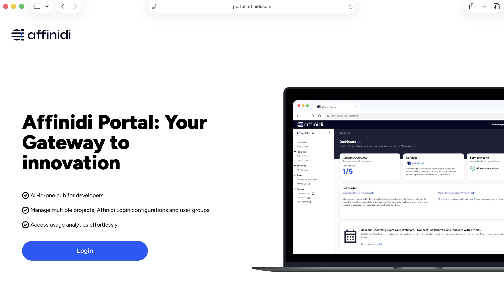
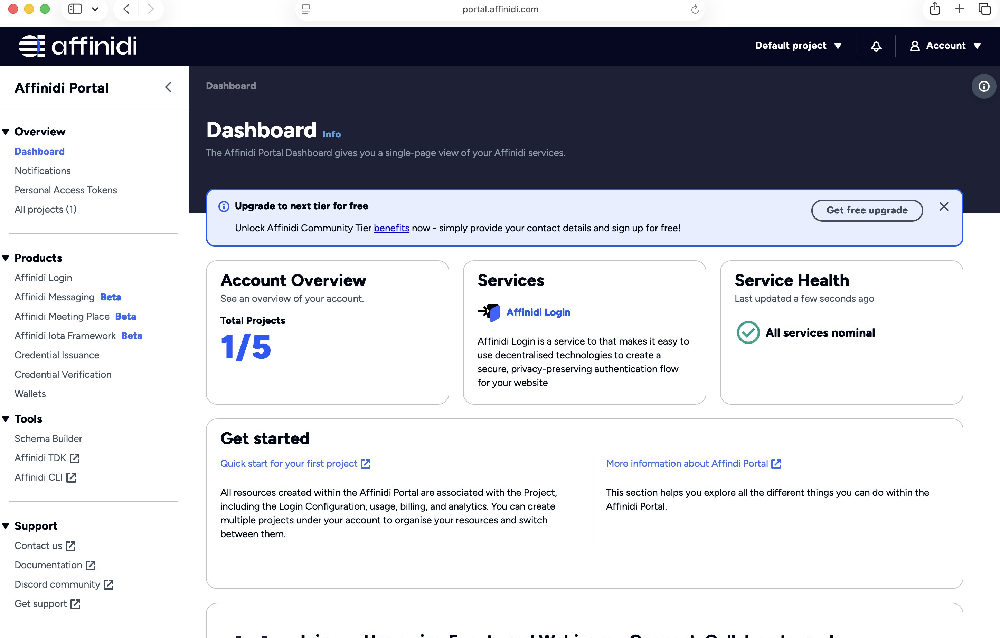
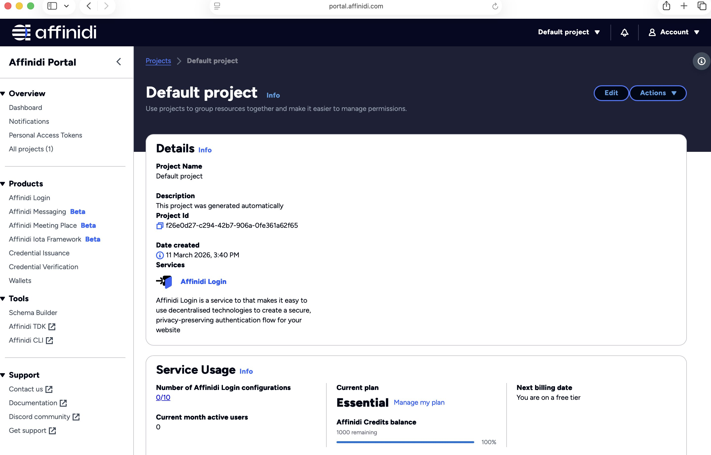
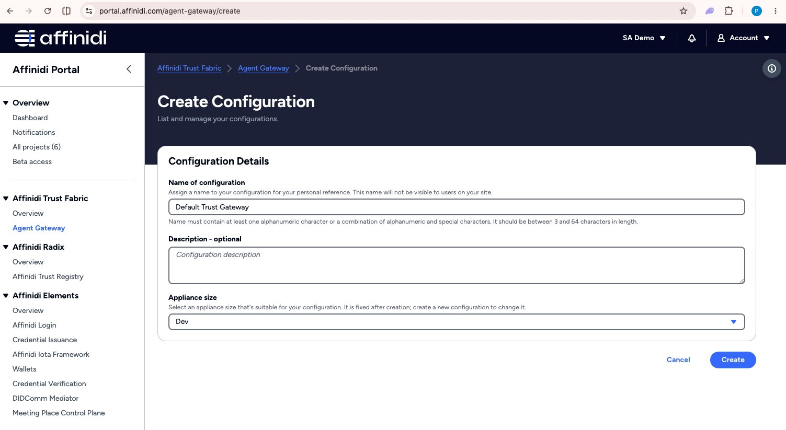
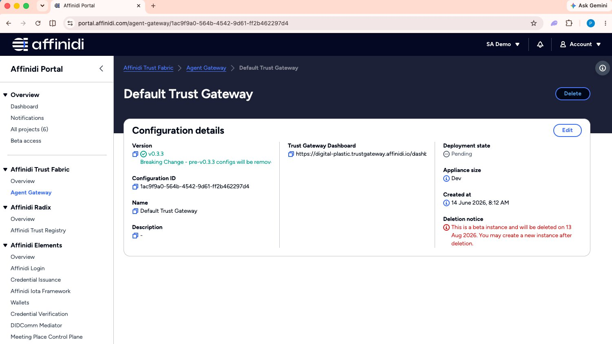
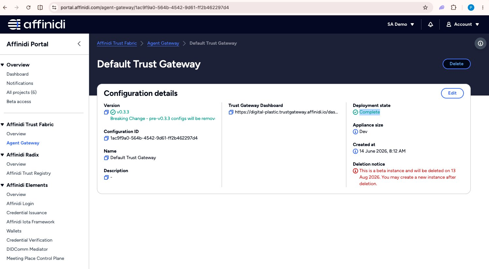
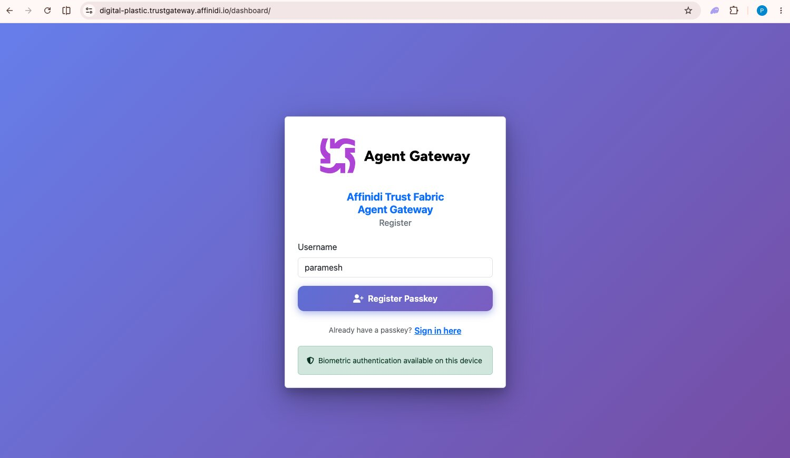
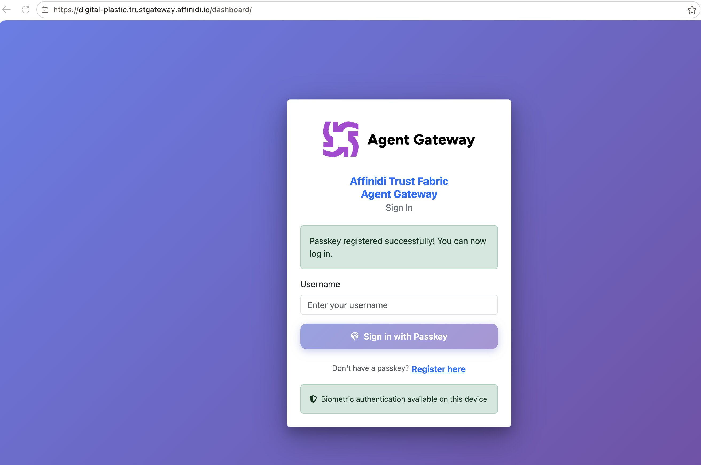
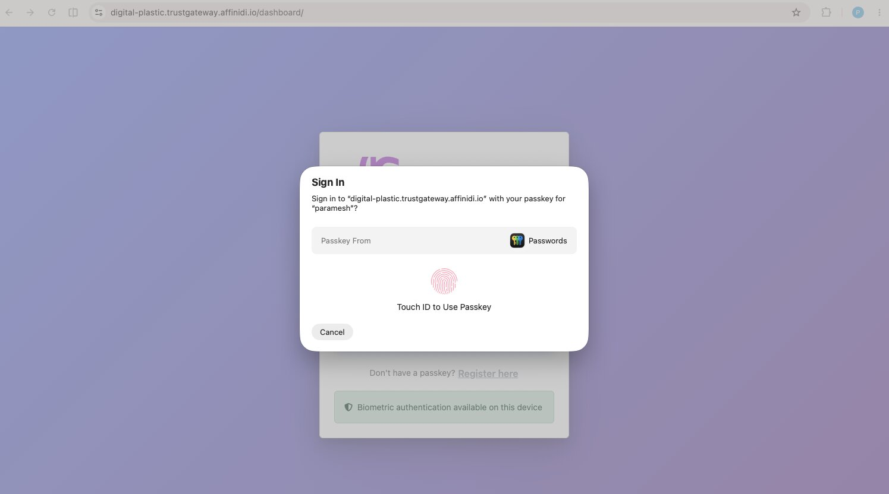
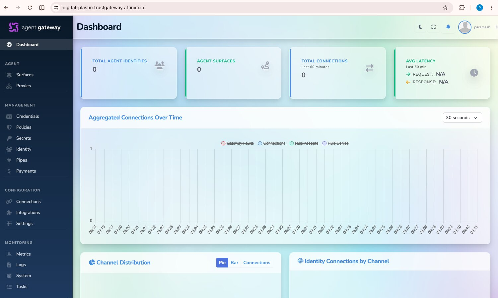

# Create Agent Gateway

## Overview

This guide walks you through the steps to create your first Agent Gateway, from logging in to the Affinidi Developer Portal to accessing the Agent Gateway control plane.

An **Agent Gateway** is a controlled entry point that manages communications on behalf of your organization. It implements security policies, handles routing, and ensures communications comply with your governance rules.

---

## Step 1: Log In to the Affinidi Developer Portal

1. Open the [Affinidi Developer Portal](https://portal.affinidi.com) in your browser.
2. Click the **Login** button.

   **First-time users** will be guided through a one-time vault setup:
   - **Create a passphrase** to protect your personal vault.
   - **Enable fingerprint authentication** if you want faster access on supported devices.
   - **Verify your email** by entering your email address and the OTP sent to your inbox.

   

3. After a successful login, you will land on the Developer Portal dashboard.

   

---

## Step 2: Open Your Project

1. Navigate to **All Projects** from the left menu bar.
2. Locate and select the project you want to use.
3. Confirm the project details page opens successfully.

   

---

## Step 3: Create Agent Gateway Configuration

1. In the Affinidi Developer Portal, select your project from the top-left project menu.
2. Click **Agent Gateway** in the left menu bar.
3. Click **Create Configuration** and provide a name and description.

   

4. Wait until the deployment status shows **Complete**. This typically takes a few minutes.
5. Once deployment is complete, copy the **Agent Gateway dashboard URL**.

   
   Note: Gateway provisioning typically takes less than 5 minutes.
   

---

## Step 4: Register and Log In to the Agent Gateway Control Plane

1. Open the Agent Gateway dashboard URL in your browser.

2. **First-time users:**
   - Click **Register here**.
   - Enter a **username**.
   - Click **Register Passkey** to complete registration.

   > The first user to register is automatically assigned the **admin** role.

   

3. **Returning users:**
   - Enter your **username**.
   - Click **Sign in with Passkey**.

   
   

4. After a successful login, you will land on the Agent Gateway dashboard.

   

---

## Output of This Step

After completing this guide, you should have:

- an Affinidi project selected in the Developer Portal
- an Agent Gateway configuration deployed
- the Agent Gateway dashboard URL
- access to the Agent Gateway control plane

You can now continue with:

- [mediator-guide.md](./mediator-guide.md)
- [fabric-connection-guide.md](./fabric-connection-guide.md)
- [trust-registry-guide.md](./trust-registry-guide.md)

## More Information

- [Agent Gateway](https://docs.affinidi.com/products/affinidi-trust-fabric/agent-gateway/)
- [Agent Gateway Overview](https://docs.affinidi.com/products/affinidi-trust-fabric/agent-gateway/overview/)
