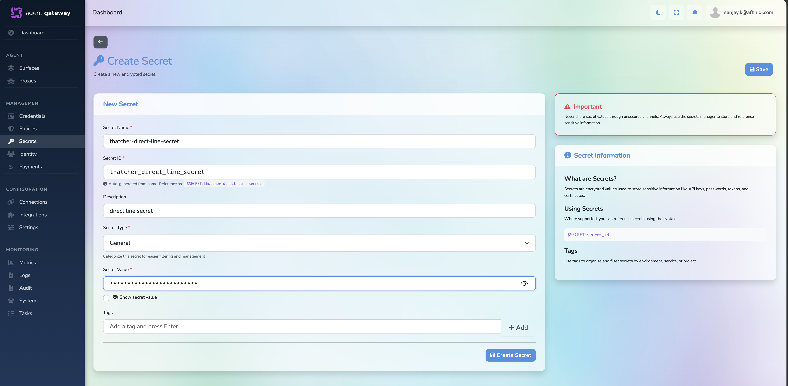

# Creating a Secret for a Copilot Studio Direct Line Credential

This guide shows how to store a Microsoft Copilot Studio Direct Line secret in Affinidi Gateway so an A2A Proxy can call the Copilot agent securely.

## Purpose

Store the Copilot Studio Direct Line credential securely in Agent Gateway instead of hardcoding it in the A2A Proxy configuration.

## Prerequisites

- A Copilot Studio agent already exists
- Direct Line security is enabled for that agent
- You have copied **Secret 1** or **Secret 2** from **Settings -> Security -> Web channel security** in Copilot Studio
- You have access to the target Affinidi Gateway

---

## Step 1: Open Secrets

1. Sign in to your Affinidi Gateway.
2. From the left menu, go to **Secrets**.
3. Click **New Secret**.

---

## Step 2: Create the Secret

Fill in the secret details:

| Field                  | Example                                                |
| ---------------------- | ------------------------------------------------------ |
| Name                   | `thatcher-direct-line-secret`                          |
| Secret Type            | `ApiKey`                                               |
| Value                  | `<direct-line-secret-from-copilot-studio>`             |
| Description (Optional) | `Direct Line secret for Thatcher Copilot Studio agent` |
| Tags (Optional)        | `copilot-studio`, `thatcher`                           |

Use one secret per Copilot Studio agent.

Examples:

```text
thatcher-direct-line-secret
dexter-direct-line-secret
```

Paste the Direct Line secret copied from Copilot Studio into the **Value** field.

The generated **Secret ID** is what you will select later from the A2A Proxy backend configuration.



---

## Step 3: Save

Click **Save**.

The secret is stored in Agent Gateway and can be reused by the proxy configuration. After saving, use the saved secret entry rather than copying the raw value around again.

## Validation

Confirm the secret is ready before creating the proxy:

- The secret appears in the **Secrets** list
- The name matches the target agent
- The **Secret Type** is set correctly
- The value came from the correct Copilot Studio agent
- The secret can be selected from the A2A Proxy backend form

---

## Common Issues

- Wrong secret pasted:
  - Requests from the A2A Proxy will fail when calling Direct Line
- Secret copied from the wrong agent:
  - Traffic may reach the wrong Copilot Studio bot or fail authorization
- Direct Line secured access not enabled:
  - The secret may not work as expected for protected access
- Secret stored with an unclear name:
  - It becomes easy to select the wrong credential during proxy setup
- Secret type set incorrectly:
  - The secret may not appear as expected in the proxy configuration flow

---

## Next Step

After the secret is created, continue to your A2A Proxy setup and select this secret in the proxy backend configuration.
