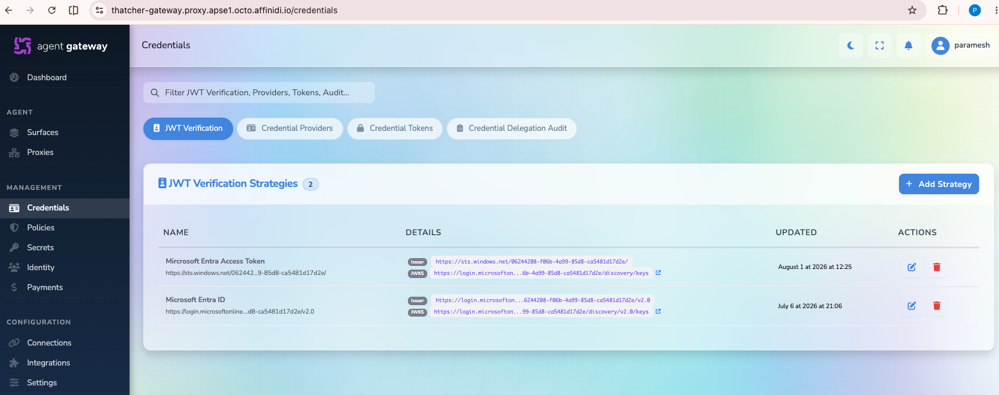
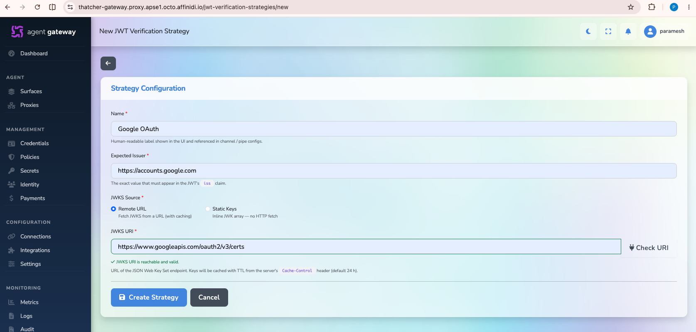
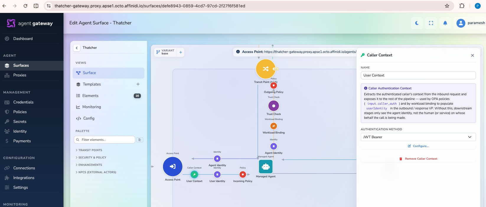
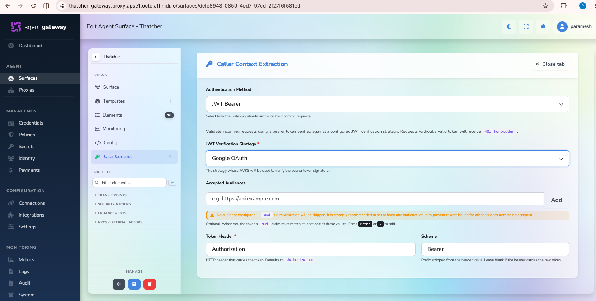

# JWT Strategy Guide

This guide explains how to create and use a JWT verification strategy in Gateway.

A JWT strategy is a reusable configuration that defines:

- Which issuer is trusted (`iss` claim)
- How signing keys are obtained (remote JWKS URI or static JWKS)

Surfaces reference this strategy in the Caller Context element instead of storing issuer details directly.

## Create a JWT Strategy

1. Open the Gateway dashboard.
2. Go to **Credentials**.
3. Select the **JWT Verification** tab.
4. Click **Add strategy**.

5. Enter the details below, then click **Create strategy**:
   - **Name**: Any descriptive name, such as Google OAuth, Microsoft Entra, or Okta OAuth
   - **Expected issuer**: Exact issuer value from the JWT `iss` claim
   - **JWKS source**: Choose **Remote** or **Static**
   - **JWKS URI**: Required when source is Remote
   - **Static JWKS**: Required when source is Static (JSON keys array)

Important:

- Expected issuer must match exactly. Even trailing slash differences can cause token rejection.
- For remote JWKS, the gateway validates the URI when the strategy is saved.
- Changes to a strategy apply on the next inbound request for all surfaces using it.

## Use JWT Strategy in a Surface

1. Open the target surface.
2. Drag and drop the **Caller Context** element.

3. Set **Authentication method** to **JWT Bearer** and click **Configure**.
4. Select the JWT strategy you created.
5. Optionally configure **Accepted audiences**.
6. Keep the header name as **Authorization** unless you have a custom header setup.

7. Click **Save surface** to apply changes.

After this, Gateway expects a valid JWT token for requests to that surface access point and validates it using the selected strategy.

## Token Validation Sequence

When a request arrives at a surface using JWT Bearer:

1. Gateway reads the bearer token from the Authorization header.
2. Gateway loads the referenced JWT strategy.
3. Gateway obtains keys from remote JWKS (cached) or static JWKS.
4. Gateway verifies the JWT signature.
5. Gateway validates issuer (`iss`) and token expiry.
6. If accepted audiences are configured on the surface, `aud` must match one of them.
7. On success, validated claims are available to policy evaluation.

If any validation step fails, the request is rejected with **401 Unauthorized**.

## Notes

- Accepted audiences are configured on the surface Caller Context element, not on the strategy itself.
- One strategy can be reused by multiple surfaces with different audience settings.
- If the remote JWKS endpoint is unreachable at request time, request validation fails with **401 Unauthorized**.

## Learn More

JWT verification strategy reference:

https://docs.affinidi.com/products/affinidi-trust-fabric/agent-gateway/reference/authentication/jwt-verification-strategies/
