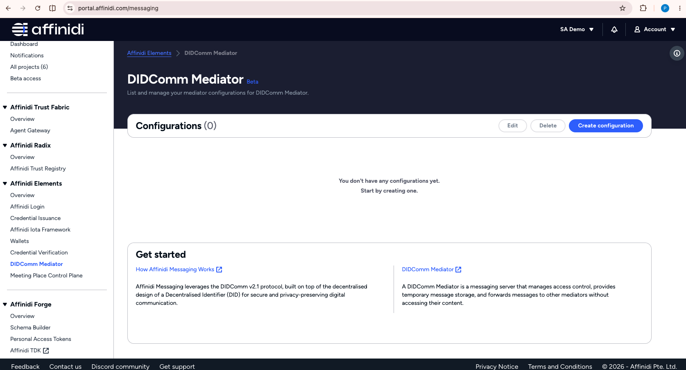
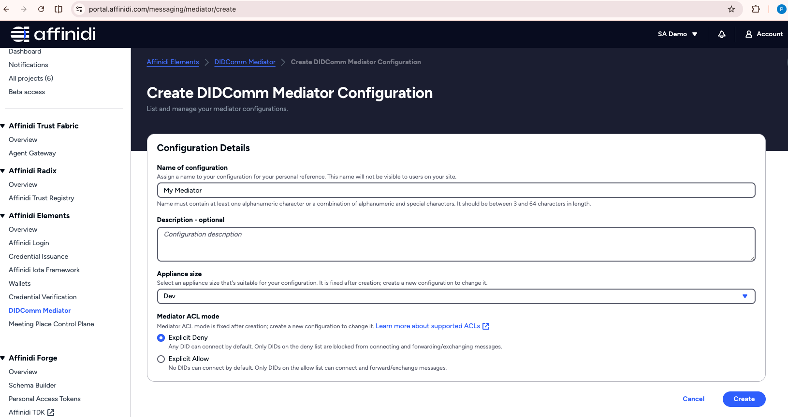
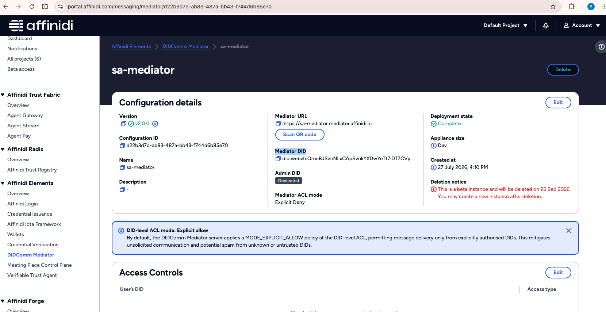
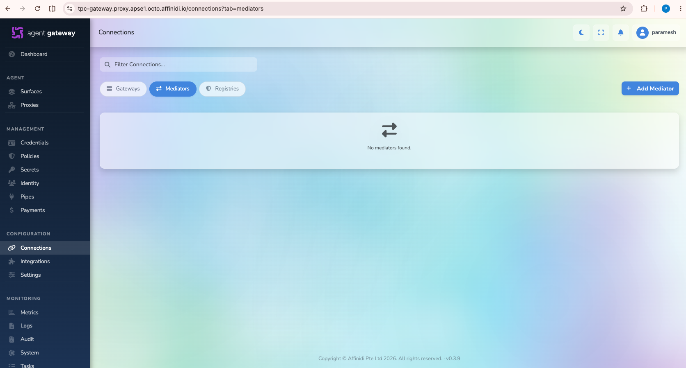
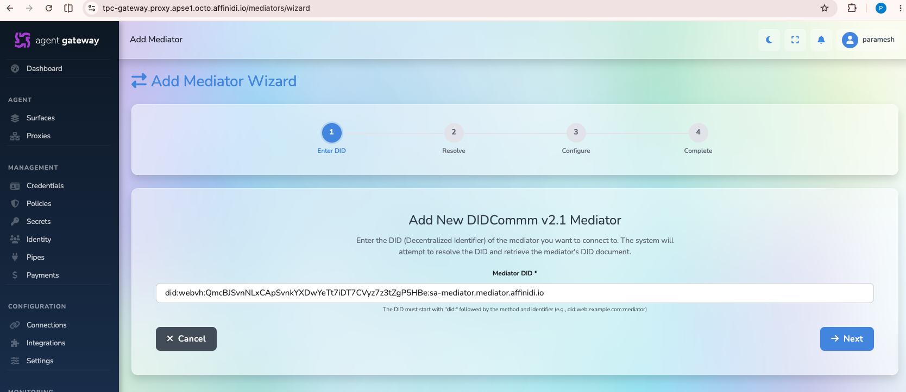
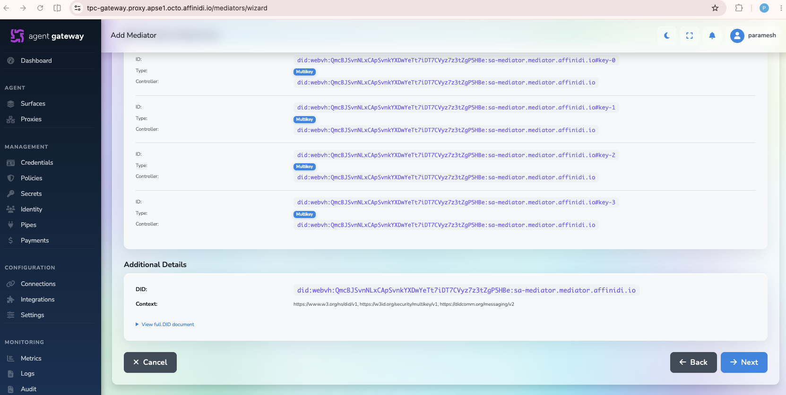
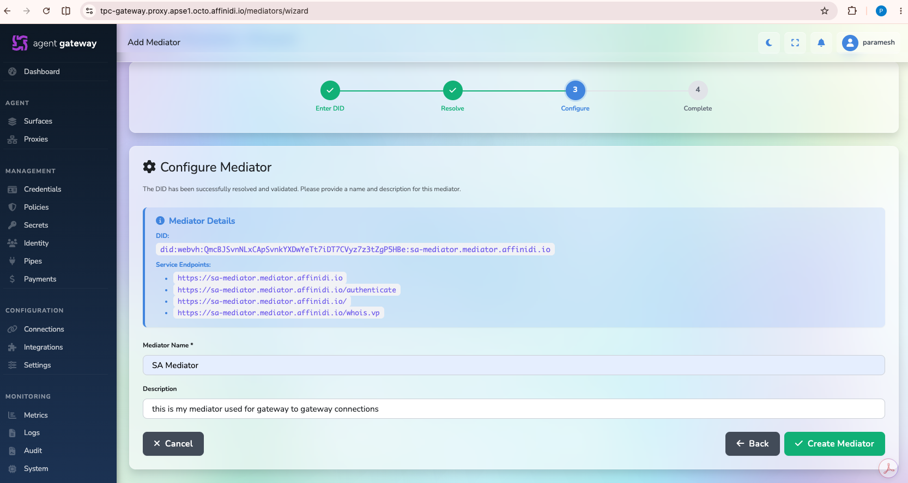
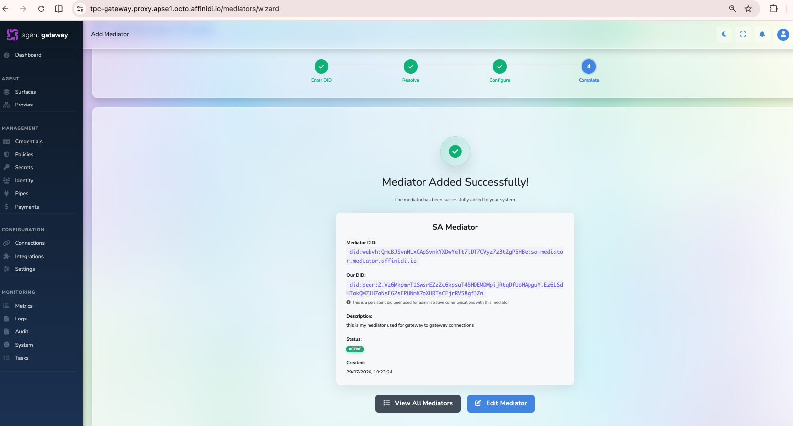
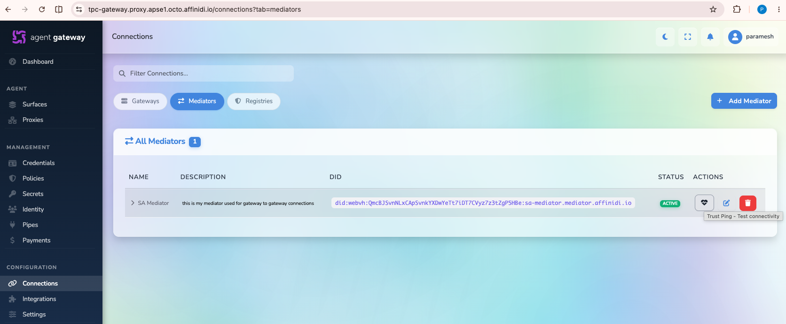

# DIDComm Mediator Setup Guide

## Overview

A DIDComm Mediator is a crucial component of the Affinidi Trust Fabric architecture. It acts as an intermediary that facilitates secure, asynchronous communication between Affinidi Gateways using the DIDComm protocol. The mediator enables gateway-to-gateway connections and ensures reliable message routing without exposing direct network connections.

This guide walks you through creating a mediator and adding it to your Affinidi Gateways.

---

## Part 1: Create a Mediator

**Skip this section if you already have an existing mediator.**

### Process:

1. **Login to Affinidi Developer Portal**

   Navigate to [https://portal.affinidi.com/](https://portal.affinidi.com/) and log in with your credentials

2. **Access DIDComm Mediator Section**

   In the left-side menu bar, locate the **Affinidi Elements** section and select **DIDComm Mediator**

   

3. **Create a New Mediator Configuration**

   Click on the **Create Configuration** button

   

4. **Enter Mediator Details**

   

   Fill in the following information:
   - **Mediator Name** (required): A descriptive name for your mediator (e.g., "My Gateway Mediator", "Production Mediator")
   - **Description** (optional): Additional details about the mediator's purpose or environment
   - Click **Create** button

5. **Wait for Deployment**

   **Note:** Mediator creation typically takes a few minutes. The system is provisioning the mediator infrastructure in the background. You can monitor the deployment status in the Affinidi portal.

6. **Copy Mediator DID**

   

   Once the deployment state shows **Complete**:
   - Locate and copy your **Mediator DID** - This is a unique identifier for your mediator
   - You will need this DID when adding the mediator to your gateways
   - Store it securely as you'll reference it multiple times

**Mediator DID Format Example:** `did:key:z6Mkk7yqnGF3YwZ8VsNf3ypu1SwBpeWc1v4MsrAr1XDHsJhi`

---

## Part 2: Add Mediator to Your Gateway

You must add the mediator to each gateway you want to use for gateway-to-gateway connections. Repeat this section for each gateway.

### Prerequisites:

- You have successfully created a mediator (see Part 1)
- You have access to the gateway dashboard with admin privileges
- You have copied your Mediator DID

### Process:

1. **Open Gateway Dashboard**

   Navigate to the Affinidi Gateway dashboard you want to configure

2. **Access Mediators Configuration**

   In the gateway dashboard, navigate to **Connections** menu

   Select the **Mediators** tab

   Click on **Add Mediator** button

   

3. **Enter Mediator DID**

   
   - Paste your Mediator DID in the input field
   - Click **Next** to proceed

4. **Verify Mediator DID Document**

   

   The gateway will resolve your mediator DID and display the DID Document, which contains:
   - Mediator identifier information
   - Endpoints and service details
   - Cryptographic key material

   Review the information to ensure it's correct, then scroll down and click **Next**

5. **Configure Mediator Details**

   

   Enter the following information for this gateway's mediator configuration:
   - **Mediator Name**: A name to identify this mediator within this gateway (e.g., "Primary Mediator", "Gateway Mediator")
   - **Description** (optional): Additional notes about this mediator's role or configuration
   - Click **Next** or **Save** to proceed

6. **Mediator Added Successfully**

   

   The mediator has been successfully added to your gateway
   - A confirmation message will appear
   - Click **View All Mediators** to see the complete list of mediators configured on this gateway

7. **Verify Mediator Health**

   In the mediators list:
   - You should see your newly added mediator in the list
   - Verify the status is **Active** or **Healthy**
   - Click the **Heartbeat** icon in the Actions column to perform a health check

   

   The heartbeat test will:
   - Send a test message to the mediator
   - Verify the connection is working properly
   - Display a status confirming the mediator is reachable

---

## Mediator Configuration for Multiple Gateways

If you have multiple gateways and want to enable gateway-to-gateway communication:

1. **Repeat Part 2 for Each Gateway**

   You must add the same mediator to each gateway that needs to communicate with other gateways
   - Gateway 1 (AG1): Add Mediator
   - Gateway 2 (AG2): Add Mediator
   - Additional Gateways: Add Mediator as needed

2. **Use the Same Mediator DID**

   All gateways in your mesh should use the same mediator DID to ensure proper routing

3. **Verify Connectivity on All Gateways**

   After adding the mediator to each gateway, test the heartbeat on each one to ensure all gateways can reach the mediator

---

## Mediator Health and Monitoring

### Heartbeat Check

Periodically verify that your mediators are healthy and reachable:

1. Navigate to **Connections > Mediators** in your gateway dashboard
2. For each mediator, click the **Heartbeat** icon
3. Review the status:
   - ✓ **Success** - Mediator is healthy and responsive
   - ✗ **Failed** - Check network connectivity and mediator status in the developer portal

### Signs of Mediator Issues

- Heartbeat checks fail consistently
- Gateway-to-gateway connections show as "Disconnected"
- Messages are not being routed between gateways
- Connection approval process hangs or times out

### Troubleshooting Mediator Issues

**Problem:** Heartbeat check fails

**Solutions:**

1. Verify the mediator deployment status in the Affinidi Developer Portal
2. Check your network connectivity
3. Ensure the mediator DID is correct and not expired
4. Try re-adding the mediator to the gateway

**Problem:** Cannot add mediator to gateway

**Solutions:**

1. Verify the mediator DID format is correct
2. Ensure the mediator deployment is complete (status should be "Complete")
3. Check that you have admin privileges on the gateway
4. Try copying the mediator DID again to avoid typos

**Problem:** Connection between gateways fails or times out

**Solutions:**

1. Verify mediator heartbeat is working on both gateways
2. Ensure both gateways have the same mediator added
3. Check that both gateways can reach the mediator
4. Verify network firewall rules allow communication to the mediator

---

## Best Practices

### Mediator Naming Convention

Use descriptive names for your mediators to easily identify their purpose:

- **Environment-based**: `Production-Mediator`, `Staging-Mediator`, `Dev-Mediator`
- **Purpose-based**: `Gateway-Fabric-Mediator`, `Partner-Integration-Mediator`
- **Region-based**: `US-East-Mediator`, `EU-West-Mediator` (if using multiple mediators)

### High Availability

- In production environments, consider having a dedicated mediator
- Test mediator failover scenarios
- Monitor mediator health regularly using heartbeat checks

### Security Considerations

- Only add your mediator to trusted gateways
- Use separate mediators for development and production environments
- Regularly verify mediator health and connectivity
- Keep mediator DIDs confidential; only share with authorized gateway administrators

### Performance

- A single mediator can support multiple gateway connections
- Place mediators in regions with low latency to your gateways
- Monitor mediator performance and gateway connection stability

---

## Next Steps

1. **Gateway-to-Gateway Connection**: Once you've added the mediator to your gateways, you can establish connections between them
   - See [Gateway to Gateway Connection Guide](./fabric-connection-guide.md) for detailed instructions

2. **Configure Surfaces**: Use the gateway connection when setting up surfaces for secure communication
   - Refer to your gateway's surface documentation for configuration details

3. **Monitor Your Fabric**:
   - Periodically check mediator health
   - Monitor gateway connection status
   - Set up alerts for connection issues

---

## Related Documentation

- [Gateway to Gateway Connection Guide](./fabric-connection-guide.md) - Connect your gateways using the mediator
- [Affinidi Trust Fabric Documentation](https://docs.affinidi.com/products/affinidi-trust-fabric/)
- [DIDComm Protocol](https://didcomm.org/) - Learn more about the DIDComm messaging protocol
- [Affinidi Developer Portal](https://portal.affinidi.com/) - Manage your mediators and gateways

---

## FAQ

**Q: Do I need a separate mediator for each gateway?**
A: No. A single mediator can serve multiple gateways. Add the same mediator to each gateway that needs to communicate.

**Q: Can I use the same mediator for both development and production?**
A: Not recommended. Create separate mediators for different environments to maintain isolation and security.

**Q: How long does mediator creation take?**
A: Typically a few minutes. You can monitor the deployment status in the Affinidi Developer Portal.

**Q: What happens if the mediator goes down?**
A: Gateway-to-gateway connections will fail. Ensure your mediator is monitored and has proper redundancy in production environments.

**Q: Can I update a mediator's name after creation?**
A: Yes. You can update the name in the gateway's mediator configuration, but not in the Affinidi Developer Portal after the initial creation.

**Q: How do I know if my mediator is working?**
A: Use the Heartbeat check in the Mediators tab of your gateway dashboard. A successful heartbeat confirms the mediator is reachable and healthy.
