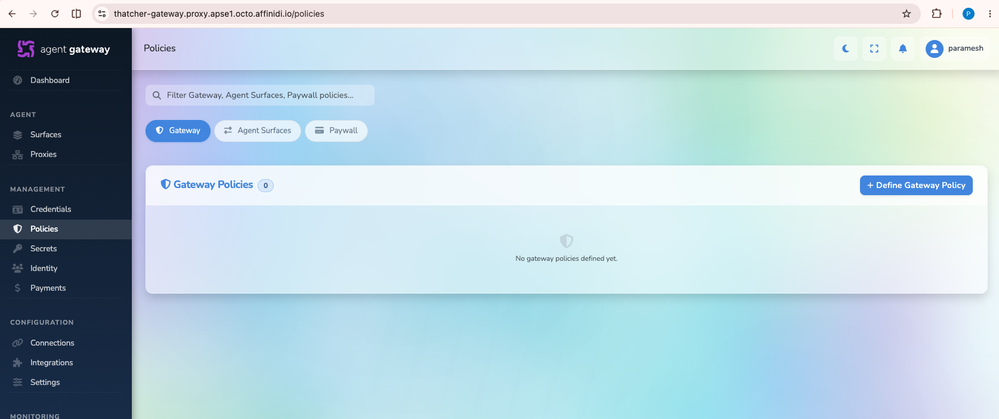
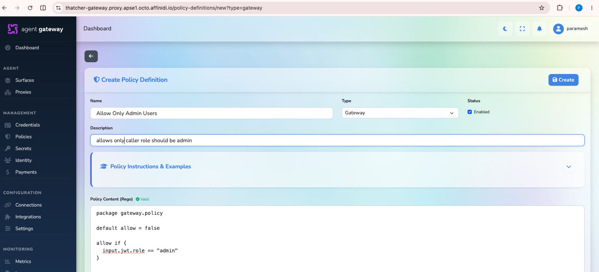
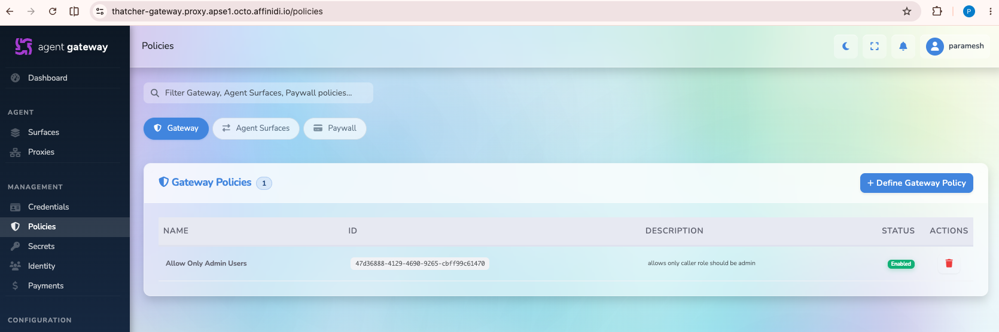
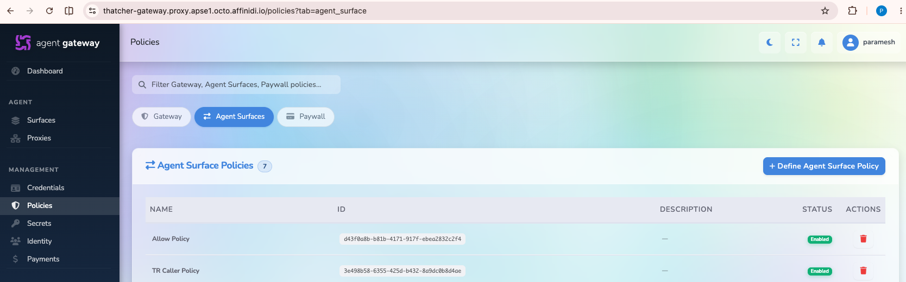
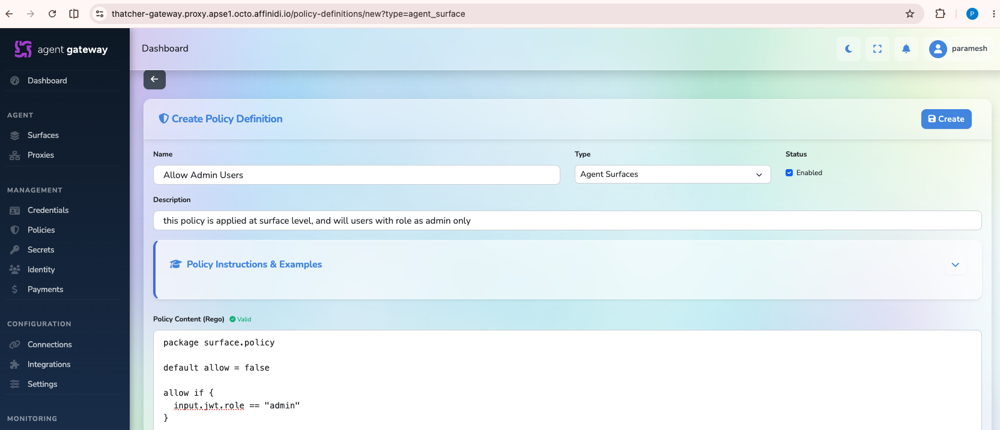
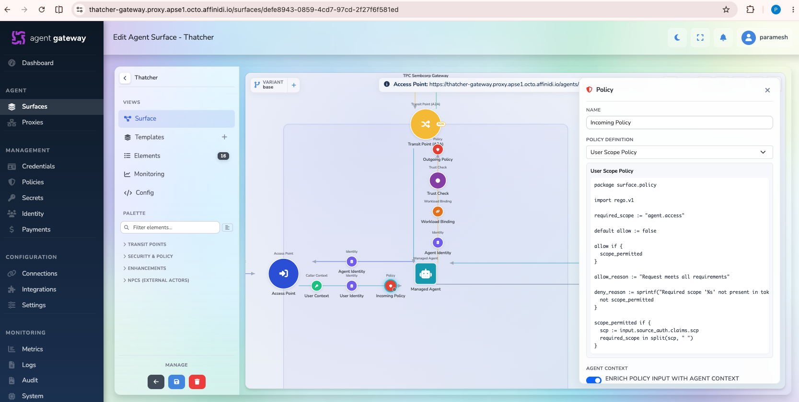

# Policy Guide

This guide explains how to create policies in the Gateway dashboard.

There are two types of policies:

1. **Gateway policy**: Cluster-wide policy evaluated for all matching traffic after authentication.
2. **Surface policy**: Policy attached to a specific surface and evaluated after gateway policy.

## How Policy Evaluation Works

For inbound flow, evaluation order is:

**Inbound request -> Authentication -> Gateway policy -> Surface policy -> Forward to target**

- A deny at gateway policy stage is final.
- Surface policies cannot override a gateway deny.
- Policy edits are applied to subsequent requests immediately.
- Policies can be enabled or disabled without deleting them.

## Available Input Context

Policies receive a structured `input` document.

Common fields used in this guide:

- `input.jwt.*` - JWT claims (`sub`, `role`, etc.)
- `input.http.method` - HTTP method
- `input.http.path` - Request path
- `input.http.headers` - HTTP headers
- `input.gateway.direction` - `"inbound"` or `"outbound"`
- `input.channel.config_id` - Target channel config ID
- `input.channel.name` - Target channel name

Additional namespaces may be available depending on the surface and enabled elements, such as:

- `input.source_auth.*` (caller authentication context)
- `input.a2a.*` (A2A method and message)
- `input.mcp.*` (MCP method/tool context)
- `input.agent.*` (agent/trust data when enabled)
- `input.trust_check_results.*` (trust registry verification results)

For the complete schema, see the policy input reference in the Learn More section.

## Create a Gateway Policy

1. Open the Gateway dashboard.
2. Go to **Policies**.
3. Select the **Gateway** tab.
4. Click **Define Gateway policy**.



5. Enter the following details, then click **Create**:
   - **Name**: Any name of your choice
   - **Type**: **Gateway**
   - **Description**: Any description of your choice
   - **Policy content**: Rego policy content



6. After creation, the policy is listed under gateway policies and is applied immediately to gateway requests.



## Gateway Policy Samples

### Require Authentication

```rego
package gateway.policy

default allow = false

# Only allow authenticated requests
allow if {
  input.jwt.sub
}
```

### Admin-Only Access

```rego
package gateway.policy

default allow = false

allow if {
  input.jwt.role == "admin"
}
```

### Allow Only Connections from a Specific Gateway DID

```rego
package gateway.policy

default allow := false

remote_gateway := "did:webvh:QmWCYMpgqdLGssPdgZBxti81QsYxxHRGmD1L1miizGgSNz:dexter-gateway.proxy.apse1.octo.affinidi.io:connection-points:b3bfd64e-0fa0-40ff-857b-eadeb8997fb6"

allow if {
  input.gateway.direction == "inbound"
  input.gateway.source_id == remote_gateway
}

deny_reason := "Invalid gateway direction - expected inbound" if {
  input.gateway.direction != "inbound"
}

deny_reason := "Invalid gateway source" if {
  input.gateway.direction == "inbound"
  input.gateway.source_id != remote_gateway
}
```

## Create a Surface Policy

1. Open the Gateway dashboard.
2. Go to **Policies**.
3. Select the **Agent surfaces** tab.
4. Click **Define Agent surface policy**.



5. Enter the following details, then click **Create**:
   - **Name**: Any name of your choice
   - **Type**: **Agent surfaces**
   - **Description**: Any description of your choice
   - **Policy content**: Rego policy content



6. To apply the policy:
   - Open the surface where you want to enforce it.
   - Select the **Policy** element.
   - Choose the policy you created.
   - Click **Save surface**.

The policy is applied to that surface immediately.



## Surface Policy Samples

### Allow Trust Registry Checks for the Caller

```rego
package surface.policy

default allow := false

allow if {
  trust_registry_authorized
}

trust_registry_authorized if {
  every r in input.trust_check_results.caller { r.ok }
}

deny_reason := "Caller failed Trust Registry verification" if {
  not trust_registry_authorized
}
```

### Policy on Input Source Auth Scope

```rego
package surface.policy

import rego.v1

required_scope := "agent.access"

default allow := false

allow if {
  scope_permitted
}

allow_reason := "Request meets all requirements"

deny_reason := sprintf("Required scope '%s' not present in token", [required_scope]) if {
  not scope_permitted
}

scope_permitted if {
  scp := input.source_auth.claims.scp
  required_scope in split(scp, " ")
}
```

### Policy on Input A2A Payload

```rego
package surface.policy

import rego.v1

# Actions permitted through this surface
allowed_actions := {"send:message"}

default allow := false

allow if {
  trust_registry_authorized
  action_permitted
}

deny_reason := "Caller did not pass Trust Registry verification" if {
  not trust_registry_authorized
}

deny_reason := sprintf("A2A action '%s' is not allowed", [a2a_action]) if {
  trust_registry_authorized
  not action_permitted
}

trust_registry_authorized if {
  every r in input.trust_check_results.target { r.ok }
}

trust_registry_authorized if {
  count(input.trust_check_results.target) == 0
}

action_permitted if {
  a2a_action in allowed_actions
}

# Extract action from message parts (data kind) or fall back to a2a method
a2a_action := action if {
  some part in input.a2a.message.parts
  part.kind == "data"
  action := part.data.action
  is_string(action)
  action != ""
} else := action if {
  action := input.a2a.method
  is_string(action)
  action != ""
} else := "unknown"
```

## Learn More

For additional policy details, see:

https://docs.affinidi.com/products/affinidi-trust-fabric/agent-gateway/concepts/opa-policies/

Complete policy input reference:

https://docs.affinidi.com/products/affinidi-trust-fabric/agent-gateway/reference/surfaces/policy-input/
