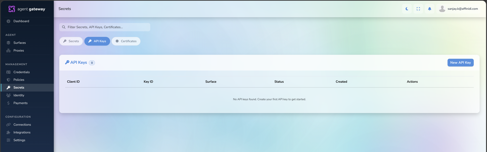
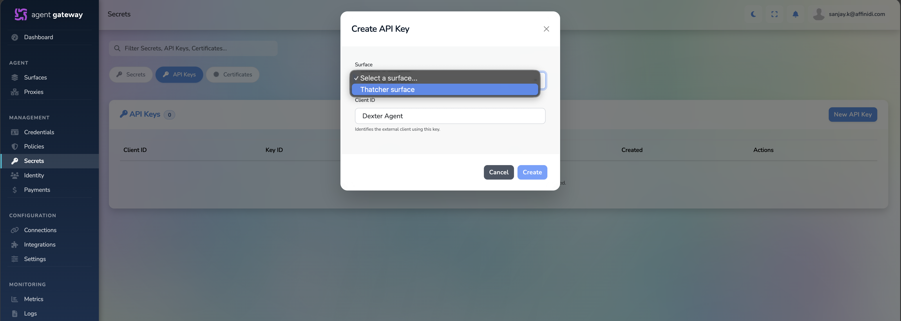

# Creating an API Key for a Surface

API Keys allow clients to authenticate when calling a protected Surface.

## Prerequisites

- A Surface has already been created.
- The Surface is configured to use API Key authentication.

---

## Create an API Key

1. Navigate to **Secrets**.
2. Select the **API Keys** tab.
3. Click **New API Key**.
   
4. Enter a **Client ID**.
   - Example: `my-agent`
   - Example: `copilot-orchestrator`

5. Select the target **Surface**.
6. Click **Create**.
   

---

## Save the Generated API Key

After creation, the gateway will generate an API Key.

Example:

```text
Client ID: my-agent
API Key: atgk_xxxxxxxxxxxxxxxxx
```

Store this value securely.

---

## Use the API Key

Include the API key in requests sent to the Surface.

Example:

```http
Authorization: atgk_xxxxxxxxxxxxxxxxx
```

or

```http
X-API-Key: atgk_xxxxxxxxxxxxxxxxx
```

Use the header configured for the Surface.

---

## Manage API Keys

From **Secrets → API Keys** you can:

- View the associated Client ID
- See which Surface the key belongs to
- Check whether the key is Active or Revoked
- Rotate the key
- Revoke the key
- Delete the key

---

## Example

```text
Surface: Weather Agent
Client ID: orchestrator-agent
Key ID: atgk_xxxxxxxxx
Status: Active
```

The client application uses the generated API key when calling the Weather Agent surface.
