# Trust Registry Integration with Affinidi Gateway

## Overview

Affinidi Trust Registry is a decentralized registry that enables verifiable trust between agents and organizations within the Affinidi Trust Fabric. By integrating a Trust Registry with your Affinidi Gateway, you can:

- Register and recognize issuers (departments/organizations) operating through your gateway
- Validate agents and their credentials before allowing communication
- Define and enforce access policies at the trust layer
- Establish a verifiable chain of trust across connected gateways

For additional reference:

- [Agent Validation via Trust Registry](https://docs.affinidi.com/products/affinidi-trust-fabric/agent-gateway/how-to-guides/connections/agent-validation-via-trust-registry/)
- [Trust Registry Reference](https://docs.affinidi.com/products/affinidi-trust-fabric/agent-gateway/reference/trust-registries/trust-registry/)
- [Issuer Reference](https://docs.affinidi.com/products/affinidi-trust-fabric/agent-gateway/reference/trust-registries/issuer/)
- [Trust Registry Concepts](https://docs.affinidi.com/products/affinidi-trust-fabric/agent-gateway/concepts/connections/trust-registry/)

---

## Prerequisites

Before you begin, ensure you have:

- Access to the [Affinidi Developer Portal](https://portal.affinidi.com/) with appropriate permissions
- A **DIDComm Mediator** - required for Trust Registry creation (see [Mediator Setup Guide](./mediator-guide.md))
- An **Affinidi Gateway** with admin privileges

---

## High-Level Steps

1. Create a Trust Registry in the Affinidi Developer Portal
2. Create an OOB Invite from the Trust Registry dashboard
3. Add the Trust Registry to your Gateway
4. Approve the connection in the Trust Registry
5. Add an Issuer/Department to the Gateway

---

## Part 1: Create a Trust Registry

1. **Login to the Affinidi Developer Portal**

   Navigate to [https://portal.affinidi.com/](https://portal.affinidi.com/) and log in with your credentials

2. **Access Affinidi Trust Registry**

   In the left-side menu bar, locate **Affinidi Radix** section and click on **Affinidi Trust Registry**

   Click the **Create Configuration** button

   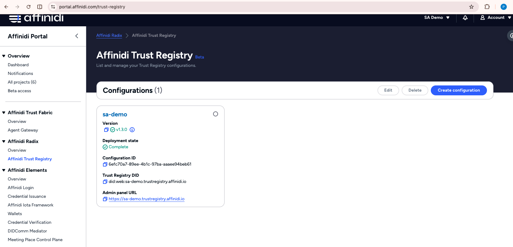

3. **Enter Configuration Details**

   Fill in the following:
   - **Name**: A descriptive name for your Trust Registry configuration (e.g., "My Trust Registry", "Production TR")
   - **Default Mediator DID**: Paste your mediator DID here
     > If you don't have a mediator, refer to the [Mediator Setup Guide](./mediator-guide.md) to create one first
   - **Administrator DIDs**: Your personal DID associated with your Developer Portal login
     > You can copy your DID from the **top-right account menu** in the Developer Portal
   - **CORS Allowed Origins**: `http://localhost:3000`
     Click the **Create** button to proceed

   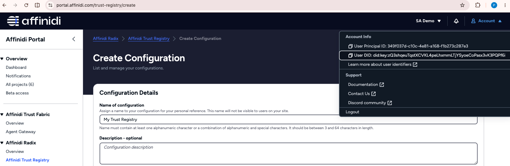
   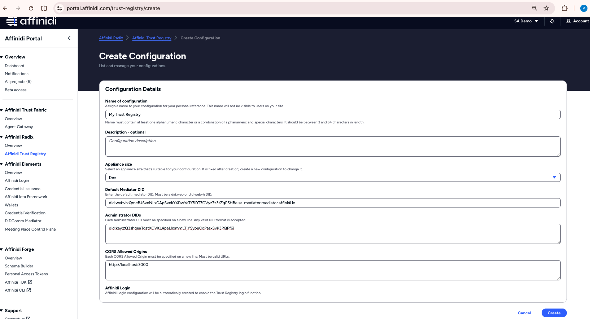

4. **Wait for Deployment**

   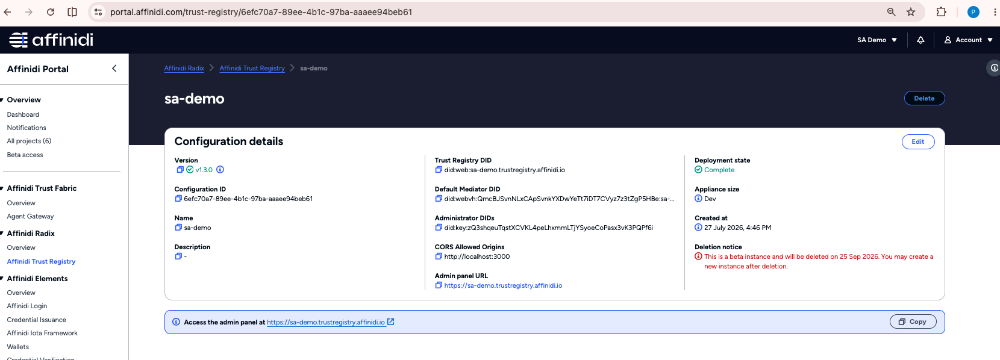

   Trust Registry creation takes a few minutes. Once the **Deployment State** shows **Completed**, copy the **Admin Panel URL** (e.g., `https://sa-demo.trustregistry.affinidi.io`)

   > Store this URL — you will use it to access the Trust Registry dashboard in the next steps

5. **Access the Trust Registry Dashboard**

   Open the Admin Panel URL in a new browser tab and log in

   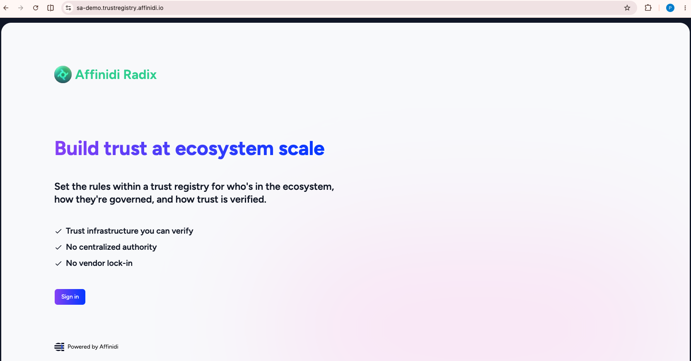

   After successful login, you should see the Trust Registry dashboard

   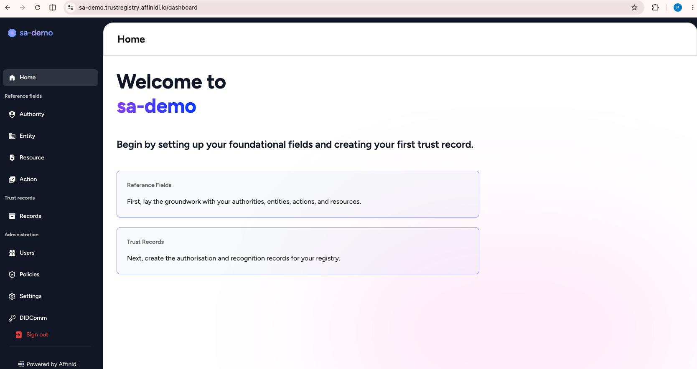

---

## Part 2: Create an OOB Invite from Trust Registry Dashboard

Before connecting the Trust Registry to your gateway, you must create a connection point in the Trust Registry and generate an OOB (Out-of-Band) invitation URL.

1. **Access Connection Settings**

   In the Trust Registry dashboard, navigate to **Administration > Connections** and click on **Create Connection** button

   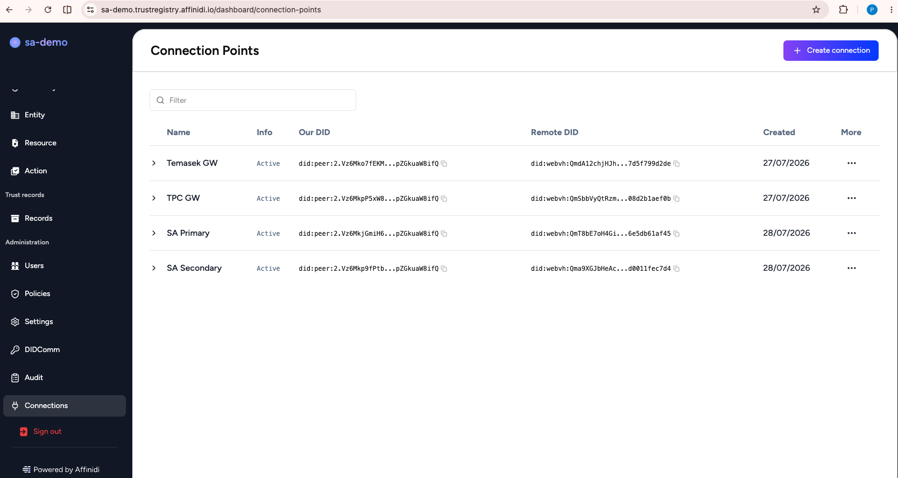

2. **Enter Connection Details**

   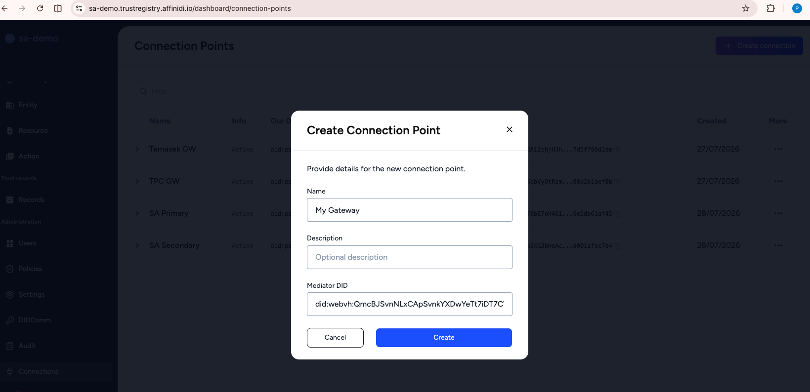

   Fill in:
   - **Name**: A name for this connection (e.g., "My Gateway Connection")
   - **Mediator DID**: Your mediator DID

   Click **Create**

3. **Copy the OOB Invitation URL**

   Once the connection is created, it will appear in the connection points list

   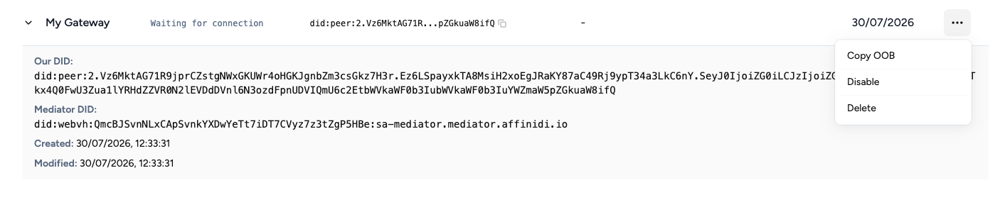
   - Click the **three-dot menu (...)** on the right side of your connection entry
   - Select **Copy OOB** to copy the OOB invitation URL

   > **Important:** Keep this OOB URL — you will paste it into the gateway in the next step

---

## Part 3: Add Trust Registry to Your Gateway

1. **Navigate to Trust Registry Settings in Gateway**

   Login to your gateway dashboard, click on **Connections** and select the **Registries** tab

   Click the **Add Trust Registry** button

   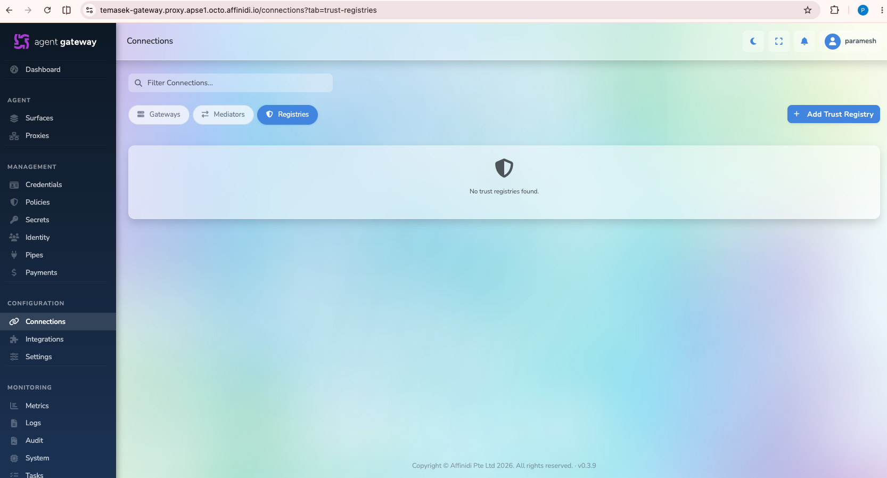

2. **Enter Trust Registry Details**

   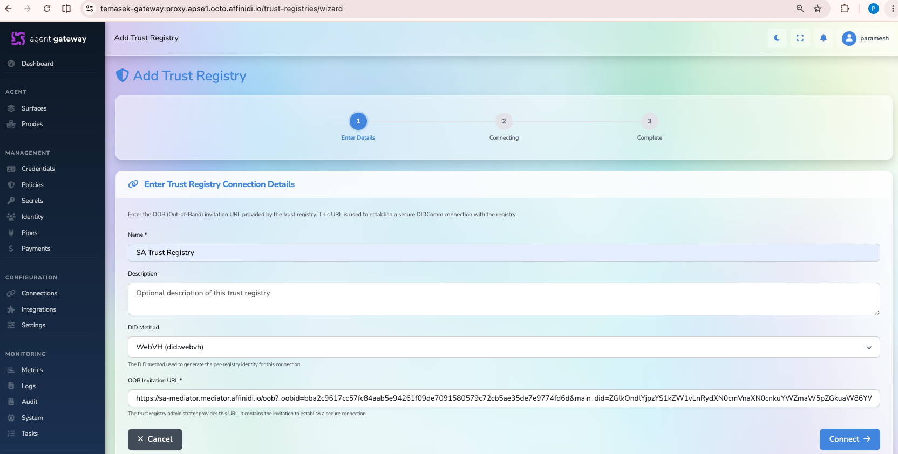

   Fill in the following and click **Connect**:

   | Field                  | Value                                                |
   | ---------------------- | ---------------------------------------------------- |
   | **Name**               | Your choice (e.g., `My Trust Registry`)              |
   | **DID Method**         | `WebVH`                                              |
   | **OOB Invitation URL** | The OOB URL copied from the Trust Registry dashboard |

3. **Connection Awaiting Approval**

   The gateway will validate the OOB URL and establish the DIDComm connection

   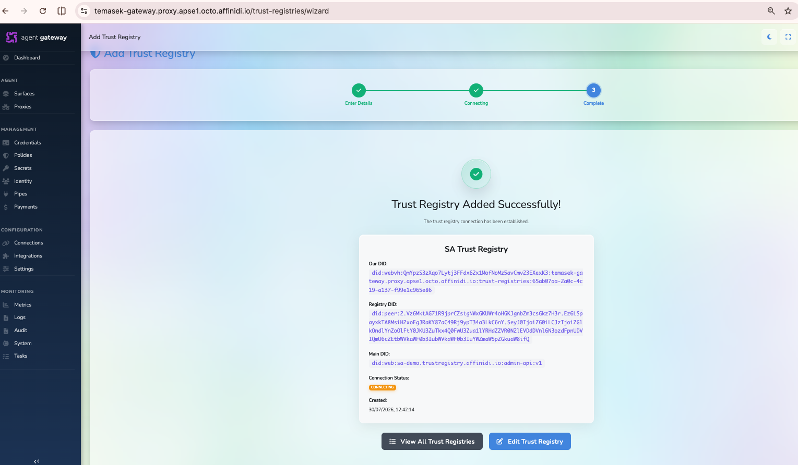

   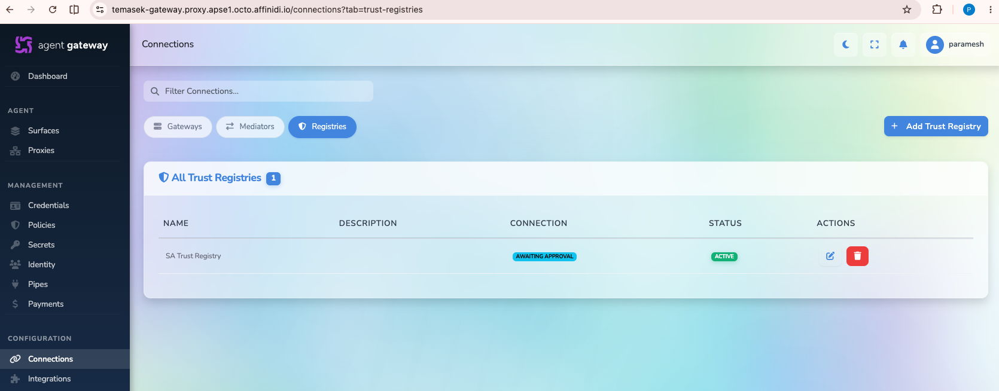

   The Trust Registry entry will appear with the status **Awaiting Approval** — this is expected. The Trust Registry must approve the connection in the next step.

---

## Part 4: Approve the Trust Registry Connection

1. **View Pending Connection in Trust Registry**

   Return to the **Trust Registry dashboard**, navigate to **Administration > Connections**

   You should see the incoming connection with status **Awaiting Approval**

   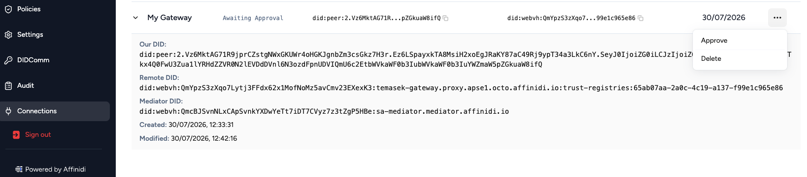

2. **Approve the Connection**

   Click the **Approve** button on the pending connection

   The status will change to **Active**

   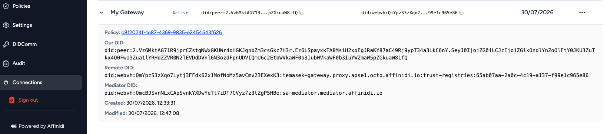

3. **Review and Update Default Policy**

   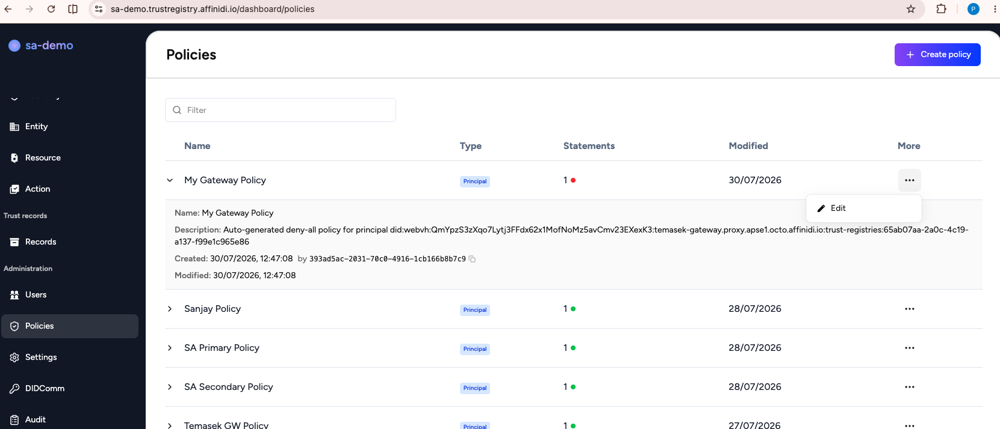

   > **Note:** By default, the connection is created with a **Deny** policy, which blocks all requests. You must update it to Allow for your gateway to communicate with the Trust Registry.

   Click the **Policy** link on the connection row, or navigate to **Policies** in the Trust Registry dashboard to edit the policy

4. **Update the Policy to Allow**

   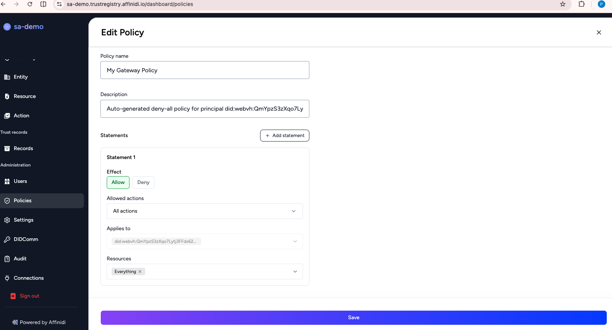

   Update the policy to grant **Allow** permissions for the gateway connection and click **Save**

5. **Verify Connection in Gateway**

   Return to your gateway dashboard

   Navigate to **Connections > Registries** — the Trust Registry connection status should now show as **Connected**

   Click the **Heartbeat** icon in the actions column to ping the Trust Registry and confirm the connection is active

---

## Part 5: Add an Issuer/Department to the Gateway

An Issuer represents a department or organization operating through your gateway. Adding an issuer registers it in the connected Trust Registry, enabling the gateway to recognize and authorize agents on its behalf.

1. **Access Identity Management**

   In the gateway dashboard, locate the **Management** section in the left menu and click on **Identity**

2. **Add an Issuer**

   Select the **Issuers** tab and click **Add Issuer**

   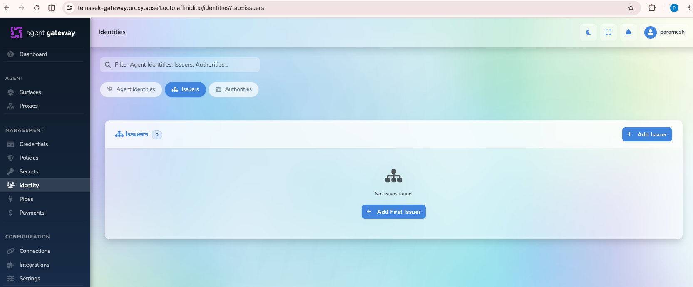

3. **Enter Issuer Details**

   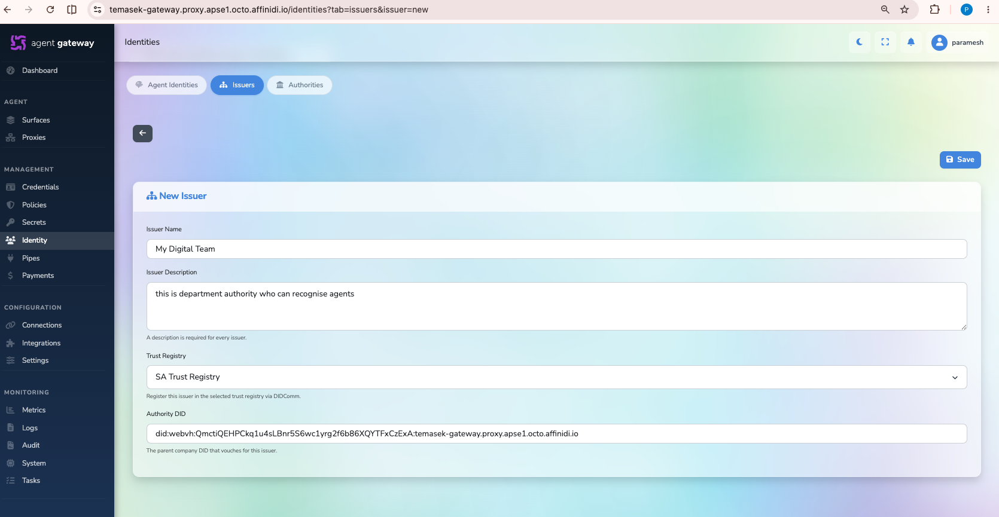

   Fill in the following and click **Save**:
   - **Issuer Name**: The name of the department or organization (e.g., "Finance Department", "Partner Org")
   - **Trust Registry**: Select the Trust Registry added in the previous steps

4. **Issuer Registration Confirmed**

   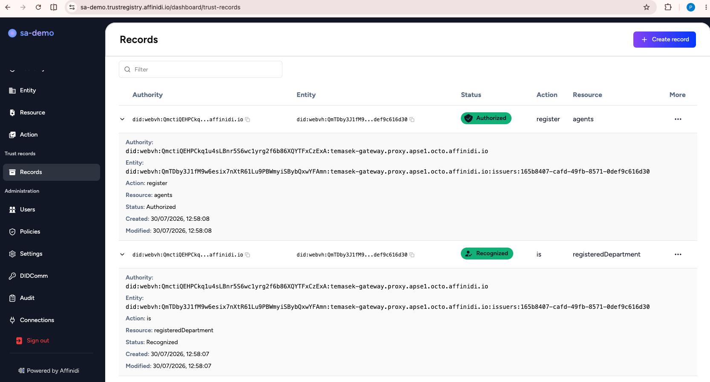

   After successful registration, the issuer will appear in the list with **Trust Registry Status** shown as **TR** in green. This indicates:
   - The issuer is recognized by the gateway as a registered department
   - The issuer is authorized by the gateway to register agents

---

## Verification Checklist

After completing all steps, verify the following:

- [ ] Trust Registry deployment state is **Completed** in the Developer Portal
- [ ] Trust Registry dashboard is accessible via the Admin Panel URL
- [ ] Gateway connection status in Trust Registry is **Active**
- [ ] Trust Registry connection policy is set to **Allow**
- [ ] Gateway shows Trust Registry status as **Connected**
- [ ] Heartbeat ping to Trust Registry succeeds
- [ ] Issuer is listed with **TR** status in green

---

## How It Works

```
┌──────────────────────────────────────────────────────────────────┐
│                      Trust Validation Flow                        │
├──────────────────────────────────────────────────────────────────┤
│                                                                    │
│  Agent Request                                                     │
│       │                                                            │
│       ▼                                                            │
│  ┌──────────────────┐    DIDComm     ┌──────────────────────┐    │
│  │  Affinidi        │◄──────────────►│  Affinidi Trust      │    │
│  │  Gateway         │   Mediator     │  Registry            │    │
│  │                  │                │                      │    │
│  │  - Routes agent  │                │  - Validates issuer  │    │
│  │  - Checks issuer │                │  - Checks policies   │    │
│  │  - Enforces TR   │                │  - Returns decision  │    │
│  │    policy        │                │                      │    │
│  └──────────────────┘                └──────────────────────┘    │
│                                                                    │
└──────────────────────────────────────────────────────────────────┘
```

When an agent makes a request through the gateway, the gateway queries the Trust Registry to validate whether the agent's issuer is trusted and authorized. The Trust Registry returns a decision based on the configured policies, and the gateway enforces that decision on the incoming request.

---

## Troubleshooting

**Problem:** Trust Registry deployment does not complete

**Solution:**

- Refresh the Developer Portal page and wait a few more minutes
- Verify your mediator DID is correct
- Ensure your administrator DID is properly formatted

---

**Problem:** OOB URL is invalid when adding to gateway

**Solution:**

- Re-copy the OOB URL from the Trust Registry dashboard (it may have expired)
- Verify the Trust Registry connection status is not already connected to another gateway

---

**Problem:** Gateway connection remains at "Awaiting Approval" after several minutes

**Solution:**

- Log in to the Trust Registry dashboard and check **Administration > Connections**
- Manually approve the pending connection
- Verify the mediator is healthy on both sides (use heartbeat checks)

---

**Problem:** Heartbeat to Trust Registry fails after approval

**Solution:**

- Confirm the connection policy is set to **Allow** (not **Deny**)
- Verify the mediator DID used when creating the Trust Registry connection matches the gateway's mediator
- Check mediator health using the [Mediator Guide](./mediator-guide.md#mediator-health-and-monitoring)

---

**Problem:** Issuer "TR" status is not showing in green

**Solution:**

- Ensure the Trust Registry connection in the gateway is **Connected** before adding issuers
- Check the Trust Registry policies — the issuer registration may be blocked
- Try removing and re-adding the issuer after confirming the TR connection is active

---

## Related Guides

- [Mediator Setup Guide](./mediator-guide.md) - Create a DIDComm Mediator required by the Trust Registry
- [Gateway to Gateway Connection Guide](./fabric-connection-guide.md) - Connect two gateways together
- [Affinidi Trust Fabric Overview](./fabric-readme.md)

---

## Additional Resources

- [Affinidi Developer Portal](https://portal.affinidi.com/)
- [Agent Validation via Trust Registry](https://docs.affinidi.com/products/affinidi-trust-fabric/agent-gateway/how-to-guides/connections/agent-validation-via-trust-registry/)
- [Trust Registry Reference](https://docs.affinidi.com/products/affinidi-trust-fabric/agent-gateway/reference/trust-registries/trust-registry/)
- [Issuer Reference](https://docs.affinidi.com/products/affinidi-trust-fabric/agent-gateway/reference/trust-registries/issuer/)
- [Trust Registry Concepts](https://docs.affinidi.com/products/affinidi-trust-fabric/agent-gateway/concepts/connections/trust-registry/)
