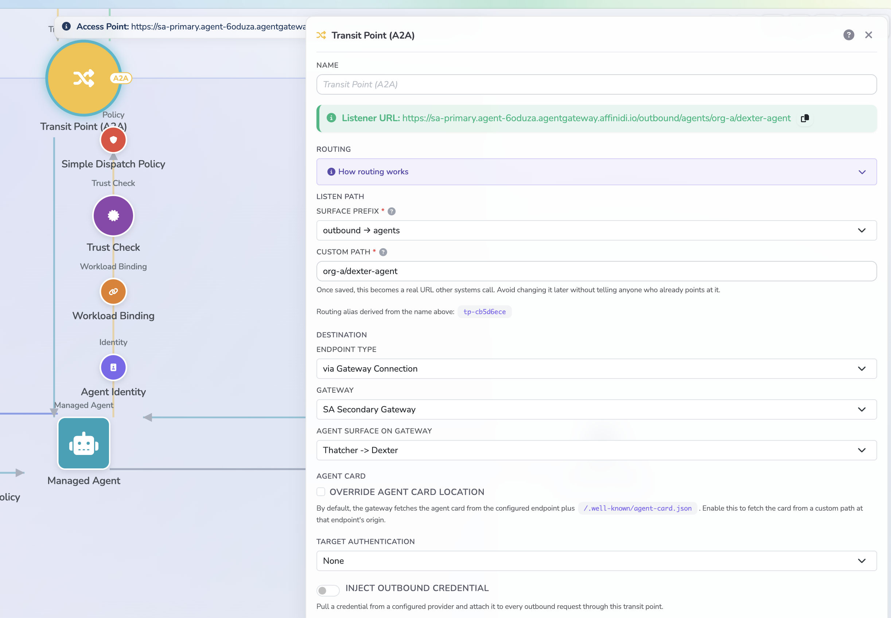
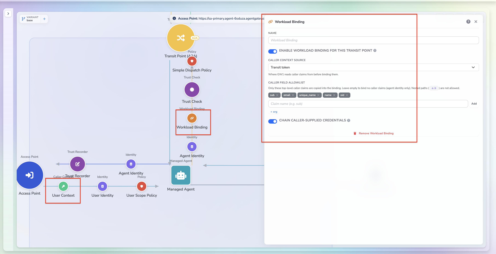

# Workload Binding Guide

## Overview

When an agent calls an agent in another organisation through Affinidi Agent Gateway, the receiving side usually needs to know two things: **which agent is calling** and **which user it is calling for**.

**Workload binding** answers both. The Transit Point binds the calling user to the calling agent and signs the result as a Verifiable Presentation (VP). The receiving gateway verifies it and makes it available to policy and to the receiving agent.

For this to work, your agent must do one small thing: **pass the transit token** it receives from the gateway on to its outbound call.

With workload binding you get:

- A gateway-signed record of the user and agent behind each cross-organisation call
- User identity available to the receiving gateway's policies
- An audit trail that ties each outbound call back to the inbound request that caused it

---

## Prerequisites

Before you begin, ensure you have:

- Two gateways connected through a fabric connection (see [Fabric Connection Guide](./fabric-connection-guide.md))
- A Trust Registry with issuers and authorities set up on both gateways (see [Trust Registry Guide](./trust-registry-guide.md))
- A JWT strategy for your identity provider, used by the surface to identify the user (see [JWT Strategy Guide](./jwt-strategy-guide.md))
- An A2A surface with an **Access Point**, **Managed Agent** and **Transit Point** (see [Gateway Setup](../use-cases/secure-agent-communication/docs/gateway-setup.md))
- An agent you can modify to read and set HTTP headers

---

## How It Works

```
 User / Portal                 GATEWAY A (Org A)                                   GATEWAY B (Org B)
 ───────────                   ──────────────────────────────────────────          ───────────────────────────────
      │  1. POST + Authorization: Bearer <user JWT>
      ├──────────────────────► [Access Point]
      │                          · validate JWT (JWT strategy / JWKS)
      │                          · build caller context (sub, email, oid …)
      │                          · dispatch policy (scp, action)
      │                          · Trust Recorder (if configured)
      │                                │ 2. forward to Managed Agent
      │                                │    + injected agent-identity VP (metadata)
      │                                │    + header  x-transit-token: <T>
      │                                ▼
      │                         ┌──────────────┐
      │                         │   AGENT A    │  3. capture x-transit-token (per request)
      │                         │ (your code)  │  4. call TP listen path, send
      │                         └──────┬───────┘     x-transit-token: <T>  (unchanged)
      │                                │             + A2A body with agentIdentity metadata
      │                                ▼
      │                         [Transit Point]
      │                          · require_transit_token → resolve <T> → caller context
      │                          · Trust Registry check (is target recognised?)
      │                          · outbound policy
      │                          · workload binding → sign VP (user ⇄ agent ⇄ target)
      │                          · sign request (sign_requests: true)
      │                                │ 5. fabric:// connection (DIDComm via Mediator)
      │                                └─────────────────────────────────────────► [Access Point – "A→B" surface]
      │                                                                              · verify gateway + VP
      │                                                                              · trust check, policy
      │                                                                              · input.identity_binding.*
      │                                                                                   ▼
      │                                                                              AGENT B (receives VP in metadata)
      │  6. response travels back the same path
      ◄───────────────────────────────────────────────────────────────────────────────────────────────────────────
```

The gateway creates and checks the transit token. Your agent only **carries it from the incoming request to the outgoing call**.

---

## High-Level Steps

1. Configure the Transit Point
2. Add the Workload Binding element
3. Update your agent to pass the transit token
4. Verify

---

## Part 1: Configure the Transit Point

1. **Open your surface**

   Go to **Surfaces**, open the surface that fronts your agent and click the **Transit Point (A2A)** element on the canvas.
   If there is not already, setup surface by following [Gateway Setup](../use-cases/secure-agent-communication/docs/gateway-setup.md)

2. **Copy the Listener URL**

   This is the URL your agent calls for outbound traffic. Set it as your agent's peer URL (for example `PEER_AGENT_URL`).

3. **Choose the destination**

   Set **Endpoint type** to **via Gateway Connection**, then select the **remote gateway** and the **receiving surface** on that gateway.

4. **Require the transit token**

   Turn on **Transit token required**. The Transit Point will then accept only calls that carry a valid `x-transit-token`.

   > Keep **Request signing** on so the receiving gateway can verify what you send.

5. **Set the Agent Identity**

   Click the **Agent Identity** element and set **Identity extraction type** to **From Payload (identity metadata)** with the fields `name`, `model` and `role`. Your agent sends these in each message (see Part 3).



---

## Part 2: Add the Workload Binding Element

1. In the **Palette**, expand **Enhancements** and add **Workload Binding** to the Transit Point.

2. Configure it:

   | Setting                      | Value                                                     |
   | ---------------------------- | --------------------------------------------------------- |
   | **Enable**                   | On                                                        |
   | **User identity comes from** | **Transit token**                                         |
   | **User fields**              | The fields to pass on, for example `sub`, `email`, `name` |

   > The fields you choose must be present in the token issued by your identity provider.

3. Save the surface.



**Copilot Studio agents** cannot forward a custom header. For those, set **Transit token required** to **off** and **User identity comes from** to **Authorization bearer JWT**. See [Copilot Studio Agent Communication](../use-cases/copilot-studio-agent-communication/).

---

## Part 3: Update Your Agent

Your agent needs three changes.

1. **Read** the `x-transit-token` header on each incoming request.
2. **Send** it, unchanged, on the outgoing call to the Transit Point Listener URL.
3. **Include** the agent identity (`name`, `model`, `role`) in the message metadata.

```python
# Incoming request: keep the token for this request only
transit_token = request.headers.get("x-transit-token")

# Outgoing call to the Transit Point Listener URL
headers = {"Content-Type": "application/json"}
if transit_token:
    headers["x-transit-token"] = transit_token

payload["params"]["message"]["metadata"] = {
    "https://fabric.affinidi.io/extensions/agent-identity/v1": {
        "agentIdentity": {"name": "My Agent", "model": "my-model", "role": "My Agent Server"}
    }
}

requests.post(PEER_AGENT_URL + "/a2a/tasks/send", json=payload, headers=headers)
```

A complete working agent is in [`agent.py`](../use-cases/secure-agent-communication/agent/agent.py).

**Keep in mind**

- Hold the token **per request**. Do not store it globally, reuse it for another request or log its value.
- If the outgoing call is made from a background task, tool or stream, copy the token into it when the request arrives, because the request is no longer available there.
- Keep `name`, `model` and `role` stable. A change creates a different agent identity.

---

## Part 4: Verify

1. Sign in as a user and send a message to the agent in the other organisation.
2. Check that your agent received `x-transit-token` and sent it on. Log that it was present, not its value.
3. On the receiving side, check that the message shows the sending agent's identity.
4. In the gateway **Audit** view (VP audit enabled under **Settings → Security**), check that the VP records the user.

### What the receiving gateway sees

Policies on the receiving gateway can read the verified binding under `input.identity_binding`, including the user fields, the sending gateway and whether the call was made on a user's behalf. See [Sample Policies](../sample-polices/README.md).

---

## Troubleshooting

| Symptom                                           | Check                                                                                                  |
| ------------------------------------------------- | ------------------------------------------------------------------------------------------------------ |
| The Transit Point rejects the call                | Your agent is sending `x-transit-token` and it is the one received on the same request.                |
| The token never reaches your agent                | A proxy or load balancer between the gateway and your agent is not removing `x-*` headers.             |
| The token is present inbound but missing outbound | The outgoing call runs outside the request (background task, tool or stream). Copy the token in first. |
| The VP has no user fields                         | The fields selected in Workload Binding are not in the identity provider's token.                      |
| 403 after the user call succeeds                  | The Trust Check or outbound policy failed. Check the target agent is recognised in the Trust Registry. |

---

## Notes

- The transit token is valid for a single request chain. Treat it like a session token and send it only to your own gateway.
- Make your agent reachable only through the gateway, so callers cannot supply their own `x-transit-token`.
- Keep **Request signing** and the **Trust Check** on for every Transit Point.

---

## Learn More

- [Gateway Setup](../use-cases/secure-agent-communication/docs/gateway-setup.md)
- [Sample Policies](../sample-polices/README.md)
- [Policy Guide](./policy-guide.md)
- [JWT Strategy Guide](./jwt-strategy-guide.md)
- [Trust Registry Guide](./trust-registry-guide.md)
