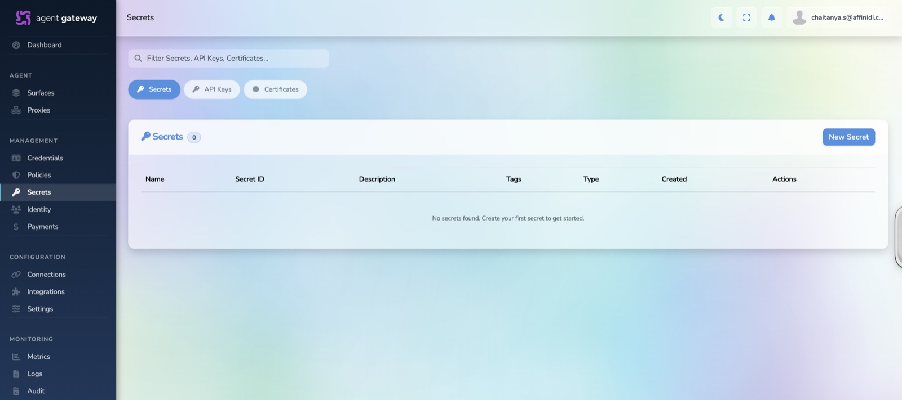
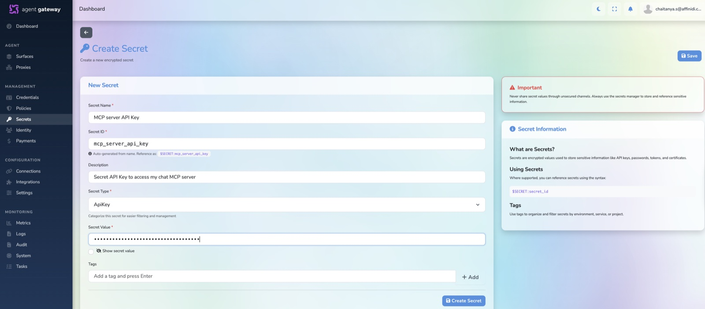
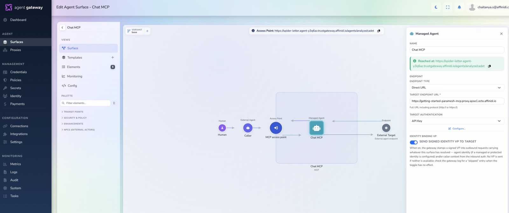
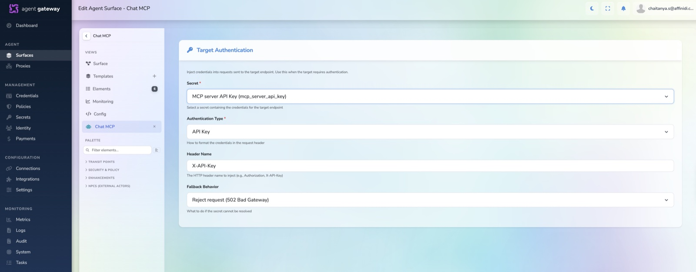

# Injecting Upstream Secrets on an Agent Gateway MCP Surface (Optional)

> **Audience:** Customers who have already set up an [MCP Surface in the Agent Gateway](../README.md#mcp-server-via-agent-gateway) and whose upstream MCP server requires an API key (or other header-based secret).
>
> **Status:** Optional. Follow this guide when your upstream server is protected and you want the gateway to authenticate to it on your behalf.

---

## 📋 Table of Contents

- [Prerequisites](#prerequisites)
- [How It Works](#how-it-works)
- [1. Create the Secret](#1-create-the-secret)
- [2. Attach the Secret to the Surface](#2-attach-the-secret-to-the-surface)
- [3. Test](#3-test)
- [Troubleshooting](#troubleshooting)

---

## Prerequisites

- An MCP surface already created in the Agent Gateway — see the [main README](../README.md#mcp-server-via-agent-gateway).
- Access to the Agent Gateway dashboard with permission to manage **Secrets** and **Surfaces**.
- A working MCP client (the bundled `mcp/test.sh`, the MCP Sandbox in the dashboard, or `curl`).

---

## How It Works

When your upstream MCP server sits behind an API key, you don't want to hand that key to every client that calls your surface. Instead, store it **once** in the Agent Gateway. The gateway then injects it as a header into every request it forwards upstream — transparently, without the client ever seeing it.

```
  MCP Client  ──────────►  Agent Gateway MCP Surface  ──────────►  Your MCP Server
                                                    │
                                                    └─ injects your stored secret
                                                       as a header on the way out
```

Your clients call the surface exactly as they normally would; the authentication to the upstream server happens entirely inside the gateway.

---

## 1. Create the Secret

Open the **Secrets** page in the Agent Gateway dashboard. Under secrets tab click **`+ New Secret`**.



Fill in the form:

- **Secret Name:** e.g. `MCP Server API Key`
- **Description:** _(optional)_
- **Secret Type:** `APIKey`
- **Secret Value:** the API key your upstream server expects

Click **Create secret**. The new secret appears in the secrets list, ready to reference.



---

## 2. Attach the Secret to the Surface

Open the MCP surface you want to protect. Click on the 'Managed Agent'. Under the target authentication, choose 'API Key' from drop down menu and click on **configure**:



In the **Target Authentication** panel, set:

- **Secret:** the secret you created in step 1
- **Authentication Type:** `API Key`
- **Header Name:** `x-api-key` _(or whatever header your upstream expects)_

Click **Save**.



---

## 3. Test

Call the surface as you normally would — clients don't need to know the secret. The gateway adds the configured header before forwarding each request to your upstream MCP server.

```bash
cd mcp
./test.sh https://<GATEWAY_HOST>/routes/<CHANNEL_PATH>
```

Confirm the header is being injected by checking your upstream server's logs, or by inspecting the request in the surface's **Logs / Traffic** view in the dashboard.


---

## Troubleshooting

| Symptom                                                               | Likely cause                                                                 | Fix                                                                                     |
| --------------------------------------------------------------------- | ---------------------------------------------------------------------------- | --------------------------------------------------------------------------------------- |
| Upstream MCP server returns `401`/`403` even though the surface works | Target Authentication is not enabled, or the wrong secret / header is set.   | Re-check the **Routing** tab on the surface — secret, auth type, and header name.       |
| Header name mismatch                                                  | Upstream expects a different header (e.g. `Authorization`).                  | Change the **Header Name** field to match what your upstream server expects.            |
| Secret value leaked                                                   | Treat it as compromised.                                                     | Delete/rotate the secret in the dashboard, create a new one, and update your upstream.  |

---

## Next Steps

- The same secret-injection pattern applies to **A2A surfaces**.
- Back to the [main README](../README.md).
