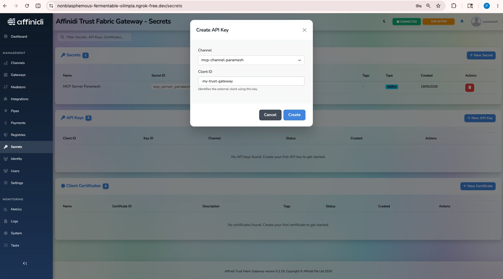
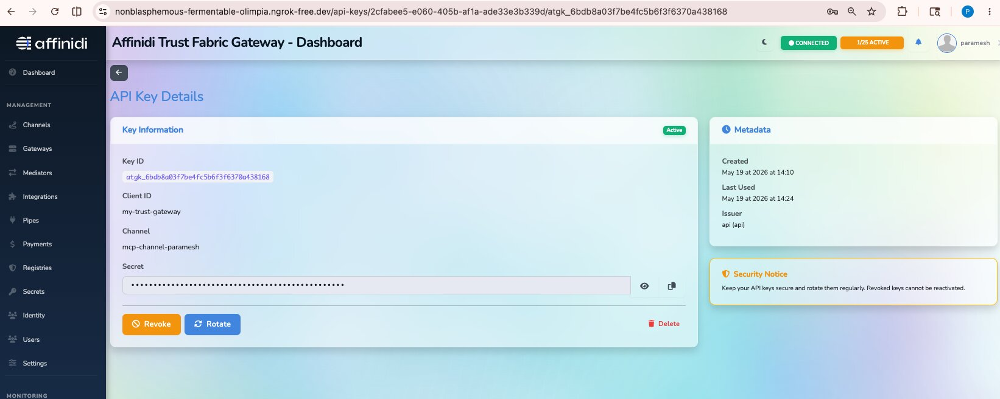
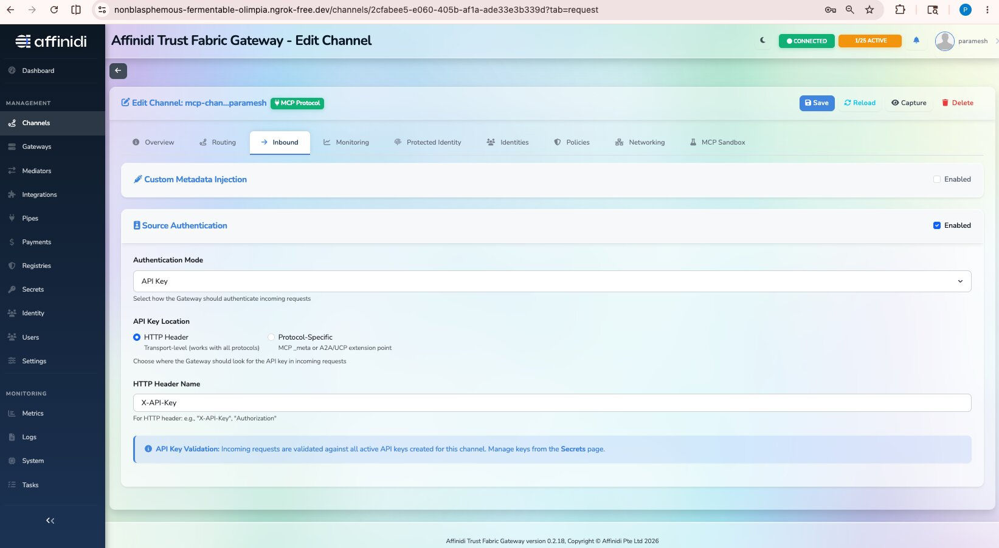
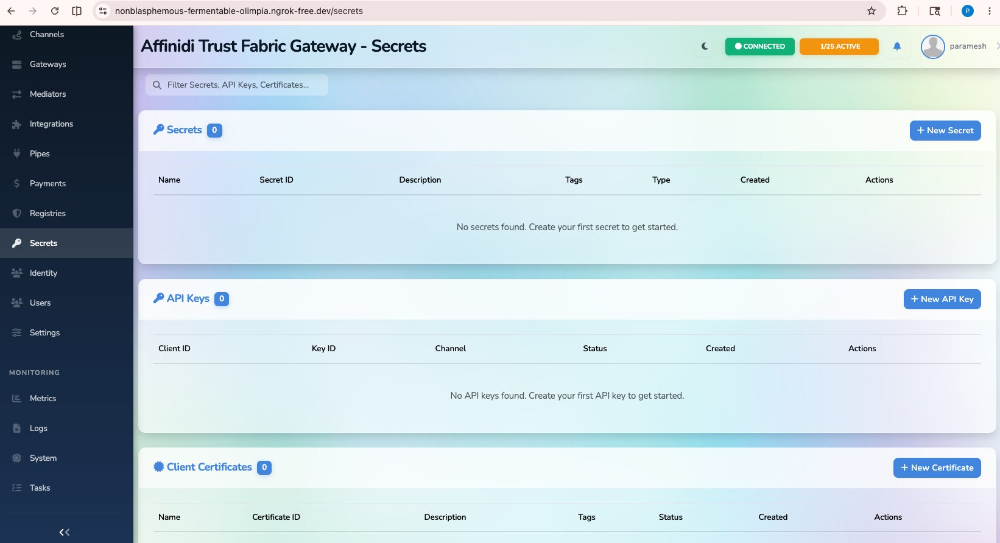
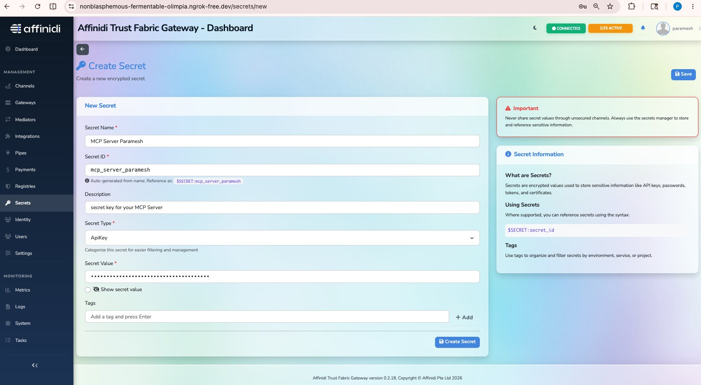
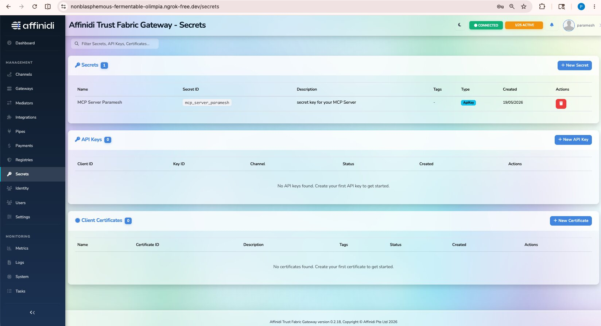
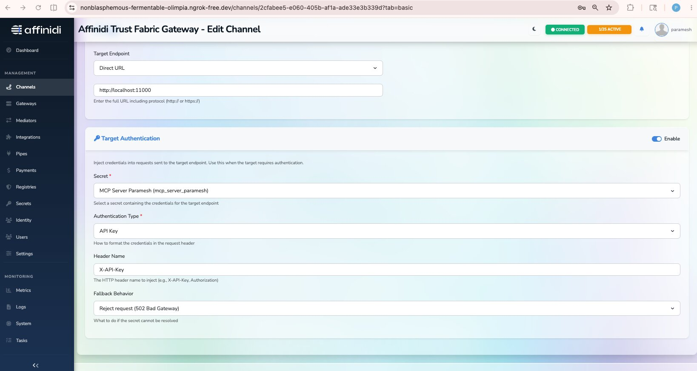
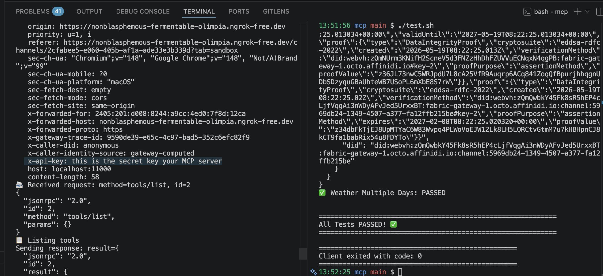

# Enabling Authentication on a Agent Gateway MCP Channel (Optional)

> **Audience:** Customers who have already set up an [MCP Surface in the Agent Gateway](../README.md#mcp-server-via-trust-gateway) and want to add an extra layer of protection.
>
> **Status:** These steps are **optional**. Use them when you need to:
>
> - Protect the **inbound** side of your MCP channel so only authorised clients can call it (**Source Authentication**), and / or
> - Inject secrets (e.g. an API key) from the Agent Gateway into requests forwarded to your **upstream** MCP server (**Target Authentication**).

---

## 📋 Table of Contents

- [Prerequisites](#prerequisites)
- [Overview](#overview)
- [Part A — Source Authentication (Protect the Channel Route)](#part-a--source-authentication-protect-the-channel-route)
- [Part B — Target Authentication (Inject Secrets to Upstream MCP Server)](#part-b--target-authentication-inject-secrets-to-upstream-mcp-server)
- [Troubleshooting](#troubleshooting)

---

## Prerequisites

- An MCP surface already created in the Agent Gateway — see the [main README](../README.md#mcp-server-via-trust-gateway).
- Access to the Agent Gateway dashboard with permission to manage **Secrets** and **Channels**.
- A working MCP client (the bundled `mcp/test.sh`, the MCP Sandbox in the dashboard, or `curl`).

---

## Overview

The Agent Gateway sits between the MCP client and your upstream MCP server. Authentication can be enforced on either side of the gateway, independently:

```
        ┌──────── Source Auth ────────┐   ┌────────── Target Auth ──────────┐
        │ client must present a key   │   │ gateway injects a secret        │
        │ to call the channel route   │   │ to the upstream server          │
        ▼                             ▼   ▼                                 ▼
  MCP Client  ──────────►  Agent Gateway MCP Channel  ──────────►  Your MCP Server
```

| Mode                      | Where the secret lives      | Who presents it                  | Use case                                                                     |
| ------------------------- | --------------------------- | -------------------------------- | ---------------------------------------------------------------------------- |
| **Source Authentication** | Issued by the Agent Gateway | The **client** → Agent Gateway   | Lock down the public channel route so only known clients can call it.        |
| **Target Authentication** | Stored in the Agent Gateway | The **Agent Gateway** → Upstream | Forward an API key / token to a protected upstream MCP server transparently. |

You can enable either, both, or neither.

---

## Part A — Source Authentication (Protect the Channel Route)

By default an MCP channel route is **unprotected** — anyone with the URL can call it. Source Authentication forces clients to present an API key in a header.

### A.1 — Create an API Key for the Channel

1. In the Agent Gateway dashboard, open the **Secrets** page and click **`+ New API Key`**.
2. Select the **Surface** you want to protect.
3. Enter a **Client ID** (e.g. `my-app`) — this identifies the calling application in logs and metrics.
4. Click **Create**. The Agent Gateway generates a new API key.




### A.2 — Enable Source Authentication on the Channel

1. Open the surface and select the **Managed Agent** element.
3. Select **Target Authentication:** as `API Key` and click on `Configure` button 
   - **Header Name:** `x-api-key`
4. Click **Save**.



### A.3 — Test

Requests **without** the header (or with a wrong key) will now be rejected with **`403 Forbidden`**.

Requests **with** the correct header pass through as normal:

```bash
curl 'https://<GATEWAY_HOST>/routes/<CHANNEL_PATH>' \
  -H 'content-type: application/json' \
  -H 'X-API-Key: <SECRET_VALUE>' \
  --data-raw '{
    "jsonrpc": "2.0",
    "id": 1,
    "method": "initialize",
    "params": {
      "protocolVersion": "2024-11-05",
      "capabilities": {},
      "clientInfo": { "name": "trust-gateway-sandbox", "version": "1.0.0" }
    }
  }'
```

---

## Part B — Target Authentication (Inject Secrets to Upstream MCP Server)

Use this when your upstream MCP server itself requires an API key (or other header-based secret). Instead of distributing the secret to every client, store it once in the Agent Gateway and let the gateway inject it into every forwarded request.

### B.1 — Create the Secret

1. In the Agent Gateway dashboard, open the **Secrets** page and click **`+ New Secret`**.

   

2. Fill in the form:
   - **Secret Name:** e.g. `MCP Server API Key`
   - **Description:** _(optional)_
   - **Secret Type:** `APIKey`
   - **Secret Value:** the API key your upstream server expects
3. Click **Create secret**.

   

4. The new secret appears in the secrets list.

   

### B.2 — Attach the Secret to the Channel

1. Open the MCP channel you want to inject the secret into.
2. Go to the **Routing** tab.
3. Tick **`Target Authentication`** and configure:
   - **Secret:** select the secret created in step B.1
   - **Authentication Type:** `API Key`
   - **Header Name:** `x-api-key` _(or whatever your upstream expects)_
4. Click **Save**.

   

### B.3 — Test

Call the channel as you normally would — clients do **not** need to know the secret. The Agent Gateway will add the configured header before forwarding to the upstream MCP server.

```bash
cd mcp
./test.sh https://<GATEWAY_HOST>/routes/<CHANNEL_PATH>
```

You can confirm the header is being injected by checking the upstream server's logs, or by viewing the request details in the channel's **Logs / Traffic** view in the dashboard.



---

## Troubleshooting

| Symptom                                                               | Likely cause                                                                       | Fix                                                                                              |
| --------------------------------------------------------------------- | ---------------------------------------------------------------------------------- | ------------------------------------------------------------------------------------------------ |
| `403 Forbidden` from the channel route                                | Source Auth is enabled and the client did not send the correct `x-api-key` header. | Add the header, or regenerate the API key from the Secrets page.                                 |
| Upstream MCP server returns `401`/`403` even though the channel works | Target Auth is not enabled, or the wrong secret / header name is configured.       | Re-check the **Routing** tab on the channel — secret, auth type, and header name.                |
| Header name mismatch                                                  | Upstream expects a different header (e.g. `Authorization`).                        | Change the **Header Name** field when enabling Target Authentication to match upstream.          |
| Secret value leaked                                                   | Treat it as compromised.                                                           | Delete/Rotate/Revoke the secret / API key in the dashboard and create a new one; update clients. |

---

## Next Steps

- The same pattern (Source / Target Authentication) applies to **A2A channels** — the tabs and fields are identical.
- Back to the [main README](../README.md).
