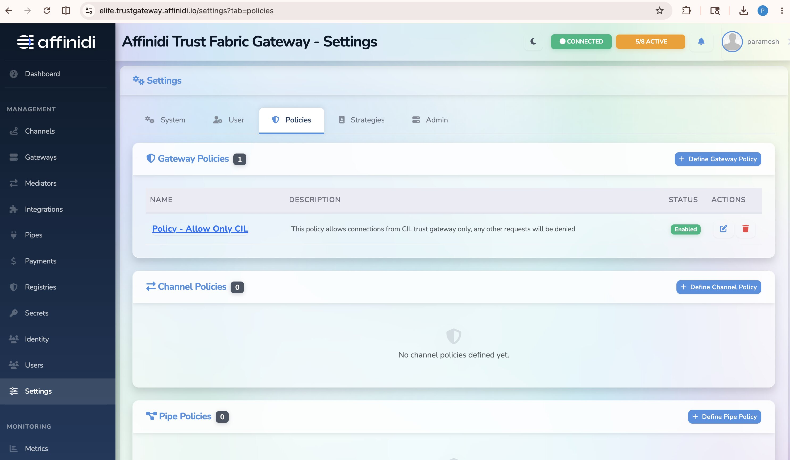
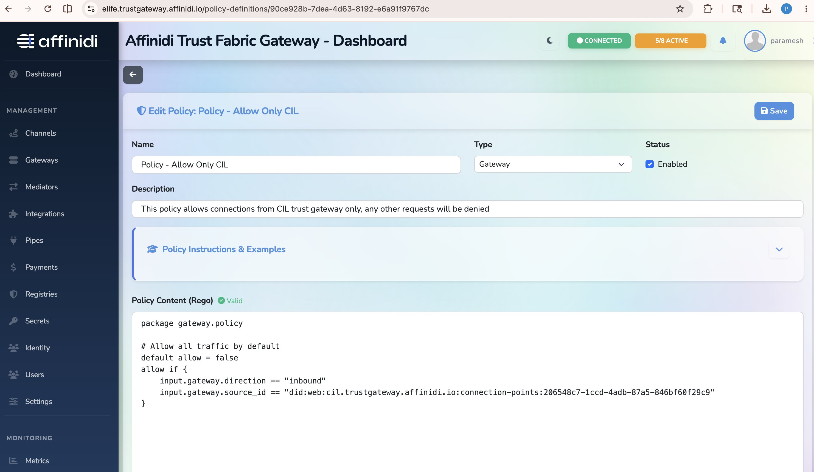
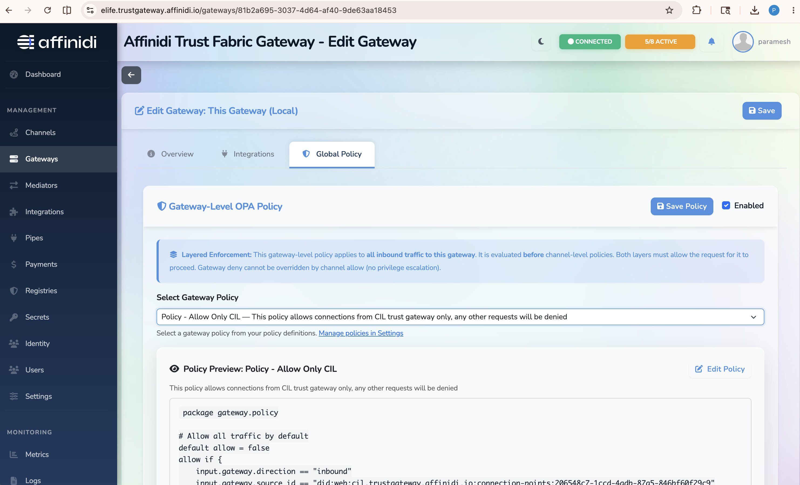
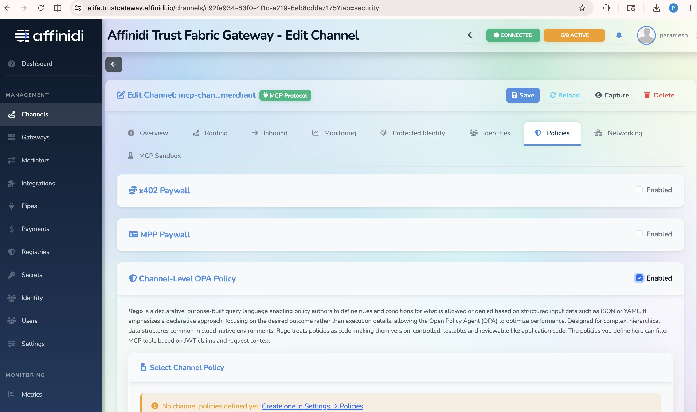

# Applying OPA Policies in the Agent Gateway (Optional)

> **Audience:** Customers who have already set up a channel in the Agent Gateway and want to enforce fine-grained access control using Open Policy Agent (OPA) policies.
>
> **Status:** These steps are **optional**. Use them when you need to:
>
> - Apply a **gateway-wide** rule that governs all inbound/outbound traffic across every channel (**Gateway Policy**), and / or
> - Apply a **per-channel** rule that controls traffic for a specific channel (**Channel Policy**).

---

## 📋 Table of Contents

- [Prerequisites](#prerequisites)
- [Overview](#overview)
- [Part A — Create a Policy](#part-a--create-a-policy)
- [Part B — Apply a Gateway-Level Policy](#part-b--apply-a-gateway-level-policy)
- [Part C — Apply a Channel-Level Policy](#part-c--apply-a-channel-level-policy)
- [Policy Reference](#policy-reference)
- [Troubleshooting](#troubleshooting)

---

## Prerequisites

- An MCP or A2A channel already created in the Agent Gateway.
- Access to the Agent Gateway dashboard with permission to manage **Policies**.
- Basic familiarity with [Rego](https://www.openpolicyagent.org/docs/latest/policy-language/) (the OPA policy language).

---

## Overview

The Agent Gateway evaluates OPA policies on every request before forwarding it upstream. Policies are written in Rego and have access to JWT claims, HTTP context, and routing information.

```
  Inbound Request
       │
       ▼
  ┌─────────────────────────────────────┐
  │         Agent Gateway               │
  │                                     │
  │  1. Gateway Policy (optional)       │  ◄── applies to ALL channels
  │  2. Channel Policy (optional)       │  ◄── applies to ONE channel
  │                                     │
  └─────────────────────────────────────┘
       │  allow = true
       ▼
  Upstream Server
```

| Scope              | Where configured                 | Applies to           |
| ------------------ | -------------------------------- | -------------------- |
| **Gateway Policy** | Gateway page → Global Policy tab | All channels         |
| **Channel Policy** | Channel page → Policies tab      | One specific channel |

Both scopes use the same policy definition — the difference is only where the policy is attached.

---

## Part A — Create a Policy

All policies are managed from the **Settings** page before being attached to a gateway or channel.

### A.1 — Open the Policies Page

1. In the Agent Gateway dashboard, navigate to **Settings**.
2. Click the **Policies** tab.
3. The list shows all existing policies with their name, type, and status.



### A.2 — Define a New Policy

1. Click **`Define gateway policy`** or **`Define channel policy`** depending on the scope you need.
2. Fill in the form:
   - **Name:** a short, descriptive identifier (e.g. `require-auth`, `admin-only`)
   - **Type:** `Gateway` or `Channel`
   - **Description:** _(optional)_
   - **Policy Content (Rego):** paste your Rego policy (see [Policy Reference](#policy-reference) below)
3. Click **Save**.



The new policy appears in the list with **Status: Enabled**.

---

## Part B — Apply a Gateway-Level Policy

A gateway-level policy applies to **all** traffic passing through the gateway, regardless of channel.

### B.1 — Enable the Gateway Policy

1. In the Agent Gateway dashboard, open the **Gateway** page.
2. Click the **Global Policy** tab.
3. Toggle **Enable gateway-level OPA policy** to on.
4. From the **Policy** dropdown, select the policy you created in Part A.
5. Click **Save Policy**.



All requests to any channel will now be evaluated against this policy. Requests where `allow = false` are rejected with **`403 Forbidden`**.

---

## Part C — Apply a Channel-Level Policy

A channel-level policy applies only to traffic on a specific channel, allowing different rules per channel.

### C.1 — Enable the Channel Policy

1. In the Agent Gateway dashboard, open **Channels** and select the channel you want to protect.
2. Go to the **Policies** tab.
3. Toggle **Enable channel-level OPA policy** to on.
4. From the **Policy** dropdown, select the policy you created in Part A.
5. Click **Save**.



Requests to this channel will now be evaluated against the selected policy. Other channels are unaffected.

---

## Policy Reference

### Policy Structure

Policies must use the `gateway.policy` package and define an `allow` rule:

```rego
package gateway.policy

# Default decision (true = allow all, false = deny all)
default allow = false

# Rules that evaluate to true allow the request
allow if {
  # Your conditions here
}
```

> **Best Practice:** Always start with `default allow = false` and explicitly allow only what you need.

### Available Input Context

| Variable                  | Description                       |
| ------------------------- | --------------------------------- |
| `input.jwt.*`             | JWT claims (e.g. `sub`, `role`)   |
| `input.http.method`       | HTTP method (`GET`, `POST`, etc.) |
| `input.http.path`         | Request path                      |
| `input.http.headers`      | HTTP request headers              |
| `input.gateway.direction` | `"inbound"` or `"outbound"`       |
| `input.channel.config_id` | Target channel config ID          |
| `input.channel.name`      | Target channel name               |

### Example: Require Authentication

Only allow requests that carry a valid JWT with a `sub` claim:

```rego
package gateway.policy

default allow = false

allow if {
  input.jwt.sub
}
```

### Example: Admin-Only Access

Restrict access to users whose JWT `role` claim equals `"admin"`:

```rego
package gateway.policy

default allow = false

allow if {
  input.jwt.role == "admin"
}
```

### Example: Allow Specific HTTP Methods Only

Block everything except `POST` requests:

```rego
package gateway.policy

default allow = false

allow if {
  input.http.method == "POST"
}
```

### Example: Scope by Channel Name

Apply different logic based on which channel is being called (useful in a gateway-level policy):

```rego
package gateway.policy

default allow = false

# Public channel — open to all
allow if {
  input.channel.name == "public-mcp"
}

# Private channel — require authentication
allow if {
  input.channel.name == "private-mcp"
  input.jwt.sub
}
```

---

## Troubleshooting

| Symptom                                           | Likely cause                                                                 | Fix                                                                                                      |
| ------------------------------------------------- | ---------------------------------------------------------------------------- | -------------------------------------------------------------------------------------------------------- |
| `403 Forbidden` on all requests                   | Policy evaluates to `allow = false` for every request.                       | Review your Rego rules; verify the input fields you reference (e.g. `input.jwt.sub`) are present.        |
| Policy changes have no effect                     | The policy is not attached, or the wrong policy is selected.                 | Re-check the **Global Policy** or **Policies** tab and confirm the correct policy is selected and saved. |
| `403` only on some channels                       | A channel-level policy is overriding or conflicting with the gateway policy. | Review both the gateway-level and channel-level policy for that channel.                                 |
| JWT claims not available (`input.jwt.*` is empty) | The request does not carry a JWT, or Source Authentication is not enabled.   | Enable **Source Authentication** on the channel, or ensure the client sends a valid Bearer token.        |
| Rego syntax error on save                         | Invalid Rego syntax in the Policy Content field.                             | Use the [OPA Playground](https://play.openpolicyagent.org/) to validate your policy before pasting.      |

---

## Next Steps

- Combine policies with [Source / Target Authentication](enable-auth.md) for layered security.
- Back to the [main README](../README.md).
