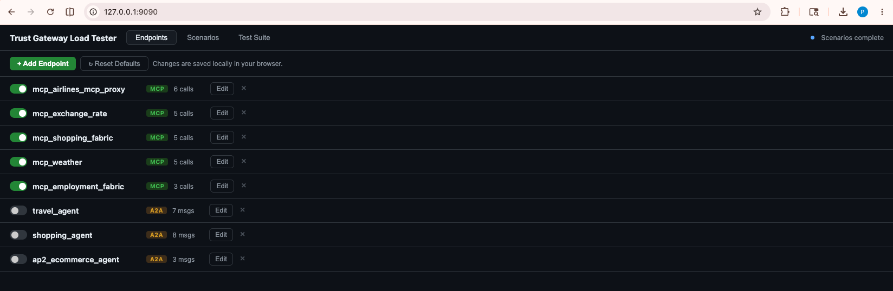
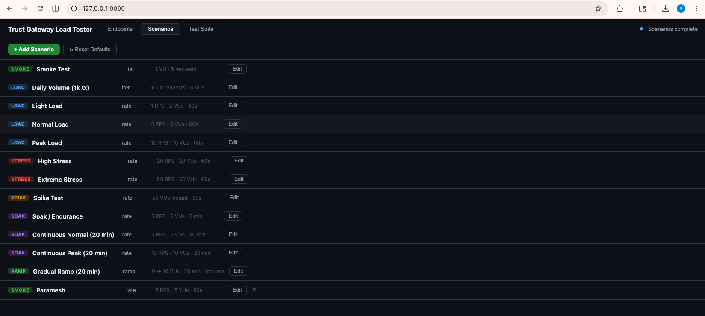
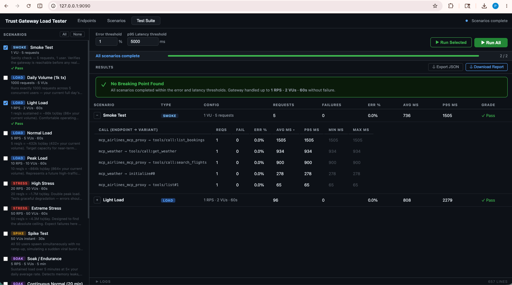

# Trust Gateway — Load Testing

A [Locust](https://locust.io)-based load testing harness for Affinidi Trust Gateway endpoints (MCP servers and A2A agents), with a built-in web UI for configuring and running tests.

## Screenshots

**Endpoints** — add, edit and toggle MCP / A2A endpoints; inactive endpoints sort to the bottom. Changes are stored in browser localStorage without touching the config file.



**Scenarios** — manage load test scenarios ordered by type (smoke → load → stress → spike → soak → ramp). Add custom scenarios or reset to built-in defaults at any time.



**Test Suite** — select scenarios, set error and latency thresholds, and run sequentially. Results update live; a breaking-point banner flags the first scenario that exceeds a threshold.



## Project structure

```
tg-test-harness/
├── data/
│   ├── endpoints.template.json  # Template — copy this to endpoints.json
│   └── endpoints.json           # Your config (gitignored — not committed)
├── locust/
│   ├── locustfile.py            # Locust test harness
│   └── requirements.txt
├── ui/
│   ├── index.html               # Single-page web UI (3-tab navigation)
│   ├── server.py                # Flask backend (SSE streaming + config API)
│   └── requirements.txt
└── run.sh                       # One-shot setup + launch script
```

## First-time setup

1. **Create your endpoints file** from the template:

   ```bash
   cp data/endpoints.template.json data/endpoints.json
   ```

2. **Edit `data/endpoints.json`** — replace the placeholder URLs and call definitions with your real endpoints. See the template for annotated MCP and A2A examples.

3. **Start the UI:**

   ```bash
   ./run.sh
   # → http://127.0.0.1:9090
   ```

`run.sh` will create a virtualenv, install all dependencies, free port 9090 if busy, and start the server. It errors early if `data/endpoints.json` is missing.

> `data/endpoints.json` is gitignored. Only `endpoints.template.json` is committed.

## Web UI

The UI has three pages accessible from the top navigation bar.

### 1. Endpoints

Manage the endpoints under test. Changes are saved in browser `localStorage` and override the server-side `endpoints.json` without modifying the file.

- **Add / Edit** — configure name, URL, type (MCP or A2A), and individual calls/messages via a modal
- **Toggle active** — enable or disable an endpoint without deleting it; inactive endpoints are sorted to the bottom
- **Reset Defaults** — discard all browser overrides and reload from `data/endpoints.json`

### 2. Scenarios

Manage load test scenarios. Scenarios are sorted by type (smoke → load → stress → spike → soak → ramp). Changes are saved in browser `localStorage`.

- **Add / Edit** — configure name, type, mode (iterations / rate / ramp), VUs, spawn rate, RPS, and duration via a modal
- **Reset Defaults** — discard all browser overrides including any custom scenarios you added

### 3. Test Suite

Run one or more scenarios sequentially against your configured endpoints.

- Select scenarios from the left panel (Smoke Test is selected by default); use **All / None** to quickly change the selection
- Set **Error threshold** (%) and **p95 Latency threshold** (ms) — used to grade each scenario pass / degraded / fail
- Press **▶ Run Selected** or **▶ Run All**
- Results appear in the table as each scenario completes; a breaking-point banner highlights the first scenario that exceeds a threshold
- **Export JSON** — machine-readable results for CI or further analysis
- **Download Report** — self-contained HTML report with per-call breakdown

## CLI usage

```bash
source .venv/bin/activate

# 20 requests, 5 parallel users (iterations mode)
ITERATIONS=20 locust --headless --users 5 --spawn-rate 5 \
  --run-time 24h -f locust/locustfile.py

# ~10 req/s for 1 minute (rate mode)
TOTAL_RPS=10 locust --headless --users 10 --spawn-rate 10 \
  --run-time 1m -f locust/locustfile.py

# Single endpoint only
ITERATIONS=10 ENDPOINTS=mcp_airlines locust --headless \
  --users 2 --spawn-rate 2 --run-time 24h -f locust/locustfile.py
```

## Environment variables

| Variable     | Default               | Description                               |
| ------------ | --------------------- | ----------------------------------------- |
| `ITERATIONS` | _(unset)_             | Total requests to send, then stop         |
| `TOTAL_RPS`  | _(unset)_             | Target RPS; set `--users` to match        |
| `ENDPOINTS`  | _(all active)_        | Comma-separated endpoint names to test    |
| `CONFIG`     | `data/endpoints.json` | Path to endpoint config file              |
| `LOG_ERRORS` | `3`                   | Max error responses to print per endpoint |

## Endpoint config format

`data/endpoints.json` structure:

```json
{
  "endpoints": [
    {
      "name": "my_mcp_endpoint",
      "active": true,
      "type": "mcp",
      "url": "<Trust_Gateway_MCP_Channel_Route>",
      "calls": [
        { "method": "initialize", "params": { "protocolVersion": "2024-11-05", ... } },
        { "method": "tools/list", "params": {} },
        { "method": "tools/call", "params": { "name": "<tool>", "arguments": {} } }
      ]
    },
    {
      "name": "my_a2a_agent",
      "active": true,
      "type": "a2a",
      "url": "<Trust_Gateway_Agent_Channel_Route>",
      "messages": [
        "Hello, what can you help me with?",
        "Give me a summary of today's news."
      ]
    }
  ]
}
```

Set `"active": false` to exclude an endpoint from runs without removing it.
