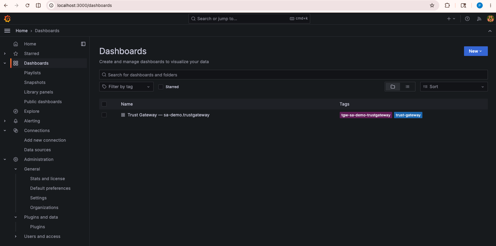
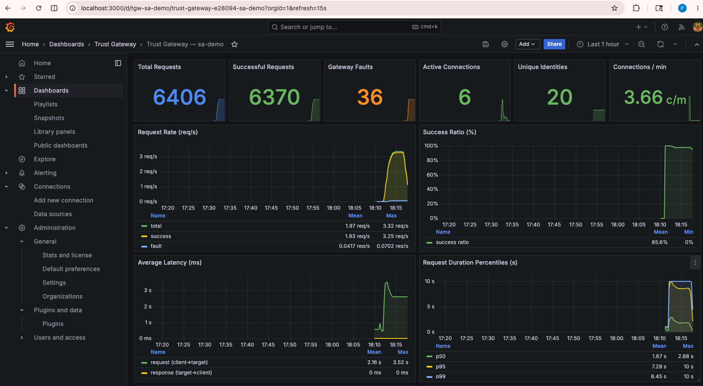

# Trust Gateway → Prometheus → Grafana

A self-contained guide for scraping the **Trust Gateway's native
Prometheus metrics endpoint** and visualising it in Grafana — no
OpenTelemetry Collector, no agents, no tunnels.

```
Trust Gateway                                    Prometheus            Grafana
┌────────────────────────────────┐  scrape (15s) ┌───────────┐  query  ┌────────────┐
│ /api/v1/metrics/prometheus     │ ────────────► │  TSDB     │ ──────► │ dashboards │
└────────────────────────────────┘               └───────────┘         └────────────┘
```

The stack supports **any number of Trust Gateway instances** — pass
each one's host to `run.sh` and the script generates a scrape job
plus a matching Grafana dashboard for it automatically. The job /
dashboard name is **derived from the host's subdomain**, so each
TG ends up with its own clearly labelled view.

> ⚠️ **Security notice — endpoint is currently unauthenticated**
>
> The Trust Gateway `/api/v1/metrics/prometheus` endpoint is **not
> protected** at the moment. Anyone with the URL can read raw metrics
> (request counts, latencies, byte volumes, unique-identity counts).
>
> Authentication (API Key / mTLS) for the Trust Gateway metrics
> endpoint is on the roadmap.

## Prerequisites

- Docker Desktop 24+ with Compose v2
- Network reachability from your machine to your Trust Gateway host(s)
- Your Trust Gateway URL(s) — only the host part of
  `https://<YOUR_TGW_HOST>/api/v1/metrics/prometheus`

## Step 1 — Verify your Trust Gateway exposes metrics

Before bringing the stack up, confirm the endpoint is reachable from
your machine and returns Prometheus-format text:

```bash
curl -s https://<YOUR_TGW_HOST>/api/v1/metrics/prometheus | head -20
```

You should see lines like:

```
# HELP agent_trust_gateway_requests_total Total number of requests processed
# TYPE agent_trust_gateway_requests_total counter
agent_trust_gateway_requests_total 5458
```

If you get an HTML error page or a connection failure, fix that first —
nothing downstream will work until this `curl` succeeds.

## Step 2 — Run the stack with your Trust Gateway host(s)

`run.sh` takes one of two flows. Pick whichever fits.

### Option A — Pass host(s) to `run.sh` (recommended)

```bash
cd tgw-prometheus-integration

# One Trust Gateway
./run.sh acme-demo.trustgateway.affinidi.io

# Multiple Trust Gateways — each gets its own scrape job + dashboard
./run.sh acme-demo.trustgateway.affinidi.io acme-prod.trustgateway.affinidi.io
```

What `./run.sh <host1> [host2 ...]` does:

1. Seeds `prometheus.yml` from
   [prometheus.yml.template](prometheus.yml.template) if it doesn't
   exist yet.
2. Rewrites the `BEGIN MANAGED` / `END MANAGED` block in
   `prometheus.yml` with one scrape job per host.
3. Generates one `tgw-<slug>.json` dashboard per host from
   [dashboard-template.json](dashboard-template.json).
4. Removes any `tgw-*.json` dashboards left over from previous runs
   that no longer match a host you passed.
5. Starts `docker compose` and reloads Prometheus.

You can pass **just the host** — no `/api/v1/...` path needed. These
are all accepted and reduce to the same host:

```bash
./run.sh acme-demo.trustgateway.affinidi.io
./run.sh https://acme-demo.trustgateway.affinidi.io
./run.sh https://acme-demo.trustgateway.affinidi.io/api/v1/metrics/prometheus
./run.sh acme-demo.trustgateway.affinidi.io:8443
```

Re-running with a different host list **replaces** the previous one —
no stale jobs and no stale dashboards.

### Option B — Edit `prometheus.yml` manually

If you'd rather not pass hosts on the command line, copy the template
and edit it:

```bash
cp prometheus.yml.template prometheus.yml
$EDITOR prometheus.yml
```

In the `BEGIN MANAGED` / `END MANAGED` block, replace each placeholder:

```yaml
- job_name: "tgw-<your-subdomain>" # e.g. "tgw-acme-demo-trustgateway"
  scheme: https
  metrics_path: /api/v1/metrics/prometheus
  static_configs:
    - targets: ["<your.tgw.host>"] # e.g. "acme-demo.trustgateway.affinidi.io"
      labels:
        instance_name: "<your-subdomain>" # e.g. "acme-demo.trustgateway"
```

Then generate the matching Grafana dashboard from the template:

```bash
sed -e 's/__JOB__/tgw-acme-demo-trustgateway/g' \
    -e 's/__TITLE__/acme-demo.trustgateway/g'   \
    -e 's/__UID__/tgw-acme-demo-trustgateway/g' \
    dashboard-template.json \
  > grafana/provisioning/dashboards/tgw-acme-demo-trustgateway.json
```

Repeat the scrape-job block and the `sed` for as many Trust Gateways
as you need. Then start the stack:

```bash
./run.sh
```

`./run.sh` with no arguments will refuse to start until both
`prometheus.yml` and at least one `tgw-*.json` dashboard exist — it
prints the commands above if anything is missing.

After the script finishes, open:

| Service    | URL                   | Credentials   |
| ---------- | --------------------- | ------------- |
| Grafana    | http://localhost:3000 | admin / admin |
| Prometheus | http://localhost:9090 | —             |

## Step 3 — Verify scraping

In Prometheus, open http://localhost:9090/targets — every job should
show `State: UP`. If a target is `DOWN`, the error column tells you
why (TLS handshake, DNS, 404 path, etc.).

In Grafana, open **Dashboards** in the left sidebar. You'll find
**one dashboard per Trust Gateway**, titled with the identifier
(e.g. _Trust Gateway — acme-demo.trustgateway_). Each dashboard
filters on its own `job="tgw-<slug>"` so the views never mix
metrics across TGs.



Open one to see the Trust Gateway metrics:



## Metrics covered by the dashboards

The Trust Gateway exposes the following `agent_trust_gateway_*` series.
Every panel on the shipped dashboards maps to one or more of these:

| Metric                                             | Type      | Meaning                            |
| -------------------------------------------------- | --------- | ---------------------------------- |
| `agent_trust_gateway_requests_total`               | counter   | All requests processed             |
| `agent_trust_gateway_requests_success_total`       | counter   | Successful requests                |
| `agent_trust_gateway_requests_gateway_fault_total` | counter   | Gateway-side failures              |
| `agent_trust_gateway_bytes_sent_total`             | counter   | Bytes sent to clients              |
| `agent_trust_gateway_bytes_received_total`         | counter   | Bytes received from clients        |
| `agent_trust_gateway_request_duration_seconds`     | histogram | End-to-end request duration        |
| `agent_trust_gateway_active_connections`           | gauge     | Currently open connections         |
| `agent_trust_gateway_connections_per_minute`       | gauge     | Rolling 1-min connection rate      |
| `agent_trust_gateway_throughput_bytes_per_sec`     | gauge     | Throughput (bytes/sec)             |
| `agent_trust_gateway_avg_request_latency_ms`       | gauge     | Avg latency client → target        |
| `agent_trust_gateway_avg_response_latency_ms`      | gauge     | Avg latency target → client        |
| `agent_trust_gateway_unique_identities`            | gauge     | Distinct agent identities observed |

Dashboard layout (same for every TG instance):

- **Row 1 — Stat cards:** Total Requests · Successful · Gateway Faults · Active Connections · Unique Identities · Connections/min
- **Row 2 — Traffic:** Request Rate (total/success/fault) · Success Ratio
- **Row 3 — Latency:** Avg Request/Response Latency (ms) · Request Duration p50/p95/p99
- **Row 4 — Throughput:** Throughput (B/s) · Bytes Rate (sent/received)
- **Row 5 — Distribution:** Request Duration heatmap

## Troubleshooting

| Symptom                             | Check                                                               |
| ----------------------------------- | ------------------------------------------------------------------- |
| Target shows `DOWN` in Prometheus   | `curl -v https://<YOUR_TGW_HOST>/api/v1/metrics/prometheus`         |
| Panels show "No data"               | Dashboard's `job=` filter must equal `job_name` in `prometheus.yml` |
| Dashboard doesn't appear in Grafana | `docker logs tgw-prom-grafana \| grep -i provisioning`              |
| Want to wipe storage                | `docker compose down -v`                                            |
| Changed `prometheus.yml`            | `docker compose restart prometheus`                                 |

## Files

```
tgw-prometheus-integration/
├── .gitignore                          ← ignores prometheus.yml and tgw-*.json
├── docker-compose.yml
├── prometheus.yml.template             ← committed; copied to prometheus.yml by run.sh
├── prometheus.yml                      ← LOCAL (gitignored); real scrape config
├── run.sh                              ← accepts any number of TG hosts
├── dashboard-template.json             ← single source of truth for panel layout
└── grafana/provisioning/
    ├── datasources/datasources.yml
    └── dashboards/
        ├── dashboard.yml              ← provider config
        └── tgw-<slug>.json            ← LOCAL (gitignored); generated by run.sh
```

> Both `prometheus.yml` and `grafana/provisioning/dashboards/tgw-*.json`
> are listed in `.gitignore`. They contain your real Trust Gateway
> hostnames — keep them local.

## Stop the stack

```bash
docker compose down          # keep data
docker compose down -v       # wipe Prometheus TSDB + Grafana state
```
