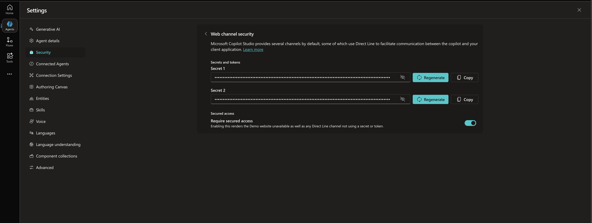
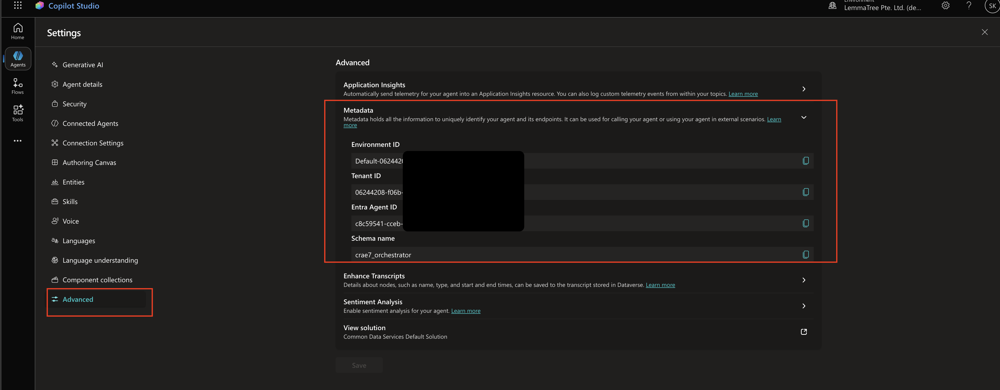
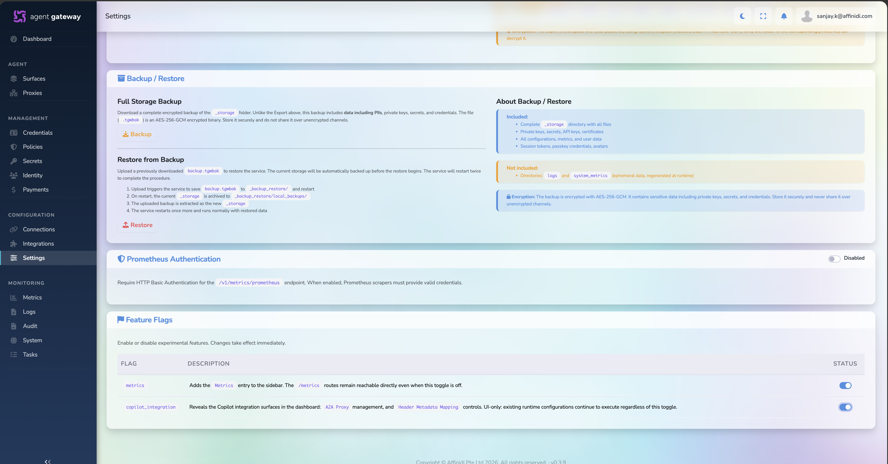
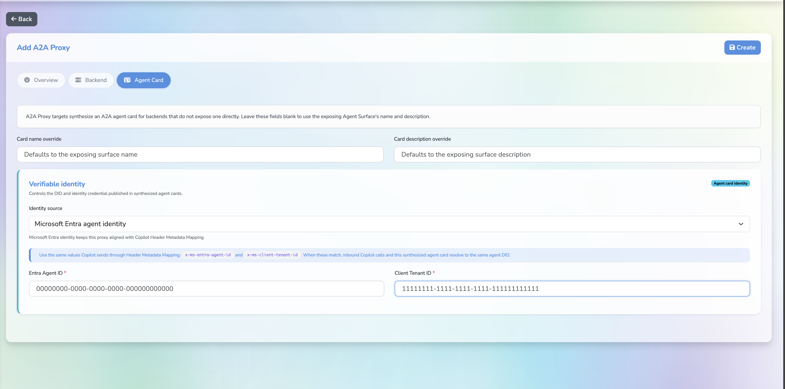

# Cross-Org Secure Agent Communication (Copilot Studio)

A hands-on guide that demonstrates secure, cross-organization agent-to-agent (A2A) communication between two **Microsoft Copilot Studio** agents using the [Affinidi Trust Gateway](https://docs.affinidi.com/products/affinidi-trust-fabric/agent-gateway/).

You will configure two independent organizations — **Org A (Thatcher Corp)** and **Org B (Dexter Labs)** — each with a Copilot Studio agent exposed through a Gateway A2A Proxy, and secure the communication channel between them with policy and trust.

> **Low-code variant:** This guide mirrors the [high-code secure-agent-communication lab](../secure-agent-communication/README.md) but replaces custom Python agents with Copilot Studio agents and eliminates the portal — testing happens via curl and CPS test chat. The gateway concepts (Fabric Connection, Trust Registry, Policy, API key auth, and Surfaces) are identical.

---

## Table of Contents

- [What You Will Build](#what-you-will-build)
- [Why an A2A Proxy Is Needed](#why-an-a2a-proxy-is-needed)
- [Prerequisites](#prerequisites)
- [Repository Structure](#repository-structure)
- [Part 1 — Copilot Studio Setup](#part-1--copilot-studio-setup)
- [Part 2 — Gateway Setup](#part-2--gateway-setup)
- [Part 3 — Test and Validate](#part-3--test-and-validate)
- [Comparison: High-Code vs Low-Code (CPS)](#comparison-high-code-vs-low-code-cps)
- [Troubleshooting](#troubleshooting)

---

## What You Will Build

```
Org A (Thatcher Corp)                              Org B (Dexter Labs)
┌──────────────────────┐                          ┌──────────────────────┐
│  Copilot Studio      │                          │  Copilot Studio      │
│  Thatcher Agent      │                          │  Dexter Agent        │
└──────────┬───────────┘                          └──────────┬───────────┘
           │ Direct Line                                     │ Direct Line
           ▼                                                 ▼
┌──────────────────────┐                          ┌──────────────────────┐
│  Thatcher A2A Proxy  │                          │  Dexter A2A Proxy    │
│  (Gateway)           │                          │  (Gateway)           │
└──────────┬───────────┘                          └──────────┬───────────┘
           │                                                 │
           ▼                                                 ▼
┌──────────────────────┐  Fabric Connection       ┌──────────────────────┐
│  Thatcher Gateway    │◄────────────────────────►│  Dexter Gateway      │
│  AP ─► MA ─► TP     │                          │  AP ─► MA ─► TP     │
└──────────────────────┘                          └──────────────────────┘
```

Each gateway surface exposes an **Access Point** (inbound) and a **Transit Point** (outbound). The A2A Proxy bridges the standard A2A protocol to Copilot Studio's Direct Line API.

---

## Why an A2A Proxy Is Needed

Copilot Studio agents do not natively expose an A2A endpoint. They use the **Direct Line** protocol for communication. The Gateway **A2A Proxy** component translates between:

| From                          | To                                  |
| ----------------------------- | ----------------------------------- |
| A2A message (JSON over HTTPS) | Direct Line conversation + activity |
| Direct Line response activity | A2A response message                |

This lets CPS agents participate in the standard A2A ecosystem without any custom code.

---

## Prerequisites

- **Microsoft Copilot Studio** access to create and publish agents (both orgs)
- **Affinidi Developer Portal** account — [portal.affinidi.com](https://portal.affinidi.com/)
- Admin access to two Affinidi Gateways (one per org)
- A terminal with `curl`
- API keys for protected surface access

---

## Repository Structure

```
copilot-studio-agent-communication/
├── README.md                       # This guide
├── gateway-config/                 # Reference surface configuration JSONs
│   ├── thatcher-surface.json        # TODO: Add surface config for Thatcher
│   ├── dexter-surface.json          # TODO: Add surface config for Dexter
│   └── policies/
│       ├── gateway-only.rego       # TODO: Inbound Trust Check policy
│       └── transit-outbound.rego   # TODO: Transit outbound policy
└── docs/
    └── images/                     # Screenshots for this guide
```

---

## Part 1 — Copilot Studio Setup

You will create two Copilot Studio agents and obtain their Direct Line secrets.

### Step 1.1 — Create Thatcher Agent (Org A)

1. Sign in to [Copilot Studio](https://copilotstudio.microsoft.com)
2. On Home, describe your agent (e.g. "You are Thatcher Corp's helper agent") and create it
3. Wait until the agent Overview page is ready
4. _(Optional)_ Update instructions to something descriptive for the lab

Reference: [Copilot Studio — Get Started](https://learn.microsoft.com/en-us/microsoft-copilot-studio/fundamentals-get-started)

### Step 1.2 — Create Dexter Agent (Org B)

Repeat the same process for the Dexter Labs agent. If using a separate tenant, sign in with that tenant's credentials.

### Step 1.3 — Enable Direct Line Security

For **each** agent:

1. Open your agent in Copilot Studio
2. Go to **Settings → Security → Web channel security**
3. Turn on **Require secured access**
4. Copy **Secret 1** (or Secret 2) — you will store this in the Gateway

5. Copy **Entra Agent ID** and **Client Tenant ID** from agent metada in same setting page.


> Propagation can take up to 2 hours. For quick testing, you can temporarily disable secured access.

Reference: [Configure Web Security](https://learn.microsoft.com/en-us/microsoft-copilot-studio/configure-web-security)

**✅ Checkpoint:** You have two CPS agents and two Direct Line secrets.

---

## Part 2 — Gateway Setup

This part configures both gateways with the full governance stack: Fabric Connection, Trust Registry, Policies, API key auth, A2A Proxies, and Surfaces.

### Step 2.1 — Setup Gateways and Fabric Connection

→ Follow [fabric-readme.md](../../feature-guide/fabric-readme.md)

You will create:

- A Mediator for DIDComm communication
- A gateway for **Org A (Thatcher Corp)**
- A gateway for **Org B (Dexter Labs)**
- A Fabric Connection between them using the mediator

> Important: On each gateway, enable the Copilot integration option to enable the A2A proxy by navigating to **Settings -> Admin -> Feature Flags** and enabling `copilot_integration`.



### Step 2.2 — Setup Trust Registry

→ Follow [trust-registry-guide.md](../../feature-guide/trust-registry-guide.md)

On **each** gateway:

- Add an **Issuer** (your own org's DID) — used to sign VPs
- Add an **Authority** (the peer org's issuer DID) — what you trust from the other gateway

### Step 2.3 — Create Policies

→ Follow [policy-guide.md](../../feature-guide/policy-guide.md)

Create two policies per gateway:

#### Inbound Access Point policy (Trust Check enforced)

```rego
package surface.policy

default allow := false

allow if {
  trust_registry_authorized
}

trust_registry_authorized if {
  every r in input.trust_check_results.caller { r.ok }
}

deny_reason := "Caller failed Trust Registry verification" if {
  not trust_registry_authorized
}
```

#### Transit Point outbound policy

```rego
package surface.policy

default allow := false

allow if {
  trust_registry_authorized
}

trust_registry_authorized if {
  every r in input.trust_check_results.target { r.ok }
}

deny_reason := "Target failed Trust Registry verification" if {
  not trust_registry_authorized
}
```

### Step 2.4 — Create Secrets and A2A Proxies

This is the CPS-specific step that replaces the custom agent deployment in the high-code lab.

#### Create Secrets

→ Follow [general-secret.md](../../feature-guide/general-secret.md)

On **each** gateway, create two secrets:

| Secret                        | Purpose                                                     |
| ----------------------------- | ----------------------------------------------------------- |
| `thatcher-direct-line-secret` | Direct Line secret for Thatcher's CPS agent                 |
| `dexter-access-point-api-key` | API key for Dexter's Access Point (exchanged between teams) |

_(Mirror for the other gateway.)_

#### Create A2A Proxies

On **each** gateway, create one A2A proxy:

1. Go to **Proxies → Create A2A Proxy**
2. Set the name (e.g. `thatcher-cps-proxy`)
3. On the **Backend** tab, select:
   - **Backend kind:** `copilot_direct_line`
   - **Secret:** the local Direct Line secret (from Step 1.3)
   - **Base URL:** `https://directline.botframework.com/v3/directline`
4. In **Agent card**, fill the mandatory fields copied in Step 1.3:
   - Entra Agent ID
   - Client Tenant ID

 5. Click **Create**

Repeat on the other gateway for the other agent.

#### Create Access Point API Keys

→ Follow [surface-api-key.md](../../feature-guide/surface-api-key.md)

For each surface:

1. Create an API key for callers of that surface
2. Exchange keys securely between teams
3. Store the remote key in local secrets for transit outbound auth

**✅ Checkpoint:** Each gateway has a secret, an A2A proxy, and an exchanged API key.

### Step 2.5 — Create A2A Surfaces

Create **2 surfaces per gateway** (4 total), following the same pattern as the high-code lab:

#### Thatcher Gateway Surfaces

| Surface Name | Config JSON                            | Purpose                                                             |
| ------------ | -------------------------------------- | ------------------------------------------------------------------- |
| `Thatcher`   | `gateway-config/thatcher-surface.json` | Primary surface — Access Point for callers, Transit Point to Dexter |

#### Dexter Gateway Surfaces

| Surface Name | Config JSON                          | Purpose                                                               |
| ------------ | ------------------------------------ | --------------------------------------------------------------------- |
| `Dexter`     | `gateway-config/dexter-surface.json` | Primary surface — Access Point for callers, Transit Point to Thatcher |

#### How to Create a Surface

1. Click **Surfaces → Add Surface**
2. Select **A2A Surface Starter Template**
3. Open **Config** section, paste the JSON template
4. Open **Surface** section to verify visual layout
5. Update element settings:
   - **Surface area:** Select Issuer

- **Managed Agent:** Set target to the local A2A Proxy created in Step 2.4
- **Endpoint type:** Via A2A proxy -> select your proxy
- **Transit Point:** Select the remote gateway and remote surface via `fabric://<remote_gateway_id>/<remote_surface_id>`
- **Caller auth:** Configure the surface to require the API key created above
- **Policy:** Select the inbound/transit policies created in Step 2.3
- **Trust Check:** Select Trust Registry, then set the Authority ID and Entity ID

6. Save the surface

After creating the surfaces, note:

- **Access Point URL** for each primary surface
- **Transit Point outbound path** for cross-org routing

**✅ Checkpoint:** 2 surfaces created (1 per gateway), all active.

---

## Part 3 — Test and Validate

### Step 3.1 — Basic Connectivity (curl)

Test the Access Point of each surface:

```bash
# Test Thatcher surface
curl -X POST "<THATCHER_ACCESS_POINT_URL>" \
    -H "Content-Type: application/json" \
  -H "Authorization: <THATCHER_SURFACE_API_KEY>" \
    -d '{
        "message": "Hello from curl to Thatcher agent",
        "sessionId": "test-session-1"
    }'

# Test Dexter surface
curl -X POST "<DEXTER_ACCESS_POINT_URL>" \
    -H "Content-Type: application/json" \
  -H "Authorization: <DEXTER_SURFACE_API_KEY>" \
    -d '{
        "message": "Hello from curl to Dexter agent",
        "sessionId": "test-session-2"
    }'
```

Expected: HTTP 200 with agent response in the body.

### Step 3.2 — Cross-Org Communication (Transit)

Trigger a message that causes Thatcher to forward to Dexter through the Transit Point:

```bash
curl -X POST "<THATCHER_ACCESS_POINT_URL>" \
    -H "Content-Type: application/json" \
  -H "Authorization: <THATCHER_SURFACE_API_KEY>" \
    -d '{
        "message": "Forward this to Dexter: What is your status?",
        "sessionId": "test-cross-org-1"
    }'
```

> Whether cross-org forwarding works depends on your CPS agent's instructions and topic routing. Configure one agent's topic to recognize forwarding intent and invoke the peer via the Transit Point path.

### Step 3.3 — Governance Validation

On each gateway, confirm:

| Check                            | Where                              |
| -------------------------------- | ---------------------------------- |
| Trust Check results (allow/deny) | Surface → Monitoring / Logs        |
| Policy decisions with reasons    | Surface → Monitoring / Logs        |
| A2A Proxy activity               | Proxy → Logs                       |
| Fabric connection healthy        | Connections → Gateways → Heartbeat |

### Step 3.4 — CPS Test Chat

You can also test from inside Copilot Studio:

1. Open your agent in CPS
2. Use the built-in **Test your agent** panel
3. Send a message — it will route through Direct Line → A2A Proxy → Surface

> Note: CPS test chat bypasses the gateway Access Point. Use curl for full end-to-end governance validation.

**✅ Done criteria:**

- Both Access Points return agent responses
- Cross-org messages route through Fabric and return successfully
- Trust Check and Policy decisions are visible in gateway logs

---

## Comparison: High-Code vs Low-Code (CPS)

| Aspect           | High-Code Lab                                 | This Guide (CPS)                                 |
| ---------------- | --------------------------------------------- | ------------------------------------------------ |
| Agent runtime    | Custom Python A2A agent                       | Copilot Studio (no code)                         |
| A2A support      | Native — agent speaks A2A directly            | Via Gateway **A2A Proxy** (CPS uses Direct Line) |
| Portal           | Custom Next.js portal with Entra login        | No portal — curl + CPS test chat                 |
| Phase structure  | Phase 1 (no gateway) → Phase 2 (with gateway) | Single walkthrough (gateway from start)          |
| Gateway features | Identical                                     | Identical                                        |
| Code to write    | Agent code + portal code + env config         | Zero code — config only                          |
| Deployment       | Deploy agents publicly (ngrok / Cloud Run)    | CPS is cloud-hosted; only gateway config needed  |

---

## Troubleshooting

| Problem                    | Cause                                                            | Fix                                                  |
| -------------------------- | ---------------------------------------------------------------- | ---------------------------------------------------- |
| 401/403 at Access Point    | Incorrect API key or missing auth header                         | Check `Authorization` header format and key value    |
| Trust Check denial         | Registry disconnected, wrong authority, or caller not recognized | Verify Trust Registry connection and authority DIDs  |
| Transit forwarding failure | Wrong `fabric://` target or inactive gateway connection          | Confirm gateway connection heartbeat and surface IDs |
| A2A Proxy returns 5xx      | Invalid Direct Line secret or CPS agent not published            | Verify secret and check agent is published in CPS    |
| Empty response from proxy  | CPS agent doesn't understand the message                         | Check agent topics/instructions in CPS               |
| Timeout                    | Fabric connection down or target surface inactive                | Check Connections → Gateways heartbeat status        |

---

## Your TODO Checklist

These are the action items to complete this guide:

- [ ] Create two Copilot Studio agents (Thatcher and Dexter)
- [ ] Obtain Direct Line secrets for both agents
- [ ] Set up two gateways with Fabric Connection (follow feature guides)
- [ ] Configure Trust Registry on both gateways
- [ ] Create inbound and transit policies on both gateways
- [ ] Create API keys for protected surfaces on both gateways
- [ ] Create secrets and A2A proxies on both gateways
- [ ] Exchange Access Point API keys between Thatcher and Dexter
- [ ] Export surface config JSONs and add to `gateway-config/`
- [ ] Create 4 surfaces (2 per gateway) using the JSON configs
- [ ] Test with curl against both Access Points
- [ ] Validate cross-org forwarding through Transit Point
- [ ] Capture screenshots for `docs/images/`
- [ ] Replace placeholder image references with actual screenshots
